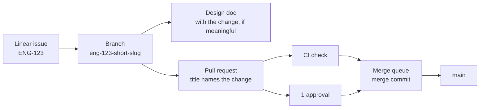

# Contributing

Conventions for every repository in `arikkfir-org`, for humans and coding agents alike. Repository-specific rules live in each repository's `<REPO>_CONTRIBUTING.md`, `CLAUDE.md` and `README.md`; where they conflict with this page, the repository wins.

## Workflow



1. **Start from a Linear issue** for anything beyond a trivial fix (see [Linear](#linear)).
2. **Branch** from the default branch using the issue's branch name.
3. **Write or update the design doc** for every meaningful unit of work, in the change's pull request (that repository's `docs/`) or on `docs`'s `main` (see
   [Design documents](#design-documents)).
4. **Open a pull request** early; mark it ready once CI is green and the description is complete.
5. **Merge through the merge queue**. Default branches accept merge commits only, after one approval, resolved conversations and a green `Continuous Integration` check. Nobody pushes directly to a protected default branch, except `docs`'s `main` (below).

Changes to the `docs` repository are pushed directly to its `main`, without a pull request. The `Docs` check runs only on pull requests, so `docs-publish` finds a broken link or a collision only after the push: fix it at once. Every other repository changes through pull requests, which carry their docs in their own `docs/` unless those go to `docs`'s `main`.

## Linear

| Team        | Key   | Scope                              |
|-------------|-------|------------------------------------|
| Engineering | `ENG` | Code, infrastructure, CI           |

- Reference issues by key: `ENG-123`. In every repository, GitHub links `ENG-` keys to the issue in Linear.
- Branch names come from Linear ("copy git branch name"): `eng-123-short-slug`. The key in the branch name links the
  pull request to the issue.
- Put a magic word in the pull request description: `Closes ENG-123` (or `Fixes`, `Resolves`) moves the issue to done
  when the pull request merges; `Part of ENG-123` or `Refs ENG-123` links without closing.
- One pull request per issue where practical. Split large issues into sub-issues rather than sending one huge
  pull request.
- Do not put issue keys in commit subjects or pull request titles; the description carries them into the merge
  commit.

### Writing an issue

The issue and the pull request each have one job. The issue says why something should change; the pull request says what changed and how. An issue may name the code path at fault, but it never designs the fix, and a pull request never re-argues why the change is needed. If the implementation ends up contradicting the issue, say so in the pull request and update the issue ([design](hub/designs/writing-issues.md)).

- **Title**: a bug's title describes the wrong behaviour as it is today ("The argocd Application never reaches Synced"). Any other issue's title states the outcome it asks for, as it will be true once done ("infra plans every pull request and applies every merge to main").
- **Body**:

  ```markdown
  <Lead paragraph: the symptom or the ask, who it affects and what follows from it. Enough to act on, no file paths.>

  ## Evidence
  <Bugs, and maintenance a measurement motivates: what proves it's real (the failing check, the log line, the reproduction), and the code path at fault, named rather than redesigned.>

  ## Done when
  <What someone can observe without reading the diff.>
  ```

- **Priority**, set when the issue is filed:

  | Priority | When                                                                      |
  |----------|---------------------------------------------------------------------------|
  | Urgent   | Something is down, exploitable or losing data, and there is no workaround |
  | High     | It hurts, but there is a workaround                                       |
  | Medium   | Limited impact; planned work starts here                                  |
  | Low      | Cosmetic, internal or cleanup                                             |

  A security weakness or data loss is never below High.

## Commit messages

[Conventional Commits](https://www.conventionalcommits.org/en/v1.0.0/):

```text
<type>(<scope>)!: <summary>

<body: what and why, wrapped at 72 columns>

<footers>
```

- **type**: `feat`, `fix`, `docs`, `refactor`, `perf`, `test`, `build`, `ci`, `chore`, `revert`.
- **scope** (optional): the component touched, e.g. `feat(webhook): …`, `fix(gke): …`.
- **summary**: imperative mood ("add", not "added"), lower case, no trailing period, at most 72 characters.
- **body**: why the change is needed and what it does at a high level; not a list of files.
- **breaking changes**: `!` after the type/scope and a `BREAKING CHANGE: …` footer explaining the migration.
- **footers**: `Closes ENG-123`, `Co-authored-by: Name <email>` (also for AI pairing).
- Commits on a branch may be small, but they land on the default branch as they are, next to the merge commit, so
  each follows these rules and builds.

## Pull requests

**Title**: names the change the pull request makes, in the imperative and in sentence case, e.g. `Report skipped pipelines as skipped checks`. It becomes the merge commit's subject, so `git log --first-parent` reads as a list of what each merge did. No `type(scope):` prefix (that belongs to commit subjects, which keep it), no issue key and no emoji. GitHub ends the merge commit's subject with ` (#123)`, so keep the title within 65 characters for the subject to fit in 72.

**Description**: the merge commit's body. Use this structure:

```markdown
## Summary
What changes and why, in two or three sentences.

## Changes
- Notable changes, grouped logically.

## Testing
How it was verified: commands run, environments, screenshots.

## Design
Link to the design doc in arikkfir-org/docs (for meaningful work).

## Risks and rollout
What could break, how to roll back, manual steps (secrets, DNS, Terraform applies).

Closes ENG-123
```

- Keep pull requests small and focused; one concern per pull request.
- Draft while incomplete; ready for review only when CI is green.
- Every review conversation ends resolved: fixed, or answered with the reason it stays.
- Re-request review after addressing changes; stale approvals are dismissed on push.
- The author merges, through the merge queue.

### Answering a review

A round ends in this order: push the fixes, reply on every thread, then request the review again.

- **Reply on the thread**, in one line: `Done.` (naming the commit) when it's fixed, or one sentence on why it stays as it is.
- **One reply at a time.** GitHub's secondary rate limit refuses replies fired at one repository in a burst, where the same replies spaced out go through. Post one, let it land, post the next. On a `403` that names the secondary limit, wait for `Retry-After` if it gives one, otherwise at least a minute, and wait longer each time it fails again ([GitHub's guidance](https://docs.github.com/en/rest/using-the-rest-api/rate-limits-for-the-rest-api#exceeding-the-rate-limit), which `reviewer/github.py` in `tooling` follows too).
- **Request the review again** once every thread has its answer. `arikkfir-reviewer` starts its next round only when asked, and a pull request whose reviewer was never asked to look again is stranded: nothing red, nothing blocking, and nobody aware it's their turn.
- **Agents reply through the GitHub connector** (`mcp__github__add_reply_to_pull_request_comment`), which writes as the developer. A raw `curl` to `api.github.com` from a cloud session is the last resort: the session's proxy replaces its credentials, so the reply is authored by `claude[bot]`. Say so in the session when you use it.

## Continuous integration

- CI is [Octomaton](https://github.com/arikkfir-org/octomaton) running Tekton pipelines declared in each repository's root `.octomaton.yaml`. There are no GitHub Actions workflows.
- Protected repositories require a check named `Continuous Integration` on pull requests and in the merge queue: the pipeline `ci` with that `displayName`. It must list `pull_request` and `merge_group` in its triggers.
- Every pipeline that checks pull requests runs on all of them, whatever their base branch: `pull_request` takes no `branches` filter. A pull request stacked on another branch is then checked before it reaches `main`, not only once the one below it merges.
- A red check is fixed, never bypassed: no skipped tests, no disabled checks, no empty commits to re-trigger. A flaky test is a bug; fix it or file it with a Linear issue.
- Pin every version: container images, Helm charts, Terraform providers, Go modules, tool versions.
- Every PipelineRun declares what each of its tasks needs, in `spec.taskRunSpecs[].computeResources`: CPU and memory requests and a memory limit, sized from real runs. Runs then land where there is room and the CI pool grows, instead of runs starving each other on one node. Set them on the task, not on its steps: the steps run one at a time in one pod, and Tekton reserves a task-level request once, while step requests add up. Leave CPU unlimited, so steps can use idle CPU.

## Design documents

Every meaningful unit of work (a new component, a change of architecture, a new convention, anything someone will later ask "why is it like this?" about) gets a design document, written before or alongside the change and updated when the implementation diverges. It never gets a pull request of its own: it ships in the change's pull request, in that repository's `docs/`, so it merges with the code it describes, or it goes straight to `docs`'s `main`.

- **Where**: `<area>/designs/<slug>.md` on the site (e.g. `hub/designs/phase-2-octomaton.md`). Every repository's `docs/` maps to the site root, so `docs/hub/designs/x.md` in `infra` is `hub/designs/x.md`. Rich visual pages may be HTML.
- **Across repositories**: put the design in the leading repository or on `docs`'s `main`, or split it into one document per repository, each in the pull request of that repository's part. A directory groups the parts (`hub/designs/<slug>/`): every repository's `docs/` composes into the one URL space at `docs.dev.kfirs.com` ([design](hub/designs/docs-site-composition.md)), so the parts read as one design. Repositories share directories, never file paths.
- **Links**: the `Docs` check resolves relative links against the other repositories' `main`, so a part links only to pages already merged or in its own pull request. Later parts link back to earlier ones.
- **Visual first**: at least one diagram (Mermaid in Markdown, or SVG/HTML) showing the moving parts.
- **Contents**: context and goal; the design; decisions with their rationale and rejected alternatives; security and failure modes; rollout and manual steps; open questions.
- **Facts in one place**: names, addresses, identities and permissions belong in the area's reference page (for the hub, [hub/reference.md](hub/reference.md)). Designs link to it instead of copying. The hub reference lives only in `docs`, so a change that adds a name to it pushes the reference to `docs`'s `main` first.
- Link the design from the pull request, and the pull request from the design once it exists.

## Investigations and walkthroughs

- An investigation ends in a root-cause write-up, whether or not it leads to a fix or an issue: [template](hub/templates/root-cause.md).
- A pull request a reviewer can't follow from its diff gets a walkthrough, linked from its `## Summary`: [template](hub/templates/walkthrough.md).
- Both use one visual vocabulary (diagrams over narration, tables over parallel lists, status markers, drill-downs): the [writing toolkit](hub/templates/toolkit.md).
- Both live in `docs`, which is public, unless they're about an internal repository (`fin`): then they live in that repository's own `docs/`, as private as its code ([design](hub/designs/investigations-and-walkthroughs.md)).

## Code and configuration

- **Formatting**: use the language's canonical formatter (`gofmt`, `terraform fmt`, `prettier` where configured) and linter. CI enforces them.
- **Comments** explain why, not what. No commented-out code; no TODO without a Linear key.
  - Leave code you didn't change alone: no new comments, docs or type annotations on it.
  - When a change touches part of a comment, change only the words whose meaning changed. Don't reflow or rewrap the rest of it: the churn buries the real change in the diff.
  - Wrap a new comment at the width of the comments around it, not at a narrower default such as 72 columns.
- **Tests** accompany behaviour changes. Bug fixes start with a failing test, in the same pull request as the fix, at the level where the bug lived: a bug in how a PipelineRun is rendered gets a test of the rendered run, not only of the code beneath it.
- **Infrastructure as code**: every cloud and cluster change goes through Terraform (`infra`) or Argo CD (`delivery`). Manual changes are for emergencies only and are back-ported to Git the same day.
- **Secrets** never enter Git. Values live in Google Secret Manager; External Secrets Operator syncs them into the cluster.
- **Least privilege**: grant the narrowest role on the narrowest resource to the narrowest identity (see [hub/reference.md](hub/reference.md)). In CI, Tekton's default ServiceAccount `pipeline` never gets a Google Cloud role. A pipeline that needs one names its own ServiceAccount, and one that publishes runs only from `main`
  ([CI ServiceAccounts](hub/designs/ci-service-accounts.md)).
- **Names**: lower-case, hyphenated (`ingress-public`, `ci-docs`); labels and annotations use the `kfirs.com/` prefix. A product with a domain of its own uses that domain instead: Octomaton writes `octomaton.dev/` labels.
- **Less is more**: reuse what exists rather than duplicate it, unless there is a good reason not to.
- **Refactor to align**: when things need to line up, change the existing code. Don't build abstractions or scaffolding around it to avoid the risk of touching it.
- **The right thing, not the easy thing**, with some slack for urgency, or when the effort far outweighs the value.
- **Go**:
  - Check every error, without exception. Logging an error isn't handling it, except at the top of the call stack, where the error is either logged or actually handled (another route taken).
  - Configure programs with [`envconfig`](https://github.com/kelseyhightower/envconfig) (environment variables), not command-line flags.
  - Start an OpenTelemetry span in every significant method.
  - Log through `log/slog` only.
- **Shell**:
  - Start every script with `set -euo pipefail` (`set -eu` in POSIX `sh`).
  - Never let an exit code stand in for an answer. When a script needs to know something, ask for the data and branch three ways, failing on anything but the two answers you expect. `if cmd >/dev/null 2>&1` can't tell "no" from "the command broke":

    ```sh
    found="$(kubectl get applications -n argocd -o json | jq --arg name "$name" 'any(.items[]; .metadata.name == $name)')"
    case "$found" in
      true) echo "found $name" ;;
      false) echo "no $name yet" ;;
      *) echo "could not list Applications" >&2; exit 1 ;;
    esac
    ```

  - Tolerate a failure on purpose with `|| true` and a comment saying why, never with `2>/dev/null` alone: silencing stderr hides the failures you didn't expect along with the one you did.
  - A loop over many items carries on past a failure, counts the failures, and exits non-zero if there were any.
- **Markdown**:
  - Do not manually wrap text; let the Markdown viewer or renderers do it on their own.
  - Keep tables borders formatted.

A repository's own rules (its `CLAUDE.md` and `README.md`) come on top of these house rules and win where they conflict.
The [pull request reviewer](hub/designs/pr-reviewer.md) applies both.

## Releases

- Every push to an application's default branch releases it: the push publishes the application's image, tagged with the commit's short SHA, which is also the version the application reports. There are no version tags.
- A release's notes are its merge commit: the pull request's title and description.
- Deploying a release is a pull request to `arikkfir-org/delivery` that bumps the pinned image tag. Octomaton and Fin are the exceptions: Argo CD deploys their `main` with the image of the commit it syncs (see [Octomaton](hub/reference.md#octomaton) and [Fin](hub/reference.md#fin)).

## Coding agents

- Agents follow this page and the repository's `CLAUDE.md`.
- Agent-authored pull requests get the same review as any other: at least one human approval.
- Agents never apply Terraform, change the cluster directly, or push to protected default branches other than `docs`'s `main`.
