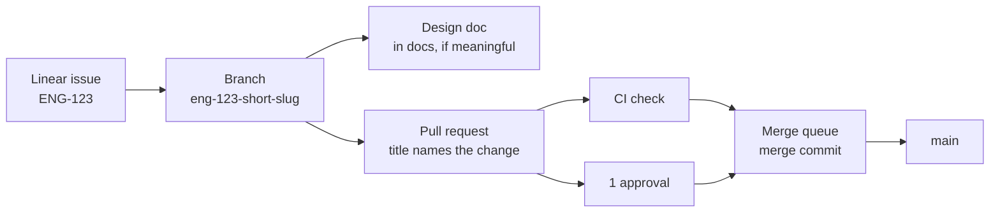

# Contributing

Conventions for every repository in `arikkfir-org`, for humans and coding agents alike. Repository-specific rules live in each repository's `<REPO>_CONTRIBUTING.md`, `CLAUDE.md` and `README.md`; where they conflict with this page, the repository wins.

## Workflow



1. **Start from a Linear issue** for anything beyond a trivial fix (see [Linear](#linear)).
2. **Branch** from the default branch using the issue's branch name.
3. **Write or update the design doc** in `arikkfir-org/docs` (cross-repo design) or `arikkfir-org/<repo>/docs` (repo-focused designed) for every meaningful unit of work (see
   [Design documents](#design-documents)).
4. **Open a pull request** early; mark it ready once CI is green and the description is complete.
5. **Merge through the merge queue**. Default branches accept merge commits only, after one approval, resolved conversations and a green `Continuous Integration` check. Nobody pushes directly to a protected default branch.

Changes in `docs` repository can be pushed directly to `main` as long as they represent the present; otherwise, a PR is required. For instance, a design for a new feature can be pushed directly to `docs`'s `main` since it describes a new feature (and clearly states it's a design for a new feature, not description of something deployed in production).

## Linear

| Team        | Key   | Scope                              |
|-------------|-------|------------------------------------|
| Engineering | `ENG` | Code, infrastructure, CI           |

- Reference issues by key: `ENG-123`. In every repository, GitHub links `ENG-` keys to the issue in Linear.
- Branch names come from Linear ("copy git branch name"): `eng-123-short-slug`. The key in the branch name links the
  pull request to the issue.
- Put a magic word in the pull request description: `Closes ENG-123` (or `Fixes`, `Resolves`) moves the issue to done
  when the pull request merges; `Part of ENG-123` or `Refs ENG-123` links without closing.
- One pull request per issue where practical. Split large issues into sub-issues rather than sending one huge
  pull request.
- Do not put issue keys in commit subjects or pull request titles; the description carries them into the merge
  commit.

## Commit messages

[Conventional Commits](https://www.conventionalcommits.org/en/v1.0.0/):

```text
<type>(<scope>)!: <summary>

<body: what and why, wrapped at 72 columns>

<footers>
```

- **type**: `feat`, `fix`, `docs`, `refactor`, `perf`, `test`, `build`, `ci`, `chore`, `revert`.
- **scope** (optional): the component touched, e.g. `feat(webhook): …`, `fix(gke): …`.
- **summary**: imperative mood ("add", not "added"), lower case, no trailing period, at most 72 characters.
- **body**: why the change is needed and what it does at a high level; not a list of files.
- **breaking changes**: `!` after the type/scope and a `BREAKING CHANGE: …` footer explaining the migration.
- **footers**: `Closes ENG-123`, `Co-authored-by: Name <email>` (also for AI pairing).
- Commits on a branch may be small, but they land on the default branch as they are, next to the merge commit, so
  each follows these rules and builds.

## Pull requests

**Title**: names the change the pull request makes, in the imperative and in sentence case, e.g. `Report skipped pipelines as skipped checks`. It becomes the merge commit's subject, so `git log --first-parent` reads as a list of what each merge did. No `type(scope):` prefix (that belongs to commit subjects, which keep it), no issue key and no emoji. GitHub ends the merge commit's subject with ` (#123)`, so keep the title within 65 characters for the subject to fit in 72.

**Description**: the merge commit's body. Use this structure:

```markdown
## Summary
What changes and why, in two or three sentences.

## Changes
- Notable changes, grouped logically.

## Testing
How it was verified: commands run, environments, screenshots.

## Design
Link to the design doc in arikkfir-org/docs (for meaningful work).

## Risks and rollout
What could break, how to roll back, manual steps (secrets, DNS, Terraform applies).

Closes ENG-123
```

- Keep pull requests small and focused; one concern per pull request.
- Draft while incomplete; ready for review only when CI is green.
- Every review conversation ends resolved: fixed, or answered with the reason it stays.
- Re-request review after addressing changes; stale approvals are dismissed on push.
- The author merges, through the merge queue.

## Continuous integration

- CI is [Octomaton](https://github.com/arikkfir-org/octomaton) running Tekton pipelines declared in each repository's root `.octomaton.yaml`. There are no GitHub Actions workflows.
- Protected repositories require a check named `Continuous Integration` on pull requests and in the merge queue: the pipeline `ci` with that `displayName`. It must list `pull_request` and `merge_group` in its triggers.
- A red check is fixed, never bypassed: no skipped tests, no disabled checks, no empty commits to re-trigger. A flaky test is a bug; fix it or file it with a Linear issue.
- Pin every version: container images, Helm charts, Terraform providers, Go modules, tool versions.
- Every PipelineRun declares what each of its tasks needs, in `spec.taskRunSpecs[].computeResources`: CPU and memory requests and a memory limit, sized from real runs. Runs then land where there is room and the CI pool grows, instead of runs starving each other on one node. Set them on the task, not on its steps: the steps run one at a time in one pod, and Tekton reserves a task-level request once, while step requests add up. Leave CPU unlimited, so steps can use idle CPU.

## Design documents

Every meaningful unit of work (a new component, a change of architecture, a new convention, anything someone will later ask "why is it like this?" about) gets a design document in `arikkfir-org/docs` (cross-repo design) or `arikkfir-org/<repo>/docs` (repo-focused designed), written before or alongside the change and updated when the implementation diverges.

- **Where**: `designs/<slug>.md` (e.g. `designs/phase-2-octomaton.md`). Rich visual pages may be HTML.
- **Visual first**: at least one diagram (Mermaid in Markdown, or SVG/HTML) showing the moving parts.
- **Contents**: context and goal; the design; decisions with their rationale and rejected alternatives; security and failure modes; rollout and manual steps; open questions.
- **Facts in one place**: names, addresses, identities and permissions belong in the area's reference page (for the hub, [hub/reference.md](hub/reference.md)). Designs link to it instead of copying.
- Link the design from the pull request, and the pull request from the design once it exists.

## Code and configuration

- **Formatting**: use the language's canonical formatter (`gofmt`, `terraform fmt`, `prettier` where configured) and linter. CI enforces them.
- **Comments** explain why, not what. No commented-out code; no TODO without a Linear key.
- **Tests** accompany behaviour changes. Bug fixes start with a failing test.
- **Infrastructure as code**: every cloud and cluster change goes through Terraform (`infra`) or Argo CD (`delivery`). Manual changes are for emergencies only and are back-ported to Git the same day.
- **Secrets** never enter Git. Values live in Google Secret Manager; External Secrets Operator syncs them into the cluster.
- **Least privilege**: grant the narrowest role on the narrowest resource to the narrowest identity (see [hub/reference.md](hub/reference.md)). In CI, Tekton's default ServiceAccount `pipeline` never gets a Google Cloud role. A pipeline that needs one names its own ServiceAccount, and one that publishes runs only from `main`
  ([CI ServiceAccounts](hub/designs/ci-service-accounts.md)).
- **Names**: lower-case, hyphenated (`ingress-public`, `ci-docs`); labels and annotations use the `kfirs.com/` prefix. A product with a domain of its own uses that domain instead: Octomaton writes `octomaton.dev/` labels.
- **Less is more**: reuse what exists rather than duplicate it, unless there is a good reason not to.
- **Refactor to align**: when things need to line up, change the existing code. Don't build abstractions or scaffolding around it to avoid the risk of touching it.
- **The right thing, not the easy thing**, with some slack for urgency, or when the effort far outweighs the value.
- **Go**:
  - Check every error, without exception. Logging an error isn't handling it, except at the top of the call stack, where the error is either logged or actually handled (another route taken).
  - Configure programs with [`envconfig`](https://github.com/kelseyhightower/envconfig) (environment variables), not command-line flags.
  - Start an OpenTelemetry span in every significant method.
  - Log through `log/slog` only.
- **Markdown**:
  - Do not manually wrap text; let the Markdown viewer or renderers do it on their own.
  - Keep tables borders formatted.

A repository's own rules (its `CLAUDE.md` and `README.md`) come on top of these house rules and win where they conflict.
The [pull request reviewer](hub/designs/pr-reviewer.md) applies both.

## Releases

- Every push to an application's default branch releases it: the push publishes the application's image, tagged with the commit's short SHA, which is also the version the application reports. There are no version tags.
- A release's notes are its merge commit: the pull request's title and description.
- Deploying a release is a pull request to `arikkfir-org/delivery` that bumps the pinned image tag. Octomaton is the exception: Argo CD deploys its `main` with the image of the commit it syncs (see [Octomaton](hub/reference.md#octomaton)).

## Coding agents

- Agents follow this page and the repository's `CLAUDE.md`.
- Agent-authored pull requests get the same review as any other: at least one human approval.
- Agents never apply Terraform, change the cluster directly, or push to protected default branches.
