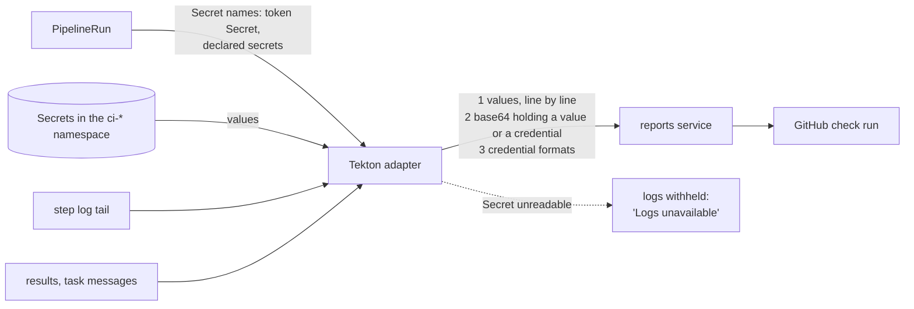

# Check run redaction

**Decision**: Octomaton removes a run's secrets from everything it passes from the run to GitHub: failed steps' log
tails, the `check-title` and `check-summary` results, and Tekton's failure messages. It removes every value of every
Secret the PipelineRun references, also inside base64, and anything shaped like a well-known credential. When it can't
read a Secret, it withholds the logs instead of posting them unredacted. Ticket:
[ENG-47](https://linear.app/arikkfir/issue/ENG-47). Pull request:
[octomaton#17](https://github.com/arikkfir-org/octomaton/pull/17).

## Context

- A failed run's check run carries the last 50 lines (at most 8 KiB) of up to five failed steps' logs, plus results and
  failure messages, verbatim. On a public repository anyone can read a check run, and GitHub keeps it.
- GitHub Actions masks the secrets it hands a job; Octomaton had no equivalent.
- No pipeline prints a credential today (the 2026-10-01 sweep found none in any check run), but one `set -x`,
  `curl -v`, verbose `git`, or a steered model would publish one at once.

## Design

1. **By value.** The adapter walks the PipelineRun for every Secret it names (the same walk that enforces the
   pipeline's `secrets`), reads each one and removes every value of 8 characters or more, longest first. A multi-line
   value, such as a private key, is also removed line by line, since a tail may hold only some of its lines.
2. **Inside base64.** Every run of 16 or more base64 characters (standard or URL-safe, padded or not) that decodes to
   text holding a value, or a credential of step 3, is removed whole. That covers `Authorization: Basic
   base64(x-access-token:<token>)`, the form the reviewer gives git.
3. **By shape.** GitHub tokens (`ghp_`, `gho_`, `ghu_`, `ghs_`, `ghr_`, `github_pat_`), PEM private keys (also cut
   off at either end), Google API keys, OAuth access tokens, client secrets and refresh tokens, `sk-` API keys, JWTs,
   AWS access key IDs, Slack tokens, `Authorization:` header values and passwords in URLs.

A run's own failure message (Tekton's PipelineRun condition, read on every status change) gets step 3 only: it holds
no step output, and reading Secrets on every status change would cost more than it protects.

## How sure can we be?

Redaction is a safety net, not a guarantee:

| Caught | Not caught |
| --- | --- |
| Any value of a Secret the run mounts, printed as is, line by line, or base64-encoded alone or with other text | A value under 8 characters, unless its shape is known |
| A credential of a known shape from anywhere, Workload Identity included | A credential of an unknown shape that the run fetched itself (`gcloud secrets versions access`, a token exchange) |
| The same, inside a base64 encoding | A secret printed transformed: split across lines, partly, hex, URL-encoded, encrypted, or base64 of only part of it |

For a secret the run reads with its own identity (infra's GitHub tokens from Secret Manager), the shape patterns are
the only net, and they catch GitHub tokens. The guarantee remains the pipelines' own rule: **never print a secret**.
The [AI reviewer](pr-reviewer.md) adds its own boundary: only organization members' words reach its model.

## Decisions

| Decision | Why | Rejected |
| --- | --- | --- |
| Redact in the Tekton adapter | It knows which Secrets a run references and can read them; services stay free of Kubernetes | Redacting in the reports service (it can't see Secrets), or in the GitHub adapter (too late to know the run's Secrets) |
| Values first, then base64, then shapes | Exact values are certain; base64 and shapes catch what values can't | Shapes only (miss arbitrary passwords and API keys) |
| Withhold logs when a Secret can't be read | Unredacted logs on a public check are the failure this prevents | Posting them anyway, or failing the whole report |
| 8-character minimum | Shorter values would erase ordinary words and numbers from logs | Redacting every value (unreadable logs) |
| Keep posting log tails on public repositories | They make failures readable without the dashboard, and the net plus the rule is enough for today's pipelines | Logs only behind sign-in, in the Tekton Dashboard |

## Security and failure modes

- Octomaton already has `get` on Secrets in tenant namespaces (`octomaton-tenant`); no new permission.
- A Secret deleted before the report (an expired token Secret) is skipped: there is nothing left to compare with, and
  GitHub token shapes are still caught.
- False positives (a long base64 digest that happens to decode to text holding a value, an `sk-` identifier) are
  redacted too; the dashboard keeps the full log.

## Rollout

Merging octomaton#17 deploys it (Argo CD runs `main`). No manual steps.
