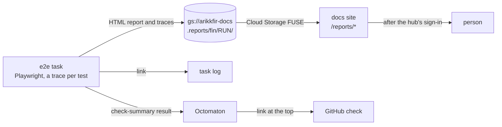

# CI reports

**Decision**: Fin's end-to-end tests record a Playwright trace of every test, passed or failed. After each CI run, the
e2e task uploads Playwright's HTML report, with the traces in it, to the docs bucket. The docs site serves it at
`https://docs.dev.kfirs.com/reports/fin/<run>/`, behind the hub's sign-in. The task prints that link in its log, and
the GitHub check shows it at the top of its summary. The bucket deletes reports after 30 days.

## Why

- CI keeps no files. When a test failed, its log was all there was: on 6 October, a merge group of fin#53 failed, and
  without the page's state at the failure, finding the cause took hours.
- A trace shows every step of a test: the page before and after each action, the network requests and the console.
  A passing run's traces help too, to compare with a failing one.

## Design

| Part | What it does | Where |
| --- | --- | --- |
| Traces | Playwright records a trace for every test, and its HTML reporter writes the report, traces included, to `playwright-report/`, next to the list in the log | fin, `apps/e2e/playwright.config.ts` |
| Upload | After the tests, whether they passed or not, the e2e step uploads the report with the CI identity's token and prints the link. A failed upload is reported in the log and the check, and never fails the check | fin, `.tekton/ci.yaml` |
| Link in the check | The e2e task writes the link to its `check-summary` result and the pipeline passes it on. Octomaton puts it at the top of the check's summary, also when the task fails | fin, `.tekton/ci.yaml`; [Octomaton](../reference.md#octomaton) |
| Storage | `gs://arikkfir-docs/.reports/fin/<run>/`, where `<run>` is the PipelineRun's name, so every run, re-run and merge group gets its own folder. Objects under `.reports/` are deleted after 30 days | infra, `terraform/gcp/storage.tf` |
| Writer | `ci-fin/ci-fin-ci` may create objects under `.reports/fin/`, and nowhere else. It can't change or delete them | infra, `terraform/gcp/iam.tf` |
| Serving | `/reports/*` serves `.reports/` as it is, apart from the layers. A folder serves its `index.html` and is never listed; a hidden path is a 404 | delivery, `platform/docs` |

## Decisions

| Decision | Why | Rejected |
| --- | --- | --- |
| The docs bucket and site | Both are already private, behind the hub's sign-in, and served from the cluster: no new bucket, host or certificate | A bucket and host of their own |
| Playwright's HTML report, not the bare trace files | The report lists every test, and opens each trace in Playwright's trace viewer on the same site. trace.playwright.dev can't fetch a trace from behind the sign-in | Links to trace.playwright.dev |
| A folder apart from the layers | `docs-publish` makes each layer a copy of the repository's `docs/` on `main`, so it would delete reports, and the `Docs` check would check them as pages | A layer for reports |
| A trace for every test, kept 30 days | A failure is easier to understand next to a passing run of the same test. 30 days outlasts most pull requests | Traces of failed tests only; keeping them forever |
| Pull requests' runs upload reports too | That's where tests fail first. Only people who can push to fin can start a run | Reports from `main` and merge groups only |

## Risks

- A run from any of fin's branches can put pages and scripts on `docs.dev.kfirs.com`, under `/reports/fin/`. They run
  in the browser of whoever opens them, signed in to the docs site, which only serves what that person can already
  read. Only people who can push to fin can do this.
- `/reports/` belongs to the reports: a page a layer publishes under `reports/` is never served.
- A report holds what the tests typed and saw: Demo Bank's made-up accounts and the local sealing seed, which seals
  nothing real. Nothing in it is secret.
