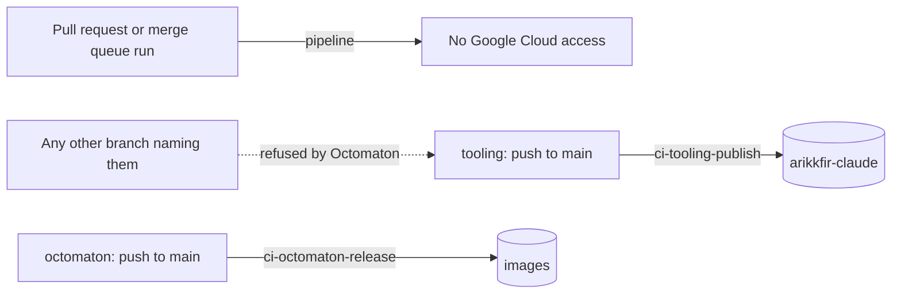

# CI ServiceAccounts

Tekton's default ServiceAccount, `pipeline`, has no Google Cloud access in any CI tenant. A pipeline that needs Google
Cloud names a ServiceAccount of its own, whose Workload Identity principal holds the roles. A ServiceAccount that
publishes can be used only from `main`. Tracked in ENG-50; the docs site's publishing moves with ENG-49.

## Why

A PipelineRun that names no ServiceAccount runs as `pipeline` (the TektonConfig's `default-service-account`), and the
pull request pipelines of `tooling` and `octomaton` name it outright. Its write roles were therefore open to every
branch: to anyone who can push one, and to every Dependabot pull request, whose dependency code runs in CI. Forks never
run.

| Tenant | `pipeline` could | Worst case |
| --- | --- | --- |
| `ci-tooling` | write bucket `arikkfir-claude` | replace `setup.sh`, which Claude Code web sessions pipe to `bash` |
| `ci-octomaton` | push to repository `images` | overwrite the image tag Octomaton runs from (tags are mutable), so a restart runs that code with the GitHub App's private key |
| `ci-docs` | write bucket `arikkfir-docs` | rewrite the docs site |

## Design

| ServiceAccount | Annotation | Roles | Named by |
| --- | --- | --- | --- |
| `ci-tooling/ci-tooling-publish` | `octomaton.dev/branches: main` | `roles/storage.objectUser`, `roles/storage.legacyBucketReader` on bucket `arikkfir-claude` | tooling's `publish` pipeline |
| `ci-octomaton/ci-octomaton-release` | `octomaton.dev/branches: main` | `roles/artifactregistry.writer` on repository `images` | octomaton's `release` pipeline |
| `<tenant>/pipeline` | none | none | every other run |

Octomaton refuses a run whose PipelineRun names an annotated ServiceAccount from any other branch
([ServiceAccount branches](../reference.md#serviceaccount-branches)). A pull request can't change the annotation, which
lives in `delivery`. `tooling` runs one PipelineRun file for both `ci` and `publish`, and a file can name only one
ServiceAccount, so it splits into `.tekton/ci.yaml` (build and verify) and `.tekton/publish.yaml` (build, verify and
upload).

Until ENG-49 moves the docs site's publishing to its own ServiceAccount, `ci-docs/pipeline` keeps its roles on
`arikkfir-docs`. The site is private and the least exposed of the three.

## Decisions

| Decision | Why | Rejected |
| --- | --- | --- |
| No roles on `pipeline` at all | A run that names no ServiceAccount runs as `pipeline`, which Octomaton never checks | Annotating `pipeline`: it would refuse every pull request run |
| One ServiceAccount per publishing pipeline, `ci-<repository>-<pipeline>` | The pattern of `ci-infra-plan` and `ci-infra-apply`; roles stay per pipeline | One shared name in every tenant: the roles differ per tenant anyway |
| Split tooling's PipelineRun file | A PipelineRun names its ServiceAccounts statically; Octomaton checks every one it names, run or not | A `when`-guarded upload task with its own ServiceAccount: still named, so pull requests would be refused |

## Rollout

1. `docs`: this design and the reference.
2. `delivery`: the two ServiceAccounts, annotated before they get any role.
3. `infra`: their roles. Pipeline `apply` applies them on merge.
4. `tooling` and `octomaton`: the push pipelines name them; `tooling` splits its PipelineRun file.
5. `infra`: `pipeline` loses its roles in `ci-tooling` and `ci-octomaton`. `ci-docs`'s go with ENG-49.
