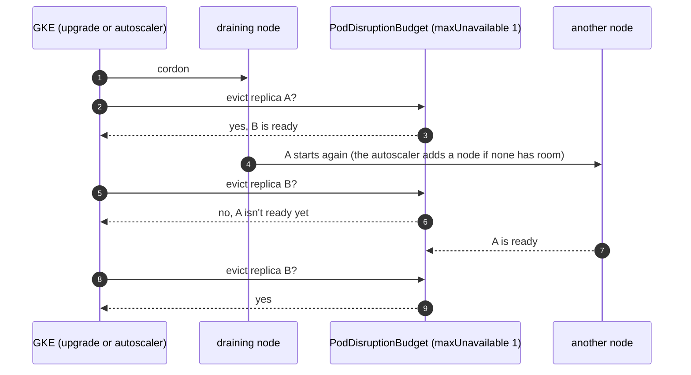
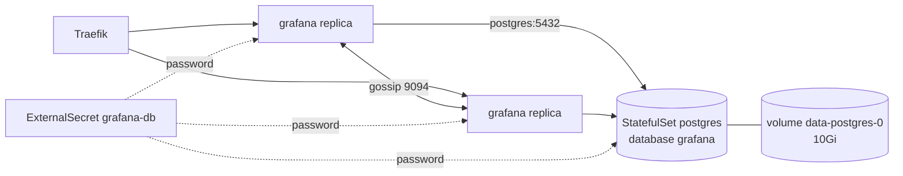

# Disruption budgets

**Decision**: every service the others depend on runs two replicas, spread over nodes when the pool has several, with
a PodDisruptionBudget of `maxUnavailable: 1`. That covers Traefik, oauth2-proxy, the docs site, Grafana, Octomaton and
its `go-import` page, and KEDA's three components. NATS keeps its chart's budget over three servers. Grafana moves its
state from a SQLite file on its own volume to a PostgreSQL database in its namespace, so that two replicas can run.
Facts:
[reference](../reference.md#kubernetes-platform). Pull requests:
[delivery#12](https://github.com/arikkfir-org/delivery/pull/12),
[octomaton#11](https://github.com/arikkfir-org/octomaton/pull/11); Grafana:
[infra#14](https://github.com/arikkfir-org/infra/pull/14),
[delivery#13](https://github.com/arikkfir-org/delivery/pull/13).

## Context

GKE drains nodes on purpose. It drains the old node in a surge upgrade, and the cluster autoscaler drains a node it
removes. A drain evicts pods, and a service with one replica is down until its pod runs again elsewhere, which takes an
image pull, a start and a readiness probe. For Traefik and oauth2-proxy that is every request. For Octomaton it is
GitHub's webhook deliveries, which GitHub doesn't retry on its own. Before this change only NATS had a budget.

## Design



| Service | Replicas | Budget | Defined in | Why several replicas work |
| --- | --- | --- | --- | --- |
| Traefik | 2 | `maxUnavailable: 1` | `delivery`: `platform/traefik/values.yaml` | Stateless; both serve both load balancers |
| oauth2-proxy | 2 | `maxUnavailable: 1` | `delivery`: `platform/auth/values.yaml` | Sessions live in cookies |
| Docs site | 2 | `maxUnavailable: 1` | `delivery`: `platform/docs/manifests/` | Each pod mounts the bucket read-only |
| Octomaton | 2 | `maxUnavailable: 1` | `octomaton`: `deploy/` | Every replica serves webhooks; the Lease holder reports, schedules and cleans up |
| `go-import` | 2 | `maxUnavailable: 1` | `octomaton`: `deploy/` | Static answers |
| KEDA operator, metrics server, webhooks | 2 each | `maxUnavailable: 1` each | `delivery`: `platform/keda/values.yaml` | KEDA keeps one operator and one metrics server active and the other on standby; both webhook replicas serve |
| NATS | 3 | `maxUnavailable: 1` (the chart's) | `delivery`: `platform/nats/values.yaml` | JetStream keeps a quorum with two of three servers |
| Grafana | 2 | `maxUnavailable: 1` | `delivery`: `platform/grafana/`, its database too | State in PostgreSQL, shared; alert state gossiped between the replicas, so each alert notifies once |

The replicas spread by host with `whenUnsatisfiable: ScheduleAnyway`. They land on different nodes when the system
pool has several, and share one otherwise, instead of making the pool grow. A drain still keeps one replica serving
with a single node: the evicted replica waits for room, which the autoscaler adds, and the budget holds the second until
the first is ready.

The extra replicas request about 0.4 CPU and 0.5Gi of memory on the system pool, mostly KEDA's. Traefik and
oauth2-proxy request nothing (their charts' defaults).

### Grafana on PostgreSQL



- PostgreSQL 18 (the official image) runs as StatefulSet `postgres` in namespace `grafana`: one replica on a 10Gi
  volume. Grafana connects to `postgres.grafana.svc.cluster.local:5432` over plain TCP. NetworkPolicy `postgres` admits
  only Grafana's pods.
- `grafana.sql` (ConfigMap `postgres`) creates role `grafana` and database `grafana` when they're missing. It also sets
  the role's password from Secret `grafana-db`, so it is safe to run any number of times.
- The image runs `/docker-entrypoint-initdb.d` only when it creates the database. An init container runs it before
  every start instead. It uses the image's own functions, the way the image's `docker-ensure-initdb.sh` does, on a
  server that listens on its socket only. So clients connect only after the script has run, a new password applies on
  the next start, and a failed first start heals on the next one.
- The owner puts a random password in Secret Manager `grafana-db-password`. ExternalSecret `grafana-db` hands it to
  both PostgreSQL and Grafana. When it changes, Reloader restarts `postgres`, which sets it, and Grafana, which reads it.
- The superuser `postgres` has no password. It signs in over the local socket only
  (`kubectl exec -n grafana postgres-0 -- psql -U postgres`), so it needs no secret.
- The database and its ExternalSecret are sync wave -1 in the `grafana` Application. Argo CD changes Grafana only once
  they are healthy, so Grafana never starts without its database.
- The two replicas share sessions, users, dashboards and alert rules through the database. Their alert managers
  gossip over Service `grafana-headless` (port 9094), so an alert notifies once. The NetworkPolicy admits that gossip
  between Grafana's own pods only.

## Decisions

| Decision | Why | Rejected |
| --- | --- | --- |
| Two replicas and `maxUnavailable: 1` | One replica always serves through a drain, and the budget stays right at any replica count | `minAvailable: 1`: the same at two replicas, but it blocks every drain if a service drops to one |
| No budget for a single replica | A budget on one pod either blocks drains (GKE waits up to an hour per node, then evicts anyway) or protects nothing | Budgets everywhere |
| Soft spread by host | Keeps the system pool at the size its load needs | Required anti-affinity: one node per replica, so a pool of at least two nodes |
| Traefik and oauth2-proxy too, though not first on the list | Every other service is reached through them; the others' budgets would protect nothing without them | Leaving them single |
| KEDA made ready now, though nothing scales through it yet | It is the hub's autoscaler for workloads to come, and it is cheap | Waiting for the first ScaledObject |
| Grafana on a PostgreSQL in its own namespace | Two replicas need a shared database. The owner chose one in the cluster, next to Grafana | Cloud SQL (the first proposal: about $12 a month, plus a VPC peering and a private zone); Grafana stateless with dashboards only as code (UI edits lost on restart); Grafana single, without a budget |
| One PostgreSQL replica, no budget | Grafana is its only client, and a move takes about a minute | A replicated PostgreSQL (an operator, and more than Grafana needs); a budget on one pod (above) |
| Migrations before every start | The image's init scripts run on an empty volume only. Running them on every start keeps them applied, new password included | The image's mechanism alone (a new password would need a manual `ALTER ROLE`); a Job (Grafana could connect before it ran) |
| No superuser password | Nothing signs in as the superuser over the network; `kubectl exec` over the socket is enough | A second Secret Manager secret |
| No TLS to PostgreSQL | Both ends are in one namespace, and the NetworkPolicy admits only Grafana | A cert-manager certificate for traffic that never leaves the namespace |
| The password by hand | Like every secret value in the hub, so Terraform state never holds one | A Terraform-generated password (it would sit in state) |

## Security and failure modes

- Budgets cover voluntary disruptions only. A node crash still takes every replica on it, and with one system node
  that is all of them.
- GKE honours a budget for up to an hour per node during an upgrade, then drains anyway.
- Permissions don't change. The network policies select pods by label, and the new replicas carry the same labels;
  Grafana's also admits its own pods on the gossip port.
- Grafana now depends on `postgres`, a single pod. Grafana loses its database while that pod moves: during a drain
  (the volume detaches and attaches, about a minute), a restart, or a password change. Grafana is a UI; nothing else
  waits on it.
- No backups. The volume is a zonal persistent disk, replicated within its zone. Losing it loses what was made in
  Grafana's UI; users come back on their next sign-in, and the data source is provisioned. Deleting the StatefulSet
  keeps the volume (the default retention).

## Rollout

1. Merge this pull request (the reference).
2. Merge the `delivery` and `octomaton` budget pull requests in any order. Argo CD scales each service to two and
   creates its budget. Nothing restarts except where a pod template changed (the spread constraint).
3. Grafana, in order:
   1. Merge the `infra` pull request and apply `terraform/gcp`. It creates the secret container and its accessor grant.
   2. Add the password:

      ```bash
      openssl rand -hex 32 | tr -d '\n' | gcloud secrets versions add grafana-db-password --data-file=-
      ```

   3. Export anything made in Grafana's UI that you want to keep (dashboards as JSON, alert rules from Alerting's
      export). The SQLite data doesn't move: users come back on their first sign-in, and the data source is
      provisioned.
   4. Merge the `delivery` Grafana pull request. Wave -1 starts `postgres`, and its init container creates the role
      and the database. Then the new Grafana replicas start on it. The old pod keeps serving until they are ready, then
      goes, and Argo CD deletes its volume.
   5. Import what you exported.
4. Check: `kubectl get pdb -A` lists `traefik`, `auth-oauth2-proxy`, `docs`, `grafana`, `octomaton`, `go-import`, the
   three KEDA budgets and `nats`, each allowing one disruption.

## Open questions

- Grafana's dashboards and alert rules could also live in Git (provisioned from `delivery`), so the database holds
  only what is made in the UI.
- Backups, if what is made in the UI becomes worth keeping: a scheduled `pg_dump` to a bucket, or volume snapshots.
