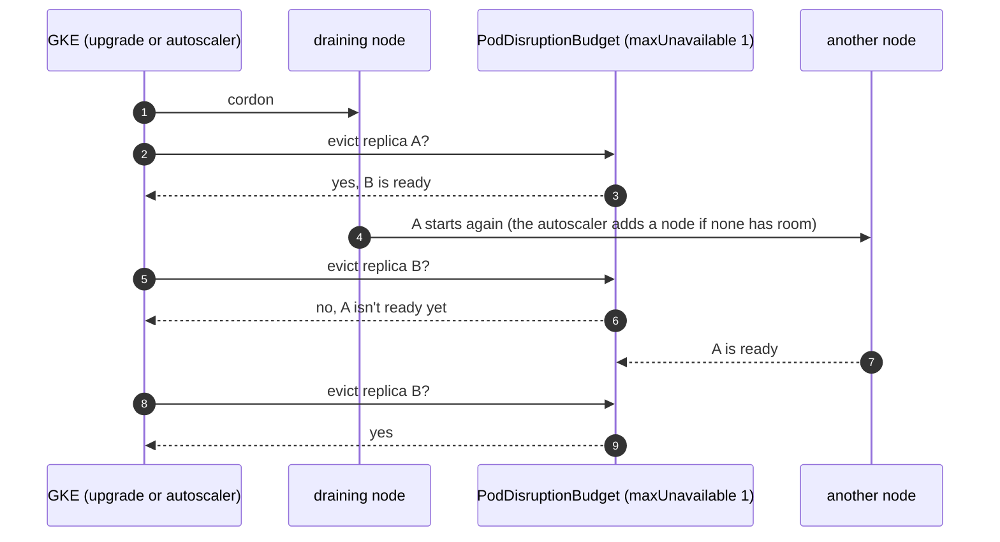

# Disruption budgets

**Decision**: every service the others depend on runs two replicas, spread over nodes when the pool has several, with
a PodDisruptionBudget of `maxUnavailable: 1`. That covers Traefik, oauth2-proxy, the docs site, Octomaton and its
`go-import` page, and KEDA's three components. NATS keeps its chart's budget over three servers. Grafana stays a single
replica with no budget, because its database lives on a `ReadWriteOnce` volume. Facts:
[reference](../reference.md#kubernetes-platform). Pull requests:
[delivery#12](https://github.com/arikkfir-org/delivery/pull/12),
[octomaton#11](https://github.com/arikkfir-org/octomaton/pull/11).

## Context

GKE drains nodes on purpose. It drains the old node in a surge upgrade, and the cluster autoscaler drains a node it
removes. A drain evicts pods, and a service with one replica is down until its pod runs again elsewhere, which takes an
image pull, a start and a readiness probe. For Traefik and oauth2-proxy that is every request. For Octomaton it is
GitHub's webhook deliveries, which GitHub doesn't retry on its own. Before this change only NATS had a budget.

## Design

| Service | Replicas | Budget | Defined in | Why several replicas work |
| --- | --- | --- | --- | --- |
| Traefik | 2 | `maxUnavailable: 1` | `delivery`: `platform/traefik/values.yaml` | Stateless; both serve both load balancers |
| oauth2-proxy | 2 | `maxUnavailable: 1` | `delivery`: `platform/auth/values.yaml` | Sessions live in cookies |
| Docs site | 2 | `maxUnavailable: 1` | `delivery`: `platform/docs/manifests/` | Each pod mounts the bucket read-only |
| Octomaton | 2 | `maxUnavailable: 1` | `octomaton`: `deploy/` | Every replica serves webhooks; the Lease holder reports, schedules and cleans up |
| `go-import` | 2 | `maxUnavailable: 1` | `octomaton`: `deploy/` | Static answers |
| KEDA operator, metrics server, webhooks | 2 each | `maxUnavailable: 1` each | `delivery`: `platform/keda/values.yaml` | KEDA keeps one operator and one metrics server active and the other on standby; both webhook replicas serve |
| NATS | 3 | `maxUnavailable: 1` (the chart's) | `delivery`: `platform/nats/values.yaml` | JetStream keeps a quorum with two of three servers |
| Grafana | 1 | none | `delivery`: `platform/grafana/values.yaml` | Its SQLite database is on a `ReadWriteOnce` volume |

The replicas spread by host with `whenUnsatisfiable: ScheduleAnyway`. They land on different nodes when the system
pool has several, and share one otherwise, instead of making the pool grow. A drain still keeps one replica serving
with a single node: the evicted replica waits for room, which the autoscaler adds, and the budget holds the second until
the first is ready.

The extra replicas request about 0.4 CPU and 0.5Gi of memory on the system pool, mostly KEDA's. Traefik and
oauth2-proxy request nothing (their charts' defaults).

## Decisions

| Decision | Why | Rejected |
| --- | --- | --- |
| Two replicas and `maxUnavailable: 1` | One replica always serves through a drain, and the budget stays right at any replica count | `minAvailable: 1`: the same at two replicas, but it blocks every drain if a service drops to one |
| No budget for a single replica | A budget on one pod either blocks drains (GKE waits up to an hour per node, then evicts anyway) or protects nothing | Budgets everywhere |
| Soft spread by host | Keeps the system pool at the size its load needs | Required anti-affinity: one node per replica, so a pool of at least two nodes |
| Traefik and oauth2-proxy too, though not first on the list | Every other service is reached through them; the others' budgets would protect nothing without them | Leaving them single |
| KEDA made ready now, though nothing scales through it yet | It is the hub's autoscaler for workloads to come, and it is cheap | Waiting for the first ScaledObject |
| Grafana unchanged | Two replicas can't share a `ReadWriteOnce` volume | See the open question |

## Security and failure modes

- Budgets cover voluntary disruptions only. A node crash still takes every replica on it, and with one system node
  that is all of them.
- GKE honours a budget for up to an hour per node during an upgrade, then drains anyway.
- Nothing changes in permissions or network policies. The policies select pods by label, and the new replicas carry
  the same labels.

## Rollout

1. Merge this pull request (the reference).
2. Merge the `delivery` and `octomaton` pull requests in any order. Argo CD scales each service to two and creates its
   budget. Nothing restarts except where a pod template changed (the spread constraint).
3. Check: `kubectl get pdb -A` lists `traefik`, `auth-oauth2-proxy`, `docs`, `octomaton`, `go-import`, the three KEDA
   budgets and `nats`, each allowing one disruption.

## Open questions

- Grafana could run two replicas only without a volume of its own. One option is dashboards and alerts as code, with
  anything made in the UI lost on restart. The other is a shared PostgreSQL database, which costs money. Until then it
  stays single, and a drain interrupts it for a minute.
