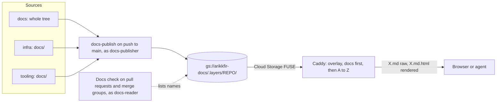

# Docs site composition

`docs.dev.kfirs.com` serves one URL space built from every repository. The `docs` repository contributes its whole
tree, and every other repository contributes its `docs/` directory. A repository keeps its docs next to its code and
changes them in the same pull request. A file path belongs to the first repository that publishes it, and a required
`Docs` check refuses any change that would take a path another repository owns. Tracked in ENG-49; it replaces the
publishing of [phase 4](phase-4-docs-site.md).

## URL space

| Source | URL | Served as |
| --- | --- | --- |
| `docs`: `dir1/doc1.md` | `/dir1/doc1.md` | the Markdown, `text/markdown` |
| | `/dir1/doc1.md.html` | the Markdown rendered as HTML, `text/html` |
| `infra`: `docs/dir1/infra-doc1.md` | `/dir1/infra-doc1.md` and `/dir1/infra-doc1.md.html` | the same |
| any repository: `x.html`, `x.png`, … | `/x.html`, `/x.png`, … | unchanged |
| | `/old.html`, when no file `old.html` exists | a redirect to `/old.md.html`, so phase 4's links keep working |

A path with any file or directory name that starts with `.` is hidden and never published: `.github/`, `.tekton/`,
`.ci/`, `.site/` and dotfiles. A source named `*.md.html` is refused, since that name belongs to a rendered page. There
are no listings, index pages or navigation. Directories are shared, so `dir1/` above holds files from two repositories.

## Design

### Layers

Each repository's sources live in its own layer, `gs://arikkfir-docs/.layers/<repository>/`, mirrored on every push to
`main`: changed files are uploaded, and removed files are deleted from that layer only. Only sources are stored. HTML is
rendered on request, so a page stays current with the site template without being republished.

### Serving

Caddy overlays the layers in a fixed order: `docs` first, then the other repositories alphabetically. A request is
answered from the first layer that has the path.

- `X.md` is served as the file, with `Content-Type: text/markdown; charset=utf-8`.
- `X.md.html` renders `X.md` from the first layer that has it, through Caddy's `templates` and its `markdown` function
  (goldmark: GitHub Flavored Markdown, footnotes, heading IDs). The page template takes the first `#` heading as the
  title, rewrites relative links to `.md` files into links to their `.md.html` pages, and renders Mermaid blocks in the
  browser. The template reads the Markdown with `readFile`, which never executes it as a template, so a `{{ … }}` in a
  document stays text.
- Hidden paths and directories answer 404. A missing `X.html` redirects to `X.md.html`.

The page template and the Caddyfile live in `delivery` (`platform/docs`), and the list of layers there is the overlay
order. A repository that isn't listed publishes its layer, but nothing of it is served.

### Collisions

A file path belongs to the repository that published it first.

- The `Docs` check lists the other layers' paths and fails when a change publishes a path that another repository
  already has, naming it. Renaming or moving either file resolves it. It runs on pull requests and in the merge queue,
  and the ruleset requires it.
- Directories never collide, only files.
- The check can't see a race: two repositories merging the same new path before either publishes. The site then serves
  the first in overlay order, and the `Docs` check of both repositories fails until one of them renames. The collision
  is never silent, and the site never serves an arbitrary winner.

### Pipelines and identities

Two organization pipelines, declared in `tooling`'s `.octomaton.yaml` and run by every repository:

| Pipeline | Trigger | Steps | ServiceAccount |
| --- | --- | --- | --- |
| `docs` (check `Docs`) | pull requests, merge groups | refuse `*.md.html` sources; check that relative links resolve against the composed site (this change's sources plus the other layers); check collisions | `docs-reader` |
| `docs-publish` | push to `main` | mirror the sources to the repository's layer, then run the same checks | `docs-publisher`, annotated `octomaton.dev/branches: main` |

Both ServiceAccounts exist in every CI tenant. Their roles bind to their Workload Identity principals:

| ServiceAccount | Role on `arikkfir-docs` | Can |
| --- | --- | --- |
| `ci-<repository>/docs-reader` | `roles/storage.legacyBucketReader` | list object names, but not read objects |
| `ci-<repository>/docs-publisher` | `roles/storage.objectUser`, with an IAM condition limiting it to `.layers/<repository>/`, and `roles/storage.legacyBucketReader` | write its own layer, and list |

The pipelines' PipelineRuns and scripts live in `tooling` (`docs-site/`), like the reviewer's. A repository can't
change them. Its pull requests are data to them, and its content is never executed. `docs` no longer has a publish
pipeline or render scripts of its own, and nothing pushes to its `main` directly.

### Writing docs

- Put a repository's docs under its `docs/` directory. They appear at the site root, so `docs/guide.md` is at
  `/guide.md.html`.
- Link with relative paths against the composed site. A link from `infra/docs/x.md` to `../hub/reference.md` resolves
  on the site, though not on GitHub.
- Hub-wide pages, such as the reference, stay in `docs`. A design ships with its change, in that repository's `docs/`; one that spans repositories goes in the leading one, or is split under a shared directory ([Design documents](../../CONTRIBUTING.md#design-documents)).

## Decisions

| Decision | Why | Rejected |
| --- | --- | --- |
| A path belongs to its first publisher; the check enforces it before merge | No document is ever hidden silently | A fixed precedence: a lower repository's file would quietly vanish. A directory per repository: the shared URL space is the point |
| Overlay at serve time | Each repository writes only its own layer, which IAM enforces, and publishes on its own push | Composing one tree at publish time, which needs either one writer triggered by every repository (Octomaton has no cross-repository trigger) or every repository writing the whole site |
| Render on request with Caddy | Publishing is a plain mirror, and a template change applies to every page at once | Rendering with pandoc at publish time: every repository's layer would need a re-render after each template change, and every page would be stored twice |
| `X.md.html`, not `X.html` | A rendered page never clashes with a hand-written `X.html`, so phase 4's rule against `x.md` next to `x.html` goes | `X.html`, which needs that rule |
| Organization pipelines in `tooling` | Every repository gets them without configuration, and none can change them | A copy in each repository's `.octomaton.yaml` |
| Pull request checks list names as `docs-reader` | Collisions and cross-repository links need the other layers, including internal repositories' | GitHub's API: Octomaton's token covers only the run's own repository |
| Only default branches publish | The site documents what is merged | Branch previews: not needed now |
| `docs-publish` mirrors first, then checks | What is merged is published. A problem found only after merging, such as a race collision or a link another repository broke, shows on `main` without holding back the rest of the layer | Checking first: one problem would freeze the whole layer |

## Security

- **Publishing:** a layer is written only by its own repository's `docs-publisher`, only from `main`, and only inside
  its prefix.
- **Pull requests:** the `Docs` check runs as `docs-reader`, which can list the bucket's object names but can't read or
  write objects. That is all this design gives a branch other than `main`. Access that other pull request pipelines
  already have, such as `infra`'s `ci-infra-plan`, is unchanged
  ([GCP identities](../reference.md#gcp-identities-and-permissions)).
- **Rendering:** documents can contain raw HTML, which is rendered as written, as pandoc did. The site stays behind the
  hub's sign-in, and only organization repositories publish.
- **Public exception:** `legal.kfirs.com`, on the public gateway, serves only the exact paths `/privacy.html`,
  `/tos.html` and their `.md.html` pages, for the Google OAuth app's branding. Both pages are this repository's, whose
  layer comes first, so no other repository can replace them; every other path on that host is a 404.
- **Internal repositories:** every repository takes part, `fin` (internal) included. Its pages are served behind the
  hub's sign-in, whose users the owner manages, like every other hub tool. The names of its files, but not their
  content, are visible to every tenant's `docs-reader`, since listing can't be limited to a prefix.

## Failure modes

| Failure | Effect |
| --- | --- |
| `docs-publish` can't mirror | The layer stays as it was, or partly updated; the run on `main` shows the error, and a re-run or the next push mirrors it again |
| `docs-publish`'s checks fail | The layer is already published; the run on `main` shows the problem until a fix merges |
| A race collision | Both repositories' `Docs` checks fail until one renames; the site serves the first in overlay order |
| A repository is missing from Caddy's layer list | Its layer isn't served; add it to the list when adding the repository |
| A page can't render | That page answers 500; the raw `X.md` still works |

## Rollout

1. `docs`: this design and the reference (arikkfir-org/docs#37).
2. `delivery`: `docs-reader` and `docs-publisher` in every CI tenant. Caddy overlays the layers and renders Markdown, with today's bucket root as a last fallback, so the site keeps working while layers fill (arikkfir-org/delivery#22, arikkfir-org/delivery#23).
3. `infra`: the two ServiceAccounts' roles, applied on merge (arikkfir-org/infra#26).
4. `tooling`: the organization pipelines `docs` and `docs-publish`. Each repository publishes its layer on its next push to `main` (arikkfir-org/tooling#10).
5. `infra`: `Docs` becomes a required check (arikkfir-org/infra#29).
6. `docs`: drop its `publish` pipeline and `.site/`, leaving `ci` with nothing to check; links to `*.html` pages become `*.md.html` (arikkfir-org/docs#39).
7. `delivery`: drop the fallback (arikkfir-org/delivery#24). The owner deletes the old root objects with `gcloud storage ls gs://arikkfir-docs/ | grep -v '/\.layers/$' | xargs gcloud storage rm -r`, and `infra` drops `ci-docs/pipeline`'s roles, the last a `pipeline` ServiceAccount holds (arikkfir-org/infra#30, [CI ServiceAccounts](ci-service-accounts.md)).
