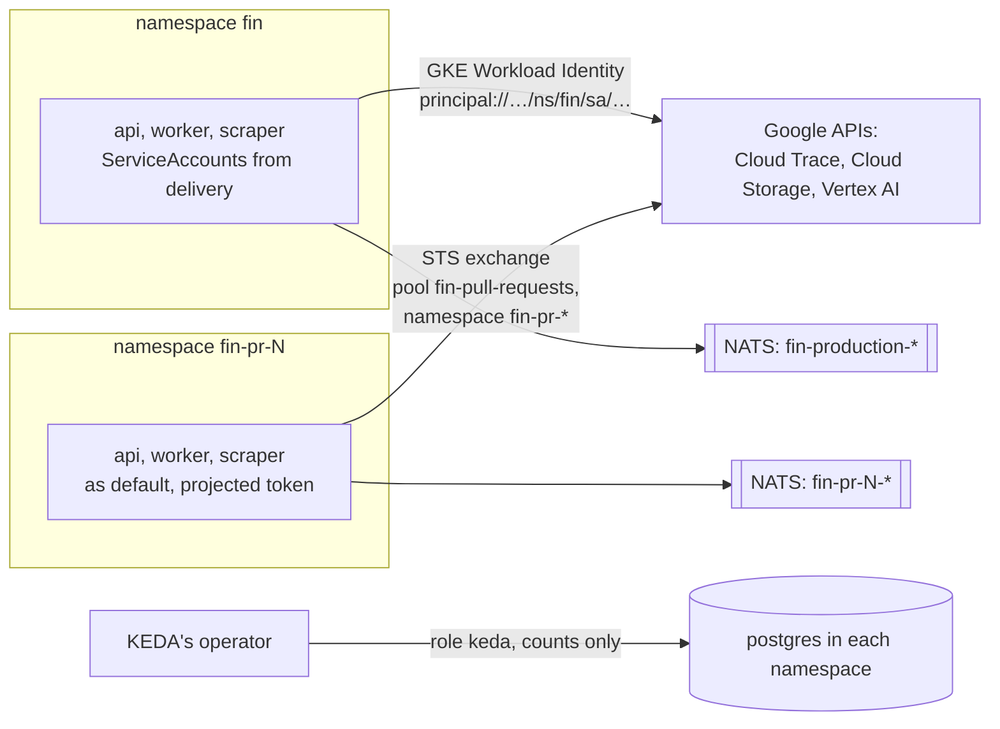

# Fin on the hub

**Decision**: Fin's new deployables (fin-worker, fin-scraper), its NATS resources, its autoscaling and its Google identities fit the hub the way its first deployment did: Fin's `deploy/` declares what runs in its namespaces, `delivery` admits each new kind only with an admission policy that holds what it may say, and `infra` grants Google access to named Kubernetes identities. Production uses GKE's own Workload Identity; pull requests' environments, whose namespaces come and go, share one Workload Identity Federation pool, `fin-pull-requests`, limited to namespaces named `fin-pr-*`. The contract is in the [reference](../reference.md#fin); Fin's architecture is in its [design](https://github.com/arikkfir-org/fin/blob/main/docs/fin/designs/architecture.md).

## Context

- Fin grows from a server and an app to five deployables: fin-api, fin-web, fin-worker (outbox relay, consumers, scheduler, jobs, model calls), fin-scraper (a Kubernetes Job per bank scrape, with Chromium) and the migrations. They talk through NATS JetStream, scale with KEDA, store scrape videos and traces in Cloud Storage, write traces to Cloud Trace and call Claude and Gemini on Vertex AI.
- Fin's `deploy/` runs from pull requests' head commits, so the AppProjects admit only kinds that can't reach beyond the environment, and admission policies hold the rest. A NACK `Stream` named like production's would take over production's stream; a KEDA trigger can make KEDA's operator connect anywhere; a Traefik `Middleware` can rewrite any request.
- GKE's Workload Identity grants to `ns/<namespace>/sa/<name>` or to a whole namespace, both named in advance. Terraform can't name a pull request's namespace before it exists, and granting the whole cluster would hand every CI run, from any branch, the same access.
- Fin's code may not make ServiceAccounts, and production's workloads need distinct identities: a compromised scraper must not read the videos and traces it wrote, which hold the typed read-only passwords.

## Design

## Decisions

| Decision | Why | Rejected |
| --- | --- | --- |
| Admit NACK's `Stream`, `Consumer` and `KeyValue` with policy `fin-jetstream`: names `fin-<env>-…`, subjects `fin.<env>.…`, no servers, credentials, mirrors or sources | Streams are declared, reviewed and deleted with their environment, and no environment can touch another's | Streams created by code; NACK resources unchecked, so a pull request could redefine production's |
| Admit KEDA's `ScaledObject`, `ScaledJob` and `TriggerAuthentication` with policy `fin-keda`: triggers `cpu`, `memory`, and `postgresql` on the environment's own database only; authentication only a `password` from a Secret | Scaling on queued work (outbox rows, scrape requests) without letting a pull request point KEDA's operator elsewhere | HorizontalPodAutoscaler on CPU alone, which can't start a Job per scrape; any trigger |
| Admit Traefik's `Middleware` with policy `fin-middlewares`: one ForwardAuth to oauth2-proxy that copies `Authorization` | The API validates the hub's ID token itself, as Argo CD does; the Middleware must live in the route's namespace | Copying the ID token on the entry point, which hands it to every protected backend |
| Production's ServiceAccounts `api`, `worker` and `scraper` come from `delivery` | Distinct identities with the narrowest grants, and Fin's code still makes no ServiceAccounts | One identity per namespace, which gives the scraper the API's reads |
| Pull requests' environments share pool `fin-pull-requests`, whose provider trusts the hub cluster's tokens only from `fin-pr-*` namespaces | Their environments reach Cloud Trace, their bucket and Vertex AI, so traces, videos and the assistant can be tried before merge; CI tenants and other namespaces can't use it | No Google access in pull requests; a grant to the whole cluster; Google service account keys |
| One bucket for every pull request, under `pr-<number>/`, deleted after 7 days; production's after 30 | Pull requests run Demo Bank only, so sharing exposes nothing real; lifecycle rules clean up what an environment leaves | A bucket per pull request, which Terraform can't create |
| What differs inside a pull request's environment and grants nothing (the identity's credential file, NATS teardown, one replica, one scrape at a time, a generated sealing key, Demo Bank only) is fin's component `components/pull-request`; `delivery` keeps what limits it (namespace label, quota, hosts, Secret Manager's reach) | A new resource and its pull-request variant land in one fin pull request, instead of a `delivery` change after each merge | All of it as `delivery` patches, each of which must wait until fin's `main` has its target |
| The API moves under `/api` on the app's host, and the `api` hosts go once it has | One origin: no CORS, no preflight, one cookie domain | Keeping a second host |

## Failure modes

- A NATS client needs no credentials, so any pod that reaches the cluster can use any subject; the policies stop environments from redefining each other's streams, and NetworkPolicies decide which pods reach NATS.
- A pull request's code decides what `components/pull-request` says, but it can only narrow: its identity's grants are fixed in `infra`, and its quota, hosts and labels come from `delivery`.
- `delivery` lists `components/pull-request` with `ignoreMissingComponents: true`, so a pull request whose head predates the component still deploys, without the pool's credentials.
- The pool's provider reads the cluster's signing keys from its public issuer; recreating the cluster changes the issuer, and the provider must follow.

## Rollout

1. This reference change.
2. `infra`: the pipelines' roles for Workload Identity pools, applied by hand, since the pipelines can't change their own roles.
3. `infra`: the pool, the grants, the buckets, the secret and Vertex AI's API; then the owner adds the sealing key's value and enables Claude Opus 5.5 in Model Garden.
4. `fin`: `components/pull-request`, and `deploy/manifests.sh` applying `ignoreMissingComponents`.
5. `delivery`: the admitted kinds and their policies, production's ServiceAccounts and images, and the component's listing.
6. `fin`: the slices that use them. Once fin's `/api` route serves production, `infra` and `delivery` drop the `api` hosts.
