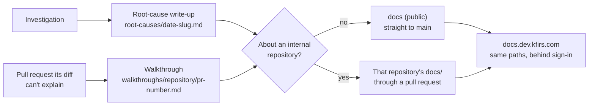

# Investigations and walkthroughs

**Decision**: every investigation ends in a root-cause write-up, whether or not it leads to a fix, and a pull request a reviewer can't follow from its diff gets a walkthrough. Both follow a fixed skeleton ([root-cause write-up](../templates/root-cause.md), [walkthrough](../templates/walkthrough.md)) and share one visual vocabulary, the [writing toolkit](../templates/toolkit.md). They live in `docs`, which is public, unless they're about an internal repository (`fin`): then they live in that repository's own `docs/`. Ticket: [ENG-51](https://linear.app/arikkfir/issue/ENG-51). Pull request: [docs#47](https://github.com/arikkfir-org/docs/pull/47).

## Context

- An investigation done in a session ends in its chat, where the next person can't find it, so they investigate again.
- A diff lists files alphabetically. A reviewer facing a change across components gets the files, not the story, and the description has to stay short: it becomes the merge commit's body.
- `weesp-ai`, another GitHub organization the owner works in, settled both with fixed-shape pages. These templates adapt them to the hub.
- `docs` is public; `fin` is internal, visible only to the organization's enterprise members ([reference](../reference.md)). The docs site composes every repository's `docs/` into one URL space behind sign-in, `fin`'s included ([docs site composition](docs-site-composition.md)).

## Design

A write-up describes what is, so in `docs` it goes straight to `main`, as `CONTRIBUTING.md` allows for the present. A walkthrough goes there once its pull request exists, like a design for work in flight. In an internal repository both go through pull requests, its default branch's only way in, and a walkthrough rides the pull request it explains.

## Decisions

| Decision                                           | Why                                                                                                                      | Rejected                                                                                                    |
|----------------------------------------------------|--------------------------------------------------------------------------------------------------------------------------|-------------------------------------------------------------------------------------------------------------|
| Every investigation ends in a write-up, fix or not | A dead end is a result too: the next person reads it instead of investigating again                                      | Writing up only investigations that lead to a fix: the dead ends get investigated twice                     |
| A fixed skeleton per kind                          | The reader knows where to find the cause, the evidence and the confidence; the writer can't skip the uncomfortable parts | Free-form pages                                                                                             |
| Placement follows the repository's visibility      | A write-up quotes logs, queries and data; about `fin`, those must stay as private as its code                            | One public place for everything (`docs`): an internal repository's write-up would be readable by anyone     |
| Walkthroughs are pages of their own                | A walkthrough explains one diff and is done when it merges; a design says why the system is shaped this way and stays    | The pull request description: it becomes the merge commit's body, and a long story there buries the summary |
| Emoji status markers                               | They look the same on GitHub, on the docs site and in a terminal                                                         | Coloured HTML labels: GitHub strips inline styles                                                           |
| Mermaid diagrams and `
` drill-downs       | GitHub and the docs site render both                                                                                     | Drawn images: they go stale silently, and nobody can review them as a diff                                  |

## Failure modes

- Nothing checks that an investigation ended in a write-up; the rule holds as long as people and sessions follow `CONTRIBUTING.md`.
- A write-up in `docs` is public as soon as it's pushed, and Git keeps it even if it's deleted later. The template asks for no credentials or personal data in any write-up, wherever it lives.
- An internal repository's file names are visible to every repository's `Docs` check, which can list the site's objects. The template asks for slugs without private details.

## Rollout

None: new pages and guidance. `root-causes/` and `walkthroughs/` appear with their first page.
