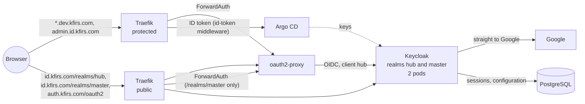
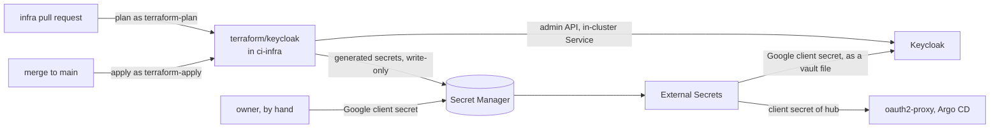

# Keycloak

**Decision**: the hub runs its own identity provider, Keycloak 26.8, in the hub cluster under its official operator, and configures it entirely with Terraform. Realm `hub` signs people in with Google, and only the people `terraform/keycloak` declares. oauth2-proxy and Argo CD move from Descope to Keycloak in one pull request, which a revert undoes, and Descope is retired a week later. Names, hosts, secrets and identities: [reference](../reference.md#authentication). Work: Linear project [Replace Descope with Keycloak](https://linear.app/arikkfir/project/replace-descope-with-keycloak-ea4810dd95aa), ENG-52 to ENG-63.

## Context

- Descope decided who signed in: the users of its project `development`, created by hand in its console, through a flow configured there too ([phase 3](phase-3-ingress-and-auth.md)). Who may sign in is configuration outside Git, and no change to it is reviewed.
- Every protected host (Argo CD, Grafana, Tekton, NUI, the Traefik dashboard, the docs site) signs in through oauth2-proxy, and Argo CD verifies the ID tokens of the same client. The identity provider is on the path of every request.
- Apps beyond the hub will need sign-up, organizations and users of their own ([later](#later)), which an identity provider the hub runs can grow into.

## Design

After the cutover, a sign-in goes from oauth2-proxy to Keycloak, which sends the browser straight to Google. Keycloak links the Google identity to the user Terraform declared with the same email, or refuses it. Keycloak keeps its sessions in PostgreSQL, so restarting a pod signs nobody out.

Terraform owns Keycloak's configuration from its first apply. It never reads a secret's value, so pull request plans need no access to any secret.

### In the cluster

| Piece | Design |
| --- | --- |
| Operator | Application `keycloak-operator` (wave 3): the operator's pinned release kustomization (CRDs, RBAC, the operator), in namespace `keycloak`, watching that namespace only. Server-side apply, for its large CRDs |
| Keycloak | Application `keycloak` (wave 4), namespace labelled `kfirs.com/public-ingress`. Resource `keycloak`: two instances spread over nodes (`ScheduleAnyway`), a PodDisruptionBudget of `maxUnavailable: 1`, the image pinned and started unoptimized, the file vault mounted from Secret `keycloak-vault`, the bootstrap admin from Secret `keycloak-bootstrap-admin` |
| Database | PostgreSQL 18 as StatefulSet `postgres`, Grafana's shape ([disruption budgets](disruption-budgets.md#grafana-on-postgresql)): one replica on a 10Gi volume; role and database `keycloak`, created by the image on the volume's first start; a password generated in the cluster; every TCP connection needs it, only the local socket is trusted |
| Hosts | `id.kfirs.com` on the public gateway routes `/realms/hub` and `/resources`, and `/realms/master` behind the hub's sign-in (Middleware `keycloak/oidc`), where the admin console signs in. `admin.id.kfirs.com` on the protected gateway routes `/` (Keycloak redirects it to the console), `/admin`, `/realms/master` and `/resources`, behind the hub's sign-in. The gateways' `*.kfirs.com` listeners match both; the wildcard certificate gains `admin.id.kfirs.com`, which is two labels deep |
| Network | The operator's NetworkPolicy admits Keycloak's HTTP port from namespaces `traefik` (both hosts) and `ci-infra` (Terraform) only. NetworkPolicy `postgres` admits only Keycloak's pods |
| Sync waves | In `keycloak`: the database and the ExternalSecrets in wave 0, Keycloak in wave 1, the routes in wave 2 |

### Configuration

| Piece | Design |
| --- | --- |
| Root | `terraform/keycloak`, state prefix `keycloak`, with providers `keycloak/keycloak` 5.9, `hashicorp/google` 8.5 and `hashicorp/random` 3.9 |
| Realm `hub` | Registration and password reset off; people exist only because Terraform declares them, keyed by the email of their Google account, and test users only while a run of Fin's end-to-end suite needs them (infra's `docs/infra/designs/test-users.md`). Access tokens live 10 minutes, longer than oauth2-proxy's 5-minute refresh, so the ID token it hands Argo CD never expires first. SSO sessions idle out after 7 days and end after 30 |
| Browser flow | Realm `hub`: Keycloak's own `browser`, set on the realm: an existing session, or Keycloak's login page, with the password form and a Google button (infra's `docs/infra/designs/test-users.md`). Realm `master`: `browser-google`, an existing session, or the redirect to Google |
| First login | `existing-users-only`: detect the existing user with the Google identity's email, then link it; anyone else is refused. Keycloak documents this flow ([existing users only](https://www.keycloak.org/docs/latest/server_admin/index.html#_detect_existing_user_first_login_flow)) |
| Identity provider `google` | Its client secret is the vault reference `${vault.google-client-secret}`: Keycloak reads the file `hub_google-client-secret` from its vault, which External Secrets fills from Secret Manager |
| Client `hub` | Confidential, standard flow only, shared by oauth2-proxy and Argo CD; its tokens carry the user's groups (`groups`) |
| Client `fin-e2e` | Fin's CI: creates, signs in and deletes members of group `fin-e2e`, through realm `hub`'s fine-grained admin permissions (infra's `docs/infra/designs/test-users.md`) |
| Pipelines | Service accounts `terraform-plan` (`view-realm` and `view-clients` of realm `master`, and `view-clients` of realm `hub`) and `terraform-apply` (realm role `admin`) in realm `master` |
| Generated secrets | One ephemeral `random_password` per secret, written write-only to Keycloak (`client_secret_wo`) and to Secret Manager (`secret_data_wo`), each with a version in `local.secret_versions`. Bumping a version rotates that secret |

## Decisions

| Decision | Why | Rejected |
| --- | --- | --- |
| The official Keycloak operator 26.8.0, from its pinned release kustomization | Keycloak's own deployment, released with Keycloak. The hub adds what it lacks: a PodDisruptionBudget and HTTPRoutes | codecentric `keycloakx` (lags upstream); Bitnami (versioned images no longer free) |
| A local PostgreSQL: one StatefulSet in namespace `keycloak`, like Grafana's | The simplest option, and a pattern the hub already runs. Terraform recreates all of Keycloak's configuration, so losing the data costs only sessions and Google links. The price: sign-in pauses while the database pod restarts | CloudNativePG with two instances (an operator to run; worth it once apps keep their users here, see [later](#later)); Cloud SQL (cost) |
| One realm, `hub`, and one confidential client, `hub`, for oauth2-proxy and Argo CD | Argo CD verifies the ID tokens oauth2-proxy forwards, so both must share the audience, as they share Descope's client today | Separate clients (Argo CD would need `allowedAudiences`) |
| Users declared in Terraform; Google login links to them by email; registration off | The list of who can sign in becomes reviewed code. Keycloak documents this exact "existing users only" first-login flow | Users managed in the console, as with Descope |
| Logins go straight to Google | One click: the browser flow redirects to Google instead of showing Keycloak's form. Superseded in realm `hub` on 8 October: Fin's test users sign in with passwords, so its login page shows the form beside Google (infra's `docs/infra/designs/test-users.md`) | Keycloak's login page with a Google button |
| Terraform generates client secrets and writes them write-only to Keycloak and Secret Manager | No secret in state or plan. With a write-only version set, refreshing a Secret Manager version never reads its value (checked in the Google provider's source), so plans need no secret access | Keycloak-generated secrets read into state; plans reading secrets from Secret Manager |
| The Google client secret reaches Keycloak through its file vault | It is the one secret Terraform can't generate, so it takes the hub's usual path: `terraform/gcp` creates the empty secret, the owner adds its value, External Secrets syncs it into Secret `keycloak-vault`, and Keycloak's pods read it from that mounted file. Terraform stores only the reference. Keycloak's vault serves identity providers' secrets, never a client's own secret, hence the previous row | Reading it in Terraform, which pull request plans would then need access to |
| Drop `offline_access`; SSO sessions idle 7 days, at most 30 | Since 26.1, requesting `offline_access` at the first login skips Keycloak's SSO cookie. Long SSO sessions keep today's experience | Keeping `offline_access` |
| Admin console only on `admin.id.kfirs.com`, behind the protected gateway | `/admin` and the master realm are reachable only behind the hub's sign-in. The console signs in against Keycloak's frontend hostname, so `id.kfirs.com` also serves `/realms/master`, but through a ForwardAuth to oauth2-proxy (Middleware `keycloak/oidc`). It is the identity platform's own console, not a dev tool, so it sits under `id.kfirs.com` rather than `dev.kfirs.com`. It needs a host of its own, because it uses the protected gateway's IP. `*.kfirs.com` doesn't cover a name two levels deep, so it joins the wildcard certificate; the issuer already solves DNS-01 in zone `kfirs-com`. Break-glass: `kubectl exec` and `kcadm.sh` | A public admin console; `keycloak.dev.kfirs.com` (it isn't a dev tool); `id-admin.kfirs.com` (no certificate change, but reads as a sibling of `id`, not part of it); `*.id.kfirs.com` on the certificate (only one host needs it) |
| Two pipeline service accounts in the master realm: `terraform-plan` (view roles) and `terraform-apply` (admin) | The same plan and apply split as for GCP ([Terraform plan and apply](terraform-plan-apply.md)); created by the first apply, which runs by hand as the bootstrap admin | One credential for both |
| Administrators sign in to the console with Google: users of realm `master`, declared in Terraform (`admin = true`), with realm role `admin` | The same sign-in as the hub, with no password anywhere; realm role `admin` administers every realm, `hub` included. Found after the cutover: the console signs in against the frontend hostname (ENG-66) | A password admin in realm `master`; admins of realm `hub` only, through `realm-management` roles, who can't administer `master` |
| Pull request plans of `keycloak` don't refresh, so `terraform-plan` reads only the data sources: `view-realm` and `view-clients` of realm `master` | Keycloak 26.8 shows a client's secret only to administrators who can manage clients, and the provider reads it to refresh a client. `apply` refreshes as `terraform-apply`, so a change made in Keycloak itself shows in the `Apply` check and is reverted | `manage-clients` for `terraform-plan`: it could read `terraform-apply`'s secret, and so administer Keycloak, from any branch |
| New secret names; cut over in one pull request; keep Descope for a week | Reverting the cutover returns to Descope at once, because `oidc-client-secret` still holds Descope's key. In the event, the owner retired Descope on the cutover's day, once step 11 passed | Reusing `oidc-client-secret` (breaks Descope sign-in before the cutover) |
| The HTTPRoutes sync in wave 2, after Keycloak | Argo CD marks a route whose backend Service is missing Degraded, which fails the sync. The operator creates `keycloak-service` only once Keycloak (wave 1) exists, so routes in an earlier wave would never let Keycloak be created | The routes in wave 0 with everything else |
| The Keycloak image is pinned and started unoptimized (`startOptimized: false`) | Naming an image makes the operator start it `--optimized`, which the stock image, never built for PostgreSQL or the file vault, can't run | Leaving the image to the operator's default (pinned only through the operator's release) |

## Security and failure modes

- **Keycloak down means every protected host is down.** The way back doesn't need it: `kubectl` through the GKE DNS endpoint, the Argo CD CLI through a port-forward, and CI through Octomaton, which only needs GitHub. Two Keycloak pods and a PodDisruptionBudget make it rare; the database is the one single instance.
- **Sign-in pauses while the database restarts.** A node drain, a GKE upgrade or a crash of the one PostgreSQL pod stops new sign-ins and token refreshes for the minute or so it takes to come back. Existing oauth2-proxy sessions keep working until their next refresh. CloudNativePG removes this ([later](#later)).
- **Bootstrapping from nothing needs a placeholder secret.** Argo CD's own Application (wave 2) and oauth2-proxy read `keycloak-hub-client-secret`, which `terraform/keycloak` writes only once Keycloak (wave 4) runs. Without a placeholder version, their ExternalSecrets have nothing to read, and the root Application never reaches wave 4 ([bootstrap runbook](../runbooks/bootstrap.md), steps 5 and 8).
- **With Keycloak down, every infra pull request's check fails**, once the pipelines plan `keycloak`: its plan runs in the same `Continuous Integration` check as `gcp` and `github`. A fix that Keycloak itself needs merges with the admin bypass, or applies by hand with `make terraform keycloak`.
- **Each quarterly minor upgrade restarts every pod.** Only the latest minor gets fixes, and pods of two minors can't run side by side. Each upgrade is a pull request that bumps the operator and the image together, merged at a quiet time: sign-in pauses for about a minute.
- **Losing the database loses sessions and Google links.** Terraform recreates the whole configuration, and users link again at their next sign-in. Backups come before any app keeps users that Terraform doesn't declare; Fin's test users, which live for one run, came first by the owner's choice (infra's `docs/infra/designs/test-users.md`).
- **Memory.** Two pods request 1.5Gi each, and PostgreSQL adds a small one: the system pool may grow to a second node. The requests are sized again from a week of real use.
- **Exposure.** Only realm `hub` and static resources are public. The admin console and realm `master` are reachable only behind the hub's sign-in: on the protected gateway, and on `id.kfirs.com/realms/master` through the same ForwardAuth, and Keycloak's pods admit only Traefik and `ci-infra`. Keycloak trusts the `X-Forwarded-*` headers of whatever reaches it, which only those two can.
- **Secrets.** No secret reaches Terraform's state, its plans or Git. The plan pipeline's Keycloak credential only reads; the apply pipeline's is an administrator, used only on `main` (Octomaton's ServiceAccount branch check). The bootstrap admin, a full administrator, is deleted once the pipelines apply `keycloak`.
- **Unverified Google emails.** The first-login flow links by email and doesn't check `email_verified`. Every declared user today is a Gmail address, which Google verifies; before declaring an address that isn't one, filter the identity provider on that claim (open questions).

| After step | Effect on sign-in | To undo |
| --- | --- | --- |
| 1–9 | None: Descope still signs everyone in | Revert or leave the pull requests; nothing depends on them yet |
| 10–11 | Every protected host uses Keycloak | Revert step 10. `oidc-client-secret` still holds Descope's key, so Descope sign-in returns as soon as Argo CD syncs |
| 12–14 | Descope is gone | No way back to Descope: hence the planned week's wait before step 12, which the owner waived |

## Rollout

Each step depends on the ones before it. Until step 10, nobody signs in differently.

| Step | Where | What | Issue |
| --- | --- | --- | --- |
| 1 | `docs` | The reference names everything the next steps create, and this design | ENG-52 |
| 2 | `infra`, `terraform/gcp` | Hosts `id` (public) and `admin.id` (protected); secrets `keycloak-bootstrap-admin`, `keycloak-google-client-secret`, `keycloak-hub-client-secret`, and the pipeline-only `infra-plan-keycloak-secret` and `infra-apply-keycloak-secret`; `ci-infra-plan` reads its own. The merge applies it | ENG-53 |
| 3 | Owner | In the GCP console for project `arikkfir` (Google Auth Platform): branding, an external audience published to production, and a web client with redirect URI `https://id.kfirs.com/realms/hub/broker/google/endpoint`. Its secret goes into `keycloak-google-client-secret`, its client ID to step 5. A random value goes into `keycloak-bootstrap-admin` (`openssl rand -hex 32`) | ENG-54 |
| 4 | `delivery` | The operator, PostgreSQL and Keycloak; the routes; `admin.id.kfirs.com` on the wildcard certificate. Merges after step 3: without the secrets' values, the ExternalSecrets fail and Keycloak can't start | ENG-55 |
| 5 | `infra` | The `terraform/keycloak` root; `ROOTS` in the `Makefile`, the validate loop in `ci.yaml`, README and CLAUDE.md. The pipelines don't plan or apply it yet | ENG-56 |
| 6 | Owner | First apply, as the bootstrap admin: `kubectl -n keycloak port-forward svc/keycloak-service 8080`, then `make terraform keycloak ARGS="-var keycloak_url=http://localhost:8080"` with `KEYCLOAK_CLIENT_ID=bootstrap-admin` and `KEYCLOAK_CLIENT_SECRET` from `keycloak-bootstrap-admin` | ENG-57 |
| 7 | `infra` | The pipelines plan and apply `keycloak` after `gcp` and `github`, as `terraform-plan` and `terraform-apply`; the `token` steps also read the Keycloak secrets. Pull request plans don't refresh, and `terraform-plan` keeps only `view-realm` and `view-clients` of realm `master` | ENG-58 |
| 8 | Owner | Delete the bootstrap admin in realm `master` | ENG-59 |
| 9 | Check | `https://id.kfirs.com/realms/hub/account` goes straight to Google and signs in the declared user; an undeclared Google account is refused | ENG-60 |
| 10 | `delivery` | The cutover: issuer `https://id.kfirs.com/realms/hub`, client `hub`, scopes without `offline_access`, both ExternalSecrets reading `keycloak-hub-client-secret`; Argo CD's middleware `descope-token` becomes `id-token`. Everyone signs in once more | ENG-60 |
| 11 | Check | Argo CD (through the interceptor, and with "Log in via Keycloak"), Grafana, Tekton, NUI, the Traefik dashboard and the docs site sign in with Google; an unlisted account is refused everywhere. Otherwise revert step 10 | ENG-60 |
| 12 | `infra`, `terraform/gcp` | Remove `oidc-client-secret`. Planned for a week after the cutover; the owner waived the wait once step 11 passed, on the cutover's day | ENG-61 |
| 13 | Owner | Delete Descope's access key, then project `development` in company `KFIRS`; disconnect the Descope connector if nothing else uses it. In the event, the owner deleted the access key and kept the project and the connector: the hub no longer trusts Descope's issuer | ENG-62 |
| 14 | `docs` | Mark [phase 3](phase-3-ingress-and-auth.md) superseded, replace step 3 of the bootstrap runbook (and give `keycloak-hub-client-secret` a placeholder there), and update the overview, the phase 4 design and the Octomaton rename runbook. Done on the cutover's day, with step 12 | ENG-63 |

## Open questions

Each is settled by the step it names.

1. Terraform reaches the admin API through the in-cluster Service, which `hostname.backchannelDynamic` allows. Step 6 proves it.
2. The vault file of `${vault.google-client-secret}` in realm `hub` is `hub_google-client-secret`. Step 9 proves it.
3. Plans show no drift on clients with write-only secrets: since 26.8, view-only roles see client secrets masked. Step 7's check proves it.
4. Hardening against unverified Google emails: add the identity provider's essential-claim filter on `email_verified`, if Keycloak offers it for Google.

Settled in step 4: the operator labels Keycloak's pods `app=keycloak` and `app.kubernetes.io/instance=keycloak` (with `app.kubernetes.io/managed-by` and `app.kubernetes.io/component`), which the PodDisruptionBudget and the spread select (the operator's 26.8.0 source).

## Later

Not part of the migration; needed once apps beyond the hub sign users in.

| What | When |
| --- | --- |
| Move the database to CloudNativePG (two instances with failover), backed up to Cloud Storage with its Barman Cloud plugin | Before any app keeps users that Terraform doesn't declare, or when a minute of sign-in downtime per node drain matters |
| An email provider, its password through the vault | Before sign-up, verification or password resets |
| Organizations and sign-up for apps (a realm or organizations per product) | With the first app |
| Metrics: a `PodMonitoring` for Keycloak's management port 9000 | Any time |
| Argo CD roles from Keycloak groups instead of admin for everyone. Its route already admits only group `admins` (infra's `docs/infra/designs/test-users.md`) | Any time |
| Logging out of any app ends the hub session: Argo CD's and Grafana's logout go to oauth2-proxy's sign-out, which also ends the Keycloak session (ENG-65) | Any time |
