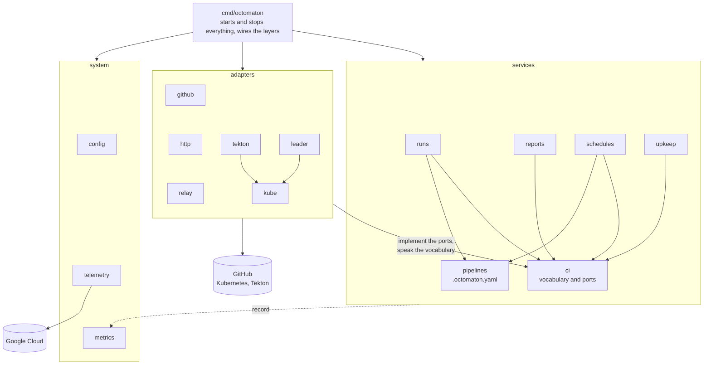
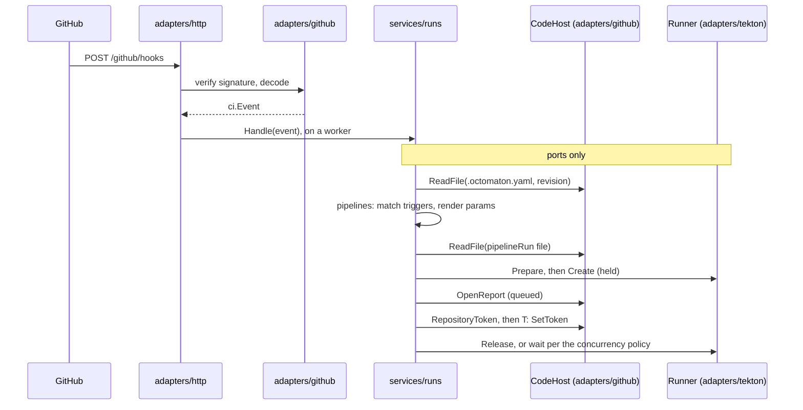
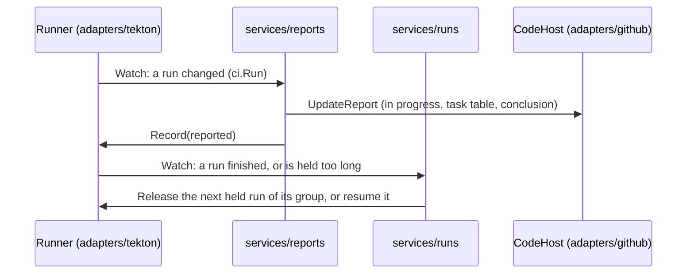

# Octomaton architecture: services, adapters, system

**Decision**: Octomaton's code splits into three layers, wired together by `cmd/octomaton`:

- **`services`** hold the CI logic and speak only Octomaton's own terms: "start this pipeline for that trigger", "report
  this run", "tell me when a run changes".
- **`adapters`** turn those terms into GitHub, Tekton, Kubernetes and HTTP calls. Callers never see which technology is
  underneath.
- **`system`** configures the process: configuration, telemetry, metrics, the version.

Dependencies point inward: adapters use the services' vocabulary; services never import an adapter or a provider's
SDK. Behaviour, configuration and every external name stay as they are. This reshapes
[octomaton#1](https://github.com/arikkfir-org/octomaton/pull/1) before its review; it doesn't change the
[contract](../reference.md#octomaton). What Octomaton does is in the [Phase 2 design](phase-2-octomaton.md).

## Why

The core logic (`trigger` and `reporter`, 3,300 lines) is written against the technologies it drives:

| Coupling | Where | Cost |
| --- | --- | --- |
| Tekton objects are the core's data model: `*unstructured.Unstructured`, about 25 label and annotation keys as its state, Tekton status conditions | `trigger`, `reporter` | Every rule (concurrency, supersede, resume, reporting) is also a Kubernetes patch; testing a rule needs a fake API server |
| go-github payloads and check-run structs | `trigger/events.go`, `reporter` | GitHub's shapes leak into run logic |
| client-go informer and workqueue | `reporter` | The reporter is half controller, half report writer |
| The trigger context, GitHub check-run markers and Tekton Dashboard links in one package | `checkrun` | Domain and presentation are mixed |

## Layers



Arrows are imports. `services/ci` declares the ports (Go interfaces); adapters implement them, and `cmd/octomaton`
hands the implementations to the services. `tekton` and `leader` share the Kubernetes clients of `kube`.

## Rules

| Package | May import | Never imports |
| --- | --- | --- |
| `internal/services/ci` | the standard library | anything else, in or outside the module |
| `internal/services/*` | `services/ci`, `services/pipelines`, other services, `system/metrics`, the standard library | `internal/adapters/*`, `k8s.io/*`, go-github, Tekton |
| `internal/adapters/*` | `services/ci`, `services/pipelines` (to parse it), `adapters/kube`, provider SDKs, `system/*` | the other services |
| `internal/system/*` | the standard library, OpenTelemetry, envconfig | `services`, `adapters` |
| `cmd/octomaton` | everything | |

A test walks the module's imports and fails on any violation, so the layering can't erode.

## Packages

```text
cmd/octomaton/            launcher: signals, system, adapters, services, run
cmd/octomaton-lint/       the linter's launcher
internal/system/          config, telemetry, metrics (+ metricstest), buildinfo
internal/services/
  ci/                     vocabulary (Repository, Trigger, Event, Run, Outcome, Report) and ports (CodeHost, Runner, Leadership)
  pipelines/              .octomaton.yaml: schema, event matching, templates
  runs/                   events to runs: evaluation, start, concurrency, re-runs, comment commands
  reports/                run state to reports: titles, task tables, failure logs, task checks
  schedules/              cron triggers to runs
  upkeep/                 token refresh, retention of finished runs' resources
  lint/                   validating a repository's configuration
internal/adapters/
  github/                 CodeHost: App auth, REST calls, check-run markers (+ githubtest); webhook payloads to ci.Event
  tekton/                 Runner: PipelineRun rendering, bookkeeping labels and annotations, status to ci.Run, Watch
  kube/                   Kubernetes clients
  leader/                 Leadership through a Lease
  http/                   server, readiness, the webhook endpoint (signature, deduplication, worker pool)
  relay/                  forwarding verified deliveries
```

| Today | Becomes |
| --- | --- |
| `config`, `telemetry`, `metrics`, `buildinfo` | `system/*`, as they are |
| `repoconfig`, `tmpl` | `services/pipelines` |
| `checkrun.Context` | `ci.Trigger`; the marker encoding moves to `adapters/github` |
| `trigger` (evaluate, start, concurrency, rerun, comments) | `services/runs` |
| `trigger` (schedules), `trigger` (maintenance) | `services/schedules`, `services/upkeep` |
| `reporter` (titles, task table, failure logs, task checks) | `services/reports` |
| `reporter` (informer, workqueue) | `adapters/tekton`, behind `Runner.Watch` |
| `tekton` | `adapters/tekton` |
| `githubapp` (+ `githubtest`), `trigger/events.go` | `adapters/github` |
| `webhook`, `http` | `adapters/http` |
| `kube`, `leader`, `relay` | `adapters/*` |
| `lint` | `services/lint`, rendering through the Tekton adapter |

## Vocabulary and ports

| Type (`services/ci`) | Meaning | Today |
| --- | --- | --- |
| `Repository` | Owner, name, IDs, default branch | `checkrun.Repository` |
| `Trigger` | Why pipelines are considered: event, revision, ref, pull request, comment, schedule. Stored with every run and report, so a re-run replays it | `checkrun.Context` |
| `Event` | A decoded delivery: push, pull request, merge group, comment, re-run request, approval | go-github payloads |
| `Run` | One pipeline run: ID (tenant and name), trigger, pipeline, attempt, concurrency, phase (held, running, finished), outcome, tasks, results, what was reported | `*unstructured.Unstructured` and its annotations |
| `Outcome` | How a finished run ended: success, failure, cancelled, timed out or skipped, with a reason | `tekton.Outcome` |
| `Report` | The status shown on the code host: name, status, conclusion, title, summary, link, trigger | GitHub check-run options |

The ports, as a sketch; exact signatures settle in code:

```go
// CodeHost is GitHub: installations, repository files, reports (check runs), people and tokens.
type CodeHost interface {
	Installations(ctx context.Context) ([]int64, error)
	Installation(id int64) Installation
	RepositoryToken(ctx context.Context, installation, repository int64, permissions map[string]string) (Token, error)
}

type Installation interface {
	Repositories(ctx context.Context) ([]Repository, error)
	ReadFile(ctx context.Context, repo Repository, path, ref string) ([]byte, error) // ErrNotFound
	ChangedFiles(ctx context.Context, t Trigger) (Changes, error)
	OpenReport(ctx context.Context, repo Repository, r Report) (ReportID, error)
	UpdateReport(ctx context.Context, repo Repository, id ReportID, r Report) error
	Report(ctx context.Context, repo Repository, id ReportID) (Report, error)
	FindReport(ctx context.Context, repo Repository, sha, name, key string) (ReportID, error)
	Permission(ctx context.Context, repo Repository, user string) (Permission, error)
	PullRequest(ctx context.Context, repo Repository, number int) (PullRequest, error)
	BranchHead(ctx context.Context, repo Repository, branch string) (string, error)
	React(ctx context.Context, repo Repository, comment int64, reaction string) error
	Comment(ctx context.Context, repo Repository, number int, body string) error
}

// Runner is the CI system that executes pipelines: Tekton on Kubernetes.
type Runner interface {
	Prepare(definition []byte, spec RunSpec) (Prepared, error) // parse, check and render; no side effects
	Create(ctx context.Context, p Prepared) (Run, error)      // held; ErrExists when the name is taken
	Get(ctx context.Context, id RunID) (Run, error)
	List(ctx context.Context, q RunQuery) ([]Run, error)
	Release(ctx context.Context, id RunID) error
	Cancel(ctx context.Context, id RunID, reason string) error
	Record(ctx context.Context, id RunID, r Record) error // what was reported, report IDs, superseded-by, …
	SetToken(ctx context.Context, id RunID, t Token) error
	TaskLogs(ctx context.Context, id RunID, task string) (string, error)
	Links(id RunID) RunLinks // where people watch a run and its tasks
	FreeResources(ctx context.Context, finishedBefore time.Time) (int, error)
	TenantExists(ctx context.Context, tenant string) (bool, error)
	// Watch calls on for every change of a run until ctx ends; on returns when to look again.
	Watch(ctx context.Context, on func(context.Context, Run) (again time.Duration, err error)) error
}

// Leadership elects the one replica that does leader-only work.
type Leadership interface {
	Lead(ctx context.Context, work func(ctx context.Context))
	Leading() bool
}
```

## Flows

An event becomes a run. Every call below the dashed line goes through a port:



A run's changes become reports. Only the leader watches:



## Behaviour and contract

Unchanged: environment variables, endpoints, check names and markers (written only by `adapters/github`), labels and
annotations (written only by `adapters/tekton`), metrics, RBAC and IAM. The reference needs no change.

## Decisions

| Decision | Why | Rejected |
| --- | --- | --- |
| One vocabulary package, `services/ci`, holding the types and the ports | Services and adapters share one language. The ports sit with the core, so adapters depend on it, never the reverse | Interfaces declared in each service (adapters would import several services); a separate `domain` layer (a fourth layer for about 300 lines) |
| Tekton labels and annotations only in `adapters/tekton`; the core reads and writes `ci.Run` fields | Concurrency, supersede and reporting rules become testable with an in-memory runner | Keeping `unstructured` objects in the core |
| The informer and workqueue behind `Runner.Watch` | "Tell me when a run changes" is the core's need; how Kubernetes delivers it is the adapter's | The reporter owning the controller |
| GitHub payloads decoded in `adapters/github` | The core sees `ci.Event`, never go-github types | Decoding in the core |
| In-memory `Runner` and `CodeHost` for the services' tests; `githubtest` and client-go fakes for the adapters' and the end-to-end tests | Rule tests are fast and need no Kubernetes; adapters are still tested against realistic fakes | End-to-end tests only |
| An architecture test on imports | Keeps the layering from eroding | Convention only |

## Migration

Every step keeps `go vet`, `go test -race` and the end-to-end test green. All of it lands in octomaton#1.

1. Move `config`, `telemetry`, `metrics` and `buildinfo` under `system`, and `kube`, `leader`, `http`, `relay` and
   `webhook` under `adapters`. This is mechanical.
2. Add `services/ci` (types and ports) and `services/pipelines` (from `repoconfig` and `tmpl`).
3. `adapters/github` implements `CodeHost` and decodes webhook payloads; the check-run markers move there.
4. `adapters/tekton` implements `Runner`: bookkeeping, the status mapping, and `Watch` (the reporter's informer).
5. Rewrite `trigger` as `services/runs`, `schedules` and `upkeep`, and `reporter` as `services/reports`, against the
   ports, tested with in-memory fakes.
6. Rewire `cmd/octomaton`, point the end-to-end test at the real adapters over fakes, add the architecture test, and
   update the README and CLAUDE.md.

## Open questions

- Names: `ci` for the vocabulary; `runs`, `reports`, `schedules` and `upkeep` for the services.
