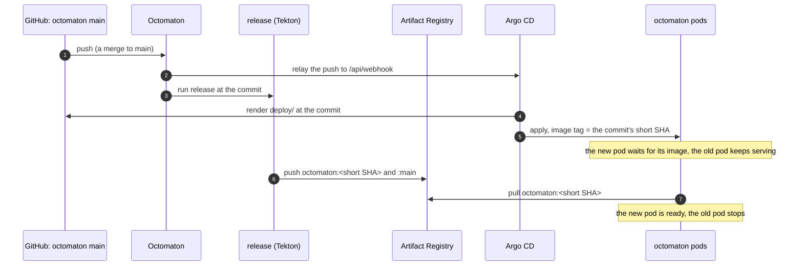

# Octomaton deployment

**Decision**: Octomaton's Kubernetes manifests live with its code, in `deploy/` of
[arikkfir-org/octomaton](https://github.com/arikkfir-org/octomaton). The Argo CD Application `octomaton`, still defined
in `delivery`, follows that repository's `main` and runs the image of the commit it syncs, so every merge to `main`
deploys itself. Names and wiring: [reference](../reference.md#octomaton). Pull requests:
[octomaton#8](https://github.com/arikkfir-org/octomaton/pull/8),
[delivery#10](https://github.com/arikkfir-org/delivery/pull/10).

## Context

Every push to Octomaton's `main` publishes an image tagged with the commit's short SHA. The manifests lived in
`delivery`, which pinned one of those tags: each Octomaton change needed a second pull request there to reach the
cluster, and a change to both code and configuration (a new variable, a new permission) was split across repositories.

## Design

| Piece | Where | What |
| --- | --- | --- |
| Manifests | `octomaton`: `deploy/` (Kustomize) | Everything in namespace `octomaton`, the ClusterRoles `octomaton` and `octomaton-tenant`, and the ClusterRoleBinding `octomaton`. The Deployment's image has no tag |
| Application | `delivery`: `apps/octomaton.yaml` | Source `arikkfir-org/octomaton` at `main`, path `deploy`; `kustomize.images` sets `…/octomaton:${ARGOCD_APP_REVISION_SHORT}`; the namespace label `kfirs.com/public-ingress` |
| Image | `octomaton`: `release` | Runs on every push to `main`, with no path filter, and retries twice when its Spot node is preempted. Tags the image with the commit's first 7 characters, as many as `ARGOCD_APP_REVISION_SHORT` has |
| Validation | `octomaton`: `ci` | Renders `deploy/` and checks it with kubeconform, as `delivery`'s CI checks its own manifests |
| What stays | `delivery` | The Application; the tenant namespaces (`ci-tenants`); the `octomaton-dev` certificate and Gateway listener; Argo CD's NetworkPolicy admitting Octomaton's relay |

Argo CD substitutes `${ARGOCD_APP_REVISION_SHORT}` with the revision of the source it renders, and only in the
Application's spec. That is why the manifests come from the octomaton repository: rendered from `delivery`, the variable
would hold `delivery`'s commit.

## Decisions

| Decision | Why | Rejected |
| --- | --- | --- |
| Manifests in the octomaton repository, deployed from `main` | One pull request changes code and deployment together, and nothing is pinned by hand | Pinning the tag in `delivery`, one pull request per release |
| The tag is `${ARGOCD_APP_REVISION_SHORT}` | Argo CD knows the commit it deploys, and `release` tags every commit with the same 7 characters | An ApplicationSet reading `main`'s SHA from GitHub (a token, polling); Argo CD Image Updater (another component, with write access to Git); `release` opening the pin pull request (write access to `delivery`) |
| The Application stays in `delivery` | `delivery` still decides what runs in the cluster and where; the octomaton repository decides how | Moving it too: the root Application reads only `delivery` |
| Plain Kustomize, not a Helm chart | The hub is the only installation, and Argo CD's image override works on Kustomize | A chart |

## Security and failure modes

- A merge to octomaton's `main` changes the cluster, as a merge to `delivery`'s does. Both repositories have the same
  ruleset (pull request, the `Continuous Integration` check, merge queue; organization admins may bypass), and the
  Application stays in project `default`, like every other.
- Argo CD hears of a commit (Octomaton relays the push) minutes before `release` has published its image. The new pod
  waits in `ImagePullBackOff` while the old one keeps serving: with one replica, the rolling update starts the new pod
  before it stops the old one. The Application shows `Progressing`, and `Degraded` once the Deployment's 10-minute
  progress deadline passes, until the image arrives.
- If `release` fails, the new pod keeps waiting and the old one keeps serving until a later commit publishes an image.
  Re-run `release`, or merge a fix. CI runs on Spot VMs, and preemption was the usual cause, hence the two retries.
- A commit that breaks Octomaton breaks CI for every repository, its own fix included. Merge the revert with the admin
  bypass; Argo CD deploys it like any other commit.

## Rollout

1. Merge octomaton#8, which adds `deploy/`. Nothing in the cluster changes.
2. Merge delivery#10, which points the Application at `deploy/` and removes `platform/octomaton/`. Argo CD keeps the
   same objects (same Application, same names) and changes only the image tag, to that of `main`'s newest commit.
3. Check that the Deployment runs the short SHA of octomaton's `main`:
   `kubectl -n octomaton get deploy octomaton -o jsonpath='{.spec.template.spec.containers[0].image}'`

If delivery#10 merges first, Argo CD reports the missing path and changes nothing until it exists.

## Open questions

- The wait for the image could go away: `release` could move a branch (say `deployed`) once the image is published,
  and Argo CD would follow that branch. `release` would then need write access to the repository.
