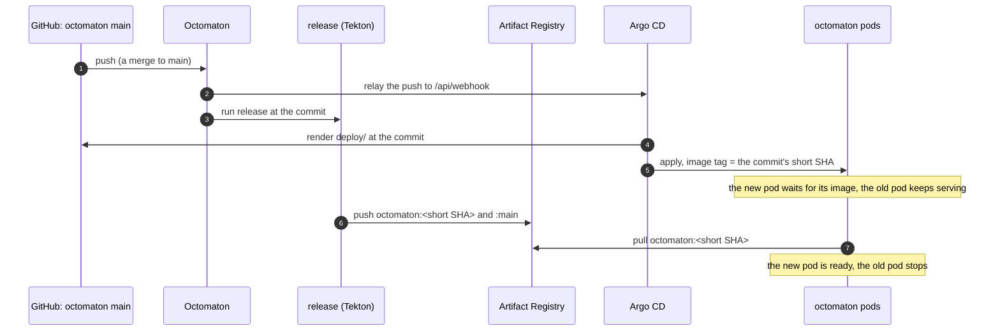
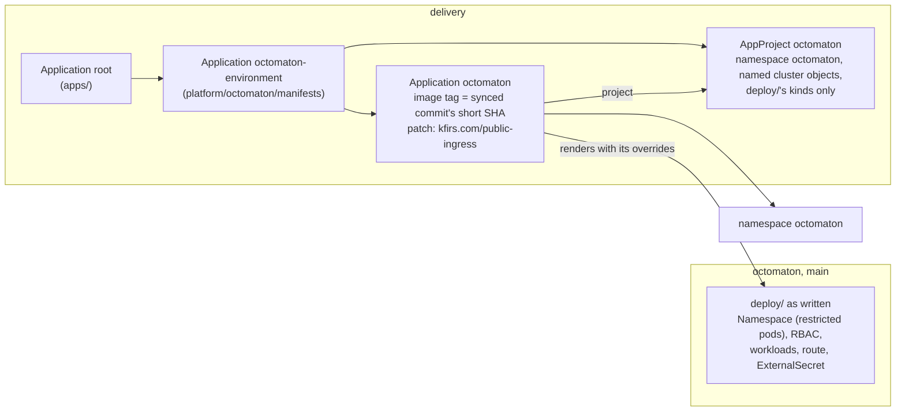

# Octomaton deployment

**Decision**: Octomaton's Kubernetes manifests live with its code, in `deploy/` of
[arikkfir-org/octomaton](https://github.com/arikkfir-org/octomaton): the hub's deployment as written, its Namespace
included. `delivery` holds what wraps it, as it does for
[Fin](https://github.com/arikkfir-org/fin/blob/main/docs/fin/designs/environments.md): the Argo CD Application
`octomaton`, which follows that repository's `main` and overrides what `delivery` decides (the image's tag, the
namespace's admission to the public gateway), and the AppProject `octomaton`, which holds it to its namespace and
kinds. Every merge to `main` deploys itself. Names and wiring: [reference](../reference.md#octomaton). Pull requests:
[octomaton#8](https://github.com/arikkfir-org/octomaton/pull/8),
[delivery#10](https://github.com/arikkfir-org/delivery/pull/10) (manifests with the code);
[delivery#33](https://github.com/arikkfir-org/delivery/pull/33),
[octomaton#24](https://github.com/arikkfir-org/octomaton/pull/24) (project, Namespace and overrides).

## Context

Every push to Octomaton's `main` publishes an image tagged with the commit's short SHA. The manifests lived in
`delivery`, which pinned one of those tags: each Octomaton change needed a second pull request there to reach the
cluster, and a change to both code and configuration (a new variable, a new permission) was split across repositories.

## Design

| Piece | Where | What |
| --- | --- | --- |
| Manifests | `octomaton`: `deploy/` (Kustomize) | Namespace `octomaton` (the latest restricted Pod Security Standard enforced; `Delete=false,Prune=false`), everything in it, the ClusterRoles `octomaton` and `octomaton-tenant`, and the ClusterRoleBinding `octomaton`. The Deployment's image has no tag |
| Application | `delivery`: `platform/octomaton/manifests`, synced by `octomaton-environment` | Application `octomaton` in project `octomaton`: source `arikkfir-org/octomaton` at `main`, path `deploy`; `kustomize.images` sets `…/octomaton:${ARGOCD_APP_REVISION_SHORT}`; `kustomize.patches` labels the Namespace `kfirs.com/public-ingress: "true"`. No `CreateNamespace`: `deploy/` holds the Namespace |
| Project | `delivery`: `platform/octomaton/manifests` | AppProject `octomaton`: source `arikkfir-org/octomaton` only; destination `octomaton`; cluster-scoped, only the Namespace, ClusterRoles and ClusterRoleBinding above, by name; namespaced, only the kinds `deploy/` holds |
| Image | `octomaton`: `release` | Runs on every push to `main`, with no path filter, and retries twice when it loses its node. Tags the image with the commit's first 7 characters, as many as `ARGOCD_APP_REVISION_SHORT` has |
| Validation | `octomaton`: `ci` | `deploy/manifests.sh` (`make manifests`) renders `deploy/` as written and with the `kustomize` options of every Application in `delivery`'s `main` that deploys it, as Argo CD applies them, and checks both with kubeconform. A patch whose target matches nothing fails it too, so a change on either side that breaks the other fails a check |
| What stays | `delivery` | The Applications and the project; the tenant namespaces (`ci-tenants`); the `octomaton-dev` certificate and Gateway listener; Argo CD's NetworkPolicy admitting Octomaton's relay |

Argo CD substitutes `${ARGOCD_APP_REVISION_SHORT}` with the revision of the source it renders, and only in the
Application's spec. That is why the manifests come from the octomaton repository: rendered from `delivery`, the variable
would hold `delivery`'s commit.

## Decisions

| Decision | Why | Rejected |
| --- | --- | --- |
| Manifests in the octomaton repository, deployed from `main` | One pull request changes code and deployment together, and nothing is pinned by hand | Pinning the tag in `delivery`, one pull request per release |
| The tag is `${ARGOCD_APP_REVISION_SHORT}` | Argo CD knows the commit it deploys, and `release` tags every commit with the same 7 characters | An ApplicationSet reading `main`'s SHA from GitHub (a token, polling); Argo CD Image Updater (another component, with write access to Git); `release` opening the pin pull request (write access to `delivery`) |
| The Application stays in `delivery` | `delivery` still decides what runs in the cluster and where; the octomaton repository decides how | Moving it too: the root Application reads only `delivery` |
| Plain Kustomize, not a Helm chart | The hub is the only installation, and Argo CD's image override works on Kustomize | A chart |
| `deploy/` holds the Namespace, with the restricted Pod Security Standard | Octomaton's pods meet it, and the deployment states it with the code, as Fin's does | `CreateNamespace` with `managedNamespaceMetadata` in `delivery` |
| `delivery` adds `kfirs.com/public-ingress` with a patch in the Application's `kustomize` options | Admission to the public gateway, which has no sign-in, is the hub's decision, and a patch reaches the Namespace that `deploy/` holds (a Namespace in the source overwrites `managedNamespaceMetadata`) | The label in `deploy/` |
| AppProject `octomaton` | `delivery` decides where Octomaton runs and what it may create; a merge to octomaton's `main` can't reach another namespace or cluster-scoped object | Project `default`, which admits anything anywhere |
| No admission policies | Only reviewed commits on `main` deploy, under the same ruleset as `delivery`; Fin's policies hold what pull requests' code says. Octomaton's ClusterRoles are its own, so a policy couldn't keep them from growing anyway | Fin's policies, adapted |
| Wrapper Application `octomaton-environment` | The project must exist before the Application that names it, and both belong together in `platform/octomaton`; the deployment keeps the name `octomaton`, so Argo CD keeps tracking its objects | The project in `platform/argocd`; renaming the deployment's Application |

## Security and failure modes

- A merge to octomaton's `main` changes the cluster, as a merge to `delivery`'s does. Both repositories have the same
  ruleset (pull request, the `Continuous Integration` check, merge queue; organization admins may bypass). Project
  `octomaton` keeps such a merge in namespace `octomaton` and in Octomaton's own ClusterRoles and ClusterRoleBinding,
  which it can still widen: it needs RBAC across the tenants.
- A new kind, or a new cluster-scoped object, in `deploy/` fails to sync until `delivery` admits it to the project:
  merge that first.
- If `deploy/` renamed its Namespace, `delivery`'s patch would match nothing and the route would lose the public
  gateway. `ci` fails any patch of `delivery`'s whose target matches nothing in `deploy/`. The Namespace is
  `Prune=false`: removing it from `deploy/` leaves it in the cluster.
- Argo CD hears of a commit (Octomaton relays the push) minutes before `release` has published its image. The new pod
  waits in `ImagePullBackOff` while the old one keeps serving: with one replica, the rolling update starts the new pod
  before it stops the old one. The Application shows `Progressing`, and `Degraded` once the Deployment's 10-minute
  progress deadline passes, until the image arrives.
- If `release` fails, the new pod keeps waiting and the old one keeps serving until a later commit publishes an image.
  Re-run `release`, or merge a fix. Until arikkfir-org/infra#20, CI ran on Spot VMs and preemption was the usual
  cause, hence the two retries.
- A commit that breaks Octomaton breaks CI for every repository, its own fix included. Merge the revert with the admin
  bypass; Argo CD deploys it like any other commit.

## Rollout

1. Merge octomaton#8, which adds `deploy/`. Nothing in the cluster changes.
2. Merge delivery#10, which points the Application at `deploy/` and removes `platform/octomaton/`. Argo CD keeps the
   same objects (same Application, same names) and changes only the image tag, to that of `main`'s newest commit.
3. Check that the Deployment runs the short SHA of octomaton's `main`:
   `kubectl -n octomaton get deploy octomaton -o jsonpath='{.spec.template.spec.containers[0].image}'`

If delivery#10 merges first, Argo CD reports the missing path and changes nothing until it exists.

The project, Namespace and overrides follow, `delivery` first:

1. Merge delivery#33. The root Application prunes Application `octomaton` from `apps/` (no finalizer: its objects stay)
   and `octomaton-environment` creates project `octomaton` and Application `octomaton` again, which adopts them. The
   existing namespace keeps its labels; the patch matches nothing yet.
2. Merge octomaton#24. Until it merges, other octomaton pull requests fail `ci`: their `deploy/` has no Namespace
   for `delivery`'s patch. Argo CD adopts the Namespace from `deploy/`, with `kfirs.com/public-ingress` from the patch
   and the restricted Pod Security Standard.
3. Check that `kubectl get ns octomaton --show-labels` lists both labels.

Merged the other way round, the Namespace from `deploy/` would overwrite `managedNamespaceMetadata` and drop
`kfirs.com/public-ingress`, detaching the webhook's route until `delivery` merges.

Roll back in the reverse order: revert octomaton#24 (with the admin bypass: its `ci` fails on `delivery`'s patch, which
then matches nothing; the Namespace stays, `Prune=false`), then delivery#33, and delete the AppProject `octomaton` it
leaves behind. Reverting `delivery` first would drop the label while `deploy/` still holds the Namespace.

## Open questions

- The wait for the image could go away: `release` could move a branch (say `deployed`) once the image is published,
  and Argo CD would follow that branch. `release` would then need write access to the repository.
