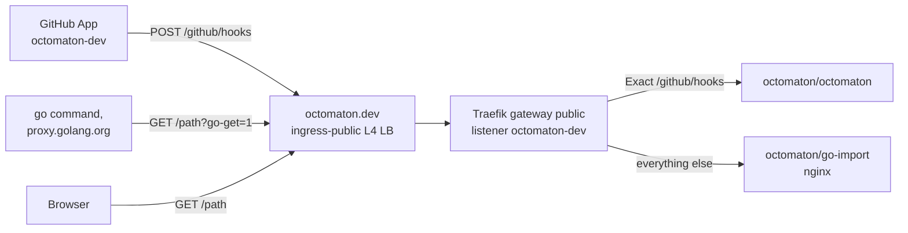
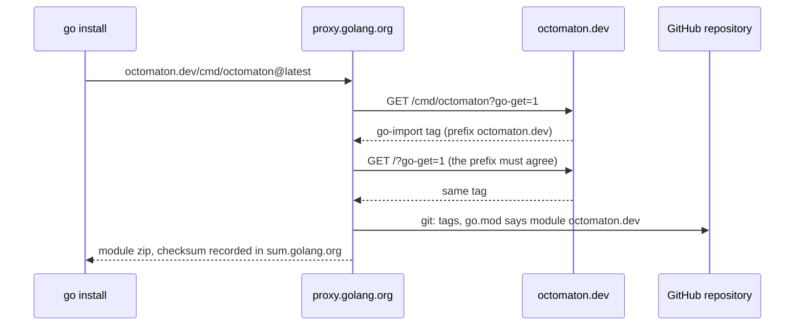

# octomaton.dev: domain, webhook and Go module

**Goal**: give Octomaton an identity of its own. `octomaton.dev` carries the GitHub App's webhook and the Go module
path, and names Octomaton's labels and configuration API group, independently of the hub's `kfirs.com`. Names and
wiring: [reference](../reference.md#octomaton). Migration from Octomatron:
[rename runbook](../runbooks/octomaton-rename.md).

## Traffic

| Request | Answer |
| --- | --- |
| `POST /github/hooks` | Octomaton; unsigned deliveries get `401` |
| `GET /<path>?go-get=1` | `200` with `<meta name="go-import" content="octomaton.dev git https://github.com/arikkfir-org/octomaton">` |
| Anything else | `302` to `https://github.com/arikkfir-org/octomaton` |

## Go module resolution

## Decisions

| Decision | Why | Rejected |
| --- | --- | --- |
| Octomaton's names live under `octomaton.dev`: webhook, Go module, labels `octomaton.dev/…`, API group `octomaton.dev/v1` | Octomaton is a product; `kfirs.com/` names belong to the hub, the way Google's labels use `google.com/` rather than Alphabet's domain | `octomaton.kfirs.com/…` labels, a webhook under `dev.kfirs.com` |
| Module path `octomaton.dev` | Short, owned, and independent of where the repository lives; `go install` works through the `go-import` tag | `github.com/arikkfir-org/octomaton` (imports follow repository renames); `octo` (not installable, and dotless paths are reserved for the standard library) |
| The hub serves the domain | Cloud DNS, cert-manager and the public gateway already exist; everything stays in Terraform and Argo CD | GitHub Pages |
| One host, two backends | The webhook stays the only path that reaches Octomaton; the rest is a static answer | A separate webhook host |
| nginx in the `octomaton` namespace | No code to maintain; one namespace owns the domain | Serving the tag from Octomaton itself |
| A certificate and listener of its own | A problem with the new domain can't block renewal of the `*.kfirs.com` certificate | A SAN on the wildcard certificate |
| GitHub App named `octomaton-dev` | GitHub refuses App names that match an existing account, and a user `octomaton` exists | |

## Security and failure modes

- The import page is static and public; it reveals only the repository URL, which is public anyway.
- Only `POST /github/hooks` reaches Octomaton, which verifies every delivery's HMAC signature first.
- Like the wildcard certificate, the `octomaton-dev` certificate is issued in the sync wave before the Gateways, so
  the Gateways wait for it: delegate the domain before the first sync.
- If `octomaton.dev` stops resolving (delegation, DNSSEC at the registrar, an expired domain), webhook deliveries
  fail until it recovers (redeliver them from the App's settings) and new `go install`s fail; versions already in the
  Go proxy keep working.
- Whoever holds the domain decides where new module versions come from; keep it renewed. The checksum database pins
  every published version, so tags are never moved.

## Open questions

- A product page at `https://octomaton.dev` would replace the redirect to the repository.
