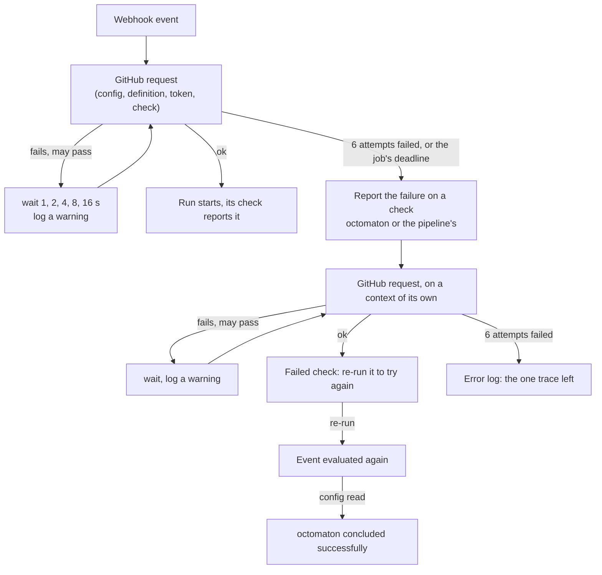

# Octomaton rides out GitHub outages

Octomaton retries every GitHub request that fails for a reason that may pass, and when an event's requests still fail it says so on a failed check, which re-runs the event. No event is lost to a GitHub outage without a trace. Linear: ENG-75.

## Context

On 2026-10-03, between 21:46 and 22:03 UTC, GitHub's API answered Octomaton with 504s and timeouts. Octomaton made each request once:

- arikkfir-org/tooling#30's push, open and review request could not read `.octomaton.yaml`. Octomaton then could not open the `octomaton` check that reports that either. The pull request got no `Continuous Integration`, no `Docs` and no `AI Review`, and nothing said why.
- A review request is never reported on a configuration problem, so even a working report path would have dropped it.
- Octomaton had already answered each webhook `202`, so GitHub would not redeliver it.

## Design

| Part | Behaviour |
| --- | --- |
| Retries | One `http.RoundTripper` under every go-github client of the App, so every call is covered: reads, checks, installation tokens (ghinstallation mints them inside the request). It retries connection errors and timeouts (30 s per attempt), 5xx but 501, 429, and GitHub's secondary rate limit (403 with `Retry-After`). It does not retry 404, 422 or a plain 403. |
| Budget | Up to 6 attempts. Waits double from 1 s to 30 s (31 s in all), or follow `Retry-After` on a 429, a 503 or a secondary rate limit, at most a minute (a primary rate limit's reset can be an hour away). A blip of about half a minute passes unseen; every attempt timing out costs 3.5 minutes. A request stops when its context ends: the webhook job's 5-minute deadline. |
| Logs | Each retry: a warning with method, path, attempt, cause and wait. A request that still fails returns its last response or error, which its caller logs once. |
| Failure report | A configuration that could not be read is Octomaton's failure, not the repository's, so every event reports it: a failed `octomaton` check; the scheduled pipeline's failed check when a schedule fires; a reply when a comment command, which has no check, is declined ("comment again to try again"). Review requests and pull request actions still leave an invalid configuration unreported. A run whose check could not be opened gets a failed check of its pipeline's name. The checks store the trigger, so re-running them tries again. Only the scheduler's periodic read of a repository's schedules just logs: its next read tries again. |
| Report budget | A failure report runs on a context detached from the job's deadline, which may be what failed, bounded at 5 minutes, and goes through the same retries. One that still fails is logged as an error. |
| Recovery | Re-running a failed `octomaton` evaluates the event again; when the configuration reads, `octomaton` is concluded successfully ("Evaluated again"), so the stale failure stops showing. |

## Decisions

| Decision | Why | Rejected |
| --- | --- | --- |
| `hashicorp/go-retryablehttp` | Well known (Terraform, Vault, Consul), and it does what retries need: rewinds request bodies, honours `Retry-After`, stops when the context ends, and plugs in as a `RoundTripper` | `cenkalti/backoff` around each call (one wrapper per call site, and bodies to rewind by hand); retries written in Octomaton |
| Retry in the transport, not per call | One place covers every GitHub call, the check reports included, and new calls get it without thought | Retrying in the services: every call site, and the ports would learn about HTTP |
| Retry POSTs too | Creating a check or a token after a 5xx that GitHub did process leaves a duplicate check run at worst; GitHub shows the newest of a name, which is the one Octomaton tracks | Retrying only GETs: the check reports are exactly what an outage must not lose |
| Report an unreadable configuration on every event | A review request lost to an outage is the case that started this. The red `octomaton` shows only during an outage, and re-running it recovers | Keeping review requests silent; reporting only on events that report invalid configurations |
| Failure reports detached from the job's deadline | The deadline is often what failed; a report on the same context could never be sent | A longer job deadline: still a race between the failure and its report |
| A budget of about half a minute of waits | GitHub's blips are short; a long outage needs the re-runnable check, not workers held for minutes while the queue fills | Retrying for the outage's length (17 minutes on 2026-10-03), which would fill the webhook queue |

## Failure modes

- An outage longer than the budget: the event's failed check says what failed; re-run it once GitHub is back.
- GitHub still down for the report: only the error log is left. Redeliver the webhook from the App's Advanced → Recent deliveries.
- Many events during an outage hold webhook workers for up to their job's deadline. A full queue answers 503, which GitHub records as a failed delivery that can be redelivered.

## Rollout

Ships with arikkfir-org/octomaton's pull request for ENG-75; the merge deploys it. No manual steps.
