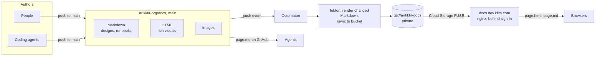

# Phase 0: Documentation

**Goal**: one shared, durable place where designs, decisions and knowledge accumulate, readable by people in a
browser and by coding agents as plain Markdown.

## Design

| Source in Git | Served as | Consumer |
| --- | --- | --- |
| `path/page.md` | `path/page.html` (rendered) and `path/page.md` (original) | browsers |
| `path/page.html` | `path/page.html` (unchanged) | browsers |
| `path/image.svg` | `path/image.svg` | pages |

URLs are `https://docs.dev.kfirs.com/<path>`, behind the hub's sign-in. Agents read the repository itself.

## Decisions

| Decision | Why | Rejected |
| --- | --- | --- |
| Direct pushes to `main`, no pull requests | Knowledge sharing must be frictionless; designs are discussed in the pull requests they accompany | Review gate on docs: slows the habit of writing things down |
| Markdown + Mermaid by default | Diffable, renders on GitHub and on the site, agents read it natively | Wiki (not in Git), Google Docs (not agent-friendly) |
| HTML allowed as-is | AI-generated architecture pages are often richer than Markdown | Forcing everything through Markdown |
| Serve the Markdown source next to the HTML | The source is one click from its page | HTML only |
| Private bucket served at `docs.dev.kfirs.com` behind the hub's sign-in; direct links only, no navigation | Same access control as every other hub tool; navigation can come later | Public bucket; static-site generator with menus and search |
| `hub/reference.md` as the single source of facts | Five repositories must agree on names, identities and addresses | Repeating values in every design |

## Organization README

`arikkfir-org/.github/README.md` introduces the organization and points at `docs` for everything else.

## Conventions

[CONTRIBUTING.md](../../CONTRIBUTING.md) defines commits, pull requests, Linear keys and design-document expectations
for every repository. Each repository adds a `CLAUDE.md` with its own agent rules.

## Open questions

- A landing page or search, once the number of pages makes direct links impractical.
