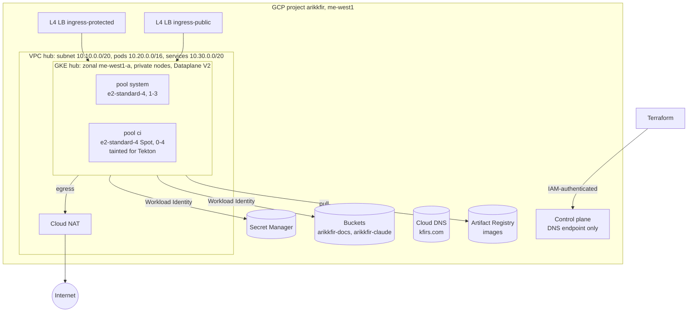
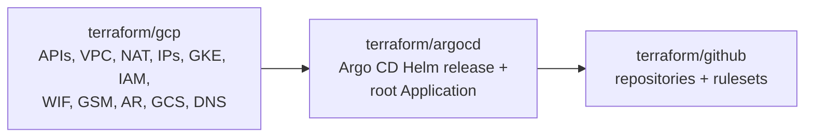

# Phase 1: Foundations

**Goal**: everything runs on GCP in one private GKE cluster in `me-west1`. Terraform (`arikkfir-org/infra`) owns cloud
and GitHub resources and bootstraps Argo CD; Argo CD (`arikkfir-org/delivery`) owns everything inside the cluster.
Exact names, ranges and permissions: [reference](../reference.md).

## Topology

## Terraform

Three root modules, each with its own state in `gs://arikkfir-devops`:

| Root | Owns | Notes |
| --- | --- | --- |
| `gcp` | APIs, network, static IPs, cluster and node pools, node service account, IAM bindings, secret containers, Artifact Registry, buckets, DNS zones (imported) and records | Secret values are added by hand |
| `argocd` | Argo CD release and the `root` Application | Connects through the cluster's DNS endpoint with the caller's Google credentials |
| `github` | The six hub repositories (imported) and their default-branch rulesets | Applied last: rulesets require the Octomaton `Continuous Integration` check |

Existing resources (the six repositories, the `kfirs-com` and `kfirfamily-com` DNS zones) are adopted with `import`
blocks and protected with `prevent_destroy`.

## GitHub rulesets

| Repository | Rules on the default branch |
| --- | --- |
| `.github`, `docs`, `infra`, `delivery`, `octomaton`, `tooling` | Pull request with 1 approval, stale approvals dismissed, last push approved, conversations resolved; required check `Continuous Integration` from the Octomaton App; merge queue (merge commits, all-green grouping); no deletion; no force-push |

Organization admins may bypass on pull requests only, so a solo maintainer can merge without a second reviewer while
nobody can push around the queue.

## Argo CD

Terraform installs Argo CD and one Application, `root`, which syncs `delivery/apps/`: one Application per component.
From then on Argo CD also manages itself (the `argocd` Application uses the same chart and release name).

```mermaid
flowchart LR
  subgraph w1[wave: CRDs and operators]
    GA[gateway-api CRDs]
    CM[cert-manager]
    ES[external-secrets]
    AC[argocd]
  end
  subgraph w2[wave: platform]
    TR[traefik]
    TO[tekton-operator]
    KE[keda]
    RL[reloader]
    NA[nats]
  end
  subgraph w3[wave: services]
    AU[auth: oauth2-proxy]
    GR[grafana]
    NK[nack]
    NU[nui]
    TC[tekton config]
    SW[octomaton]
    DS[docs site]
    CT[ci-tenants]
  end
  root[root Application] --> w1 --> w2 --> w3
```

| Component | Purpose |
| --- | --- |
| External Secrets Operator | Syncs Secret Manager values into Kubernetes Secrets (`ClusterSecretStore gcp-secret-manager`) |
| cert-manager | Let's Encrypt certificates via DNS-01 on Cloud DNS |
| Gateway API CRDs + Traefik | Ingress on L4 load balancers (see [phase 3](phase-3-ingress-and-auth.md)) |
| KEDA | Event-driven autoscaling for future workloads |
| NATS (JetStream), NACK, NUI | Messaging on a three-server JetStream cluster, JetStream resources as CRDs, and a UI |
| Stakater Reloader | Restarts workloads when their ConfigMaps/Secrets change |
| Grafana | Dashboards over Cloud Monitoring (including GKE managed Prometheus) |
| Tekton operator + `TektonConfig` | Pipelines, Triggers and Dashboard; runs default to the `ci` node pool |

## Decisions

| Decision | Why | Rejected |
| --- | --- | --- |
| Zonal cluster (`me-west1-a`) | The GKE free tier covers one zonal cluster's management fee; a personal hub doesn't need a regional control plane | Regional cluster (about $73/month more); switch `zone` to the region to change |
| Private nodes, no external control-plane IP, DNS endpoint | No public node IPs; control plane reachable only with Google IAM credentials, from anywhere | Authorized networks (static IP allowlists), bastion hosts |
| Direct Workload Identity principals, no Google service accounts | Fewer identities and keys; IAM binds straight to `namespace/serviceaccount` | One GSA per workload with impersonation |
| Spot `ci` pool scaling from zero | CI is bursty and retryable; pay only while pipelines run | Running CI on the system pool |
| Three clustered NATS servers, a 50Gi JetStream volume each, spread across nodes only when possible | Streams can keep three replicas and survive a server restart; a soft spread doesn't grow the system pool just for NATS | A single server (no replication; a restart stops messaging); a hard spread (forces three system nodes) |
| Self-managed Gateway API CRDs, GKE Gateway disabled | Traefik implements the Gateway API; GKE's controller is not used | GKE Gateway controller (unreliable for this use) |
| Three Terraform roots | Kubernetes providers can't be configured from a cluster created in the same apply; GitHub rules must come last | One root with `-target` applies |
| Terraform imports existing repos and zones | Adopts what exists without recreation | Recreating (would lose history and records) |
| App-of-apps with sync waves | Deterministic ordering (CRDs before users) with plain Argo CD | ApplicationSets (more indirection for a fixed set) |
| No Workload Identity Federation pool for GitHub | No GitHub Actions run; CI runs in the cluster with GKE Workload Identity | A GitHub OIDC pool without grants |

## Security

- No service account keys anywhere; workloads authenticate with Workload Identity.
- Secret values exist only in Secret Manager and in the Kubernetes Secrets ESO creates; ESO is the only reader.
- Every GCP grant is scoped to the smallest resource (bucket, repository, secret, managed zone).

## Rollout

See the [bootstrap runbook](../runbooks/bootstrap.md).

Changing the size of NATS's JetStream volumes means recreating the `nats` StatefulSet and its claims once, because
Kubernetes doesn't update a StatefulSet's volume claim templates. The pull request that made NATS a three-server cluster
([arikkfir-org/delivery#9](https://github.com/arikkfir-org/delivery/pull/9)) lists the commands.

## Open questions

- CD for application images (automatic pull requests to `delivery` on release).
- Backups of cluster state that isn't in Git (NATS JetStream data, Grafana dashboards).
