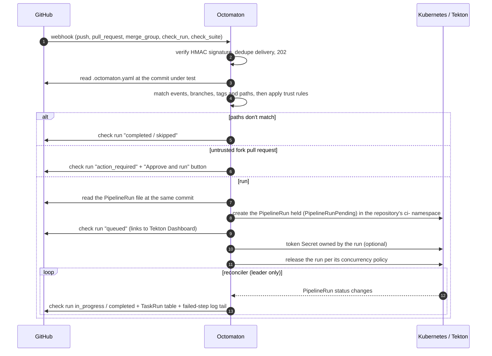
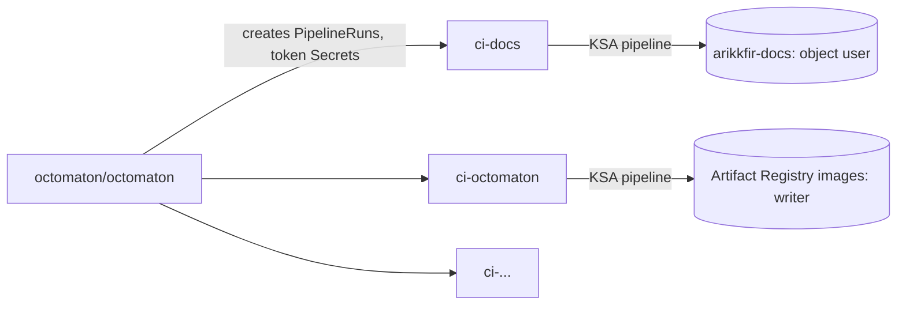
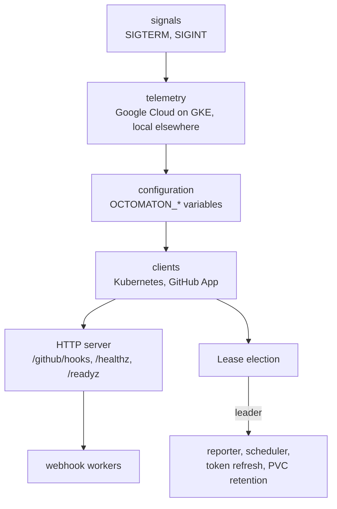
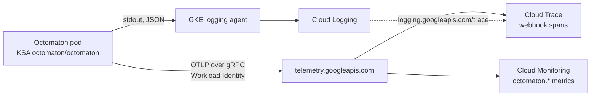

# Phase 2: Octomaton

**Goal**: replace GitHub Actions. A GitHub App delivers webhooks to Octomaton in GKE; Octomaton runs the Tekton
`PipelineRun`s that the repository's root `.octomaton.yaml` maps to those events and reports each one as a GitHub
check run. Code: [arikkfir-org/octomaton](https://github.com/arikkfir-org/octomaton). Names and wiring:
[reference](../reference.md#octomaton). Domain, webhook host and Go module path: [octomaton.dev](octomaton-dev.md).

## Principles

1. **Application-agnostic.** Octomaton knows nothing about what a repository builds, its language, layout, CI or CD.
2. **One file.** The only repository file Octomaton reads is the root `.octomaton.yaml`, plus the `PipelineRun`
   files it points to. There are no conventional directories and no configuration in Tekton labels or annotations.
3. **Plain Tekton.** `PipelineRun` files are ordinary Tekton YAML. Octomaton injects event context only through
   `params` (Go templates over a documented context) and an optional token workspace.

Octomaton is derived from an earlier, application-aware implementation; these principles are what changed.

## Flow



## Configuration

```yaml
apiVersion: octomaton.dev/v1
pipelines:
  - name: ci                          # check-run name
    pipelineRun: .tekton/ci.yaml      # any path; Octomaton assumes no layout
    on:
      pull_request: {branches: [main]}
      merge_group: {}
      push: {branches: [main], tags: ["v*"], paths: ["src/**"]}
    params:
      repo-url: "{{ .Repository.CloneURL }}"
      revision: "{{ .Revision }}"
    githubToken: {workspace: github-token}
    timeout: 1h
    concurrency: {group: "pr-{{ .PullRequest.Number }}", policy: supersede}
```

The full schema and template context are in the [reference](../reference.md#repository-configuration-octomatonyaml)
and the Octomaton README.

## Behaviour

| Situation | Behaviour |
| --- | --- |
| No `.octomaton.yaml` | Nothing happens |
| Invalid `.octomaton.yaml` | One failed check run named `octomaton` explaining the error |
| Event matches, paths don't | Check run reported as `skipped`, which satisfies required checks |
| Changed files can't be determined | Treated as matching (runs rather than silently skipping) |
| Pull request from outside the org (fork) | `action_required` check with an "Approve and run" button for users with write access |
| Repository namespace missing | Failed check: "repository not onboarded" |
| Newer commit on the same pull request or branch | Concurrency groups decide: `supersede` cancels older runs (the default for pull requests), `queue` runs one at a time, `latest` keeps only the newest waiting run |
| `/command` comment on a pull request | Pipelines with a matching `on.comment.pattern` run (definitions from the default branch, code from the pull request); the commenter needs write access; 👀 when started, a reply with the result when done |
| Cron schedule | Pipelines with `on.schedule` run at the default branch head, once per slot |
| Long run | The installation token is refreshed while the run lives; a live task table and per-task checks (`taskChecks`) show progress |
| Octomaton restarts mid-dispatch | Runs are created held (`PipelineRunPending`) and released only once their check and token exist; held runs are resumed |
| Merge group destroyed | Its runs are cancelled |
| "Re-run" in GitHub | The pipeline re-runs with the original context, stored in the check run itself, so it works after pruning |

## Tenancy and identity



- Each repository runs in its own namespace, `ci-<repository>`, created in `delivery` (onboarding a repository is a
  small change there, plus IAM in `infra` if it needs cloud access).
- Runs use the namespace's `pipeline` service account. GCP permissions attach to that identity through Workload
  Identity, so one repository's pipelines can never use another's permissions.
- Octomaton's own identity can create `PipelineRun`s and token Secrets only in tenant namespaces
  (`ClusterRole octomaton-tenant`, bound per namespace), and watch runs cluster-wide.
- Tekton's default pod template schedules runs onto the Spot `ci` node pool.

## Process

`cmd/octomaton` is a launcher: it starts the parts in dependency order and stops them in reverse; the logic lives in
the packages under `internal/`. Every replica serves webhooks; only the leader writes to GitHub from the reporter.



| On SIGTERM, in order | Bound |
| --- | --- |
| `/readyz` fails; the HTTP server stops accepting connections and finishes the requests in flight. Meanwhile the leader's jobs stop and it releases the Lease | 10 s |
| Queued deliveries are processed and relayed | 15 s |
| Telemetry exporters flush | 5 s |

Telemetry follows where the process runs. On GKE (a pod with a GCP metadata server), everything goes to Google Cloud,
linked by trace ID; anywhere else, logs are text and nothing is exported. Variables and grants:
[reference](../reference.md#server-configuration).



## Decisions

| Decision | Why | Rejected |
| --- | --- | --- |
| Check runs (Checks API) rather than commit statuses | Rich output, re-run buttons, requested actions, required-check integration | Commit statuses |
| Params and a token workspace instead of templating inside PipelineRun files | Files stay valid Tekton; no templating collisions with scripts | Pipelines-as-Code style `{{ }}` substitution in YAML |
| Runs are created held, then released | The check run and token Secret exist before anything executes; a restart mid-dispatch is resumed; concurrency queues need held runs anyway | Creating Secrets first, `generateName` |
| Deterministic run names with attempts (`<repo>-<pipeline>-<sha7>-<n>`) | Redeliveries and duplicate events find the existing run; re-runs are new attempts | Random names (duplicates on redelivery) |
| Skipped checks for path-filtered pipelines | Required checks can't deadlock on unrelated changes | Not reporting (blocks merges) |
| Namespace per repository | Isolation of credentials and permissions | Shared CI namespace |
| Unstructured objects + dynamic client | Avoids the heavy Tekton Go module; only a few status fields are read | Tekton typed clients |
| Leader election for the reconciler only | Any replica can take webhooks; one writer updates check runs | Single replica without election |
| Configuration from environment variables only (`envconfig`) | One mechanism for settings and secrets: the ConfigMap and the Secret map straight to variables, nothing is mounted, and every problem is reported at startup | A YAML file with mounted secret files; flags |
| Telemetry to Google Cloud on GKE: logs through stdout to Cloud Logging, metrics and traces over OTLP to the Telemetry API; nothing exported elsewhere | One place for logs, metrics and traces, linked by trace ID. OTLP is Google's recommended path (its own Cloud Monitoring and Cloud Trace exporters are deprecated) and needs no collector | A Prometheus endpoint; an OpenTelemetry Collector; Google's deprecated exporters |
| The linter is its own command, `octomaton-lint` | The server takes no arguments; the linter is what people install | Subcommands of one binary |

## Security

- Webhooks are verified (HMAC-SHA256) before anything else; the webhook route is the only public path.
- Fork pull requests never run without approval from someone with write access.
- Installation tokens are minted per run with least permissions (contents read), expire within an hour and are
  garbage-collected with the run.
- Trusted pull requests can change their own pipeline files, so they can use their namespace's permissions; that is
  why namespaces, not pipelines, are the isolation boundary.

## Rollout

1. Create the GitHub App (permissions and events in the [reference](../reference.md#octomaton)); store its ID, key
   and webhook secret in Secret Manager.
2. Build the first image locally with `ko` (see the [bootstrap runbook](../runbooks/bootstrap.md)); afterwards
   Octomaton builds itself on tags `v*`.
3. Argo CD deploys it from `delivery`.
4. Apply the GitHub rulesets once `ci` checks appear on pull requests.
