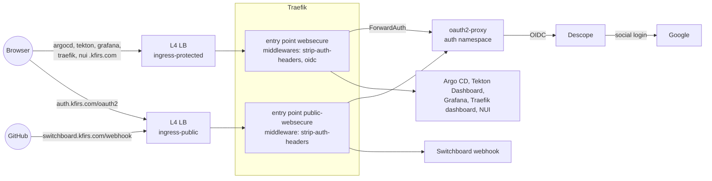
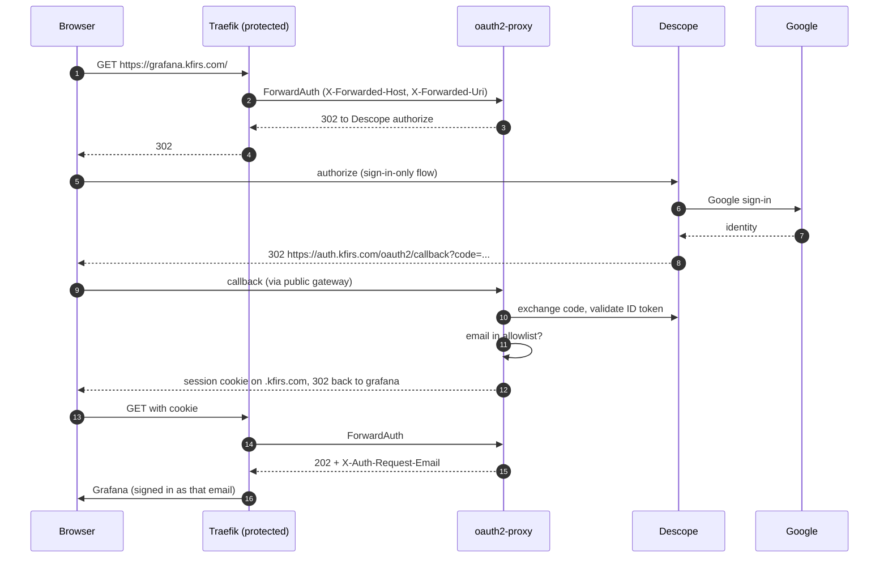

# Phase 3: Ingress and authentication

**Goal**: expose cluster applications through Traefik on L4 (passthrough network) load balancers, and make OpenID
authentication against a strict allowlist the default for everything, so an internal application can't be exposed
unauthenticated by forgetting a setting. Hosts, IPs and names: [reference](../reference.md#ingress).

## Design

One Traefik deployment serves two Gateways, each on its own entry points and its own load balancer IP:

| Gateway | Entry point | Load balancer | Interceptor | Routes allowed from |
| --- | --- | --- | --- | --- |
| `protected` | `websecure` (8443 → 443) | `ingress-protected` | every request authenticated | any namespace |
| `public` | `public-websecure` (9443 → 443) | `ingress-public` | none | namespaces labelled `kfirs.com/public-ingress=true` |

The interceptor is attached to the **entry point**, not to routes: every route on the protected gateway is
authenticated, including routes added later, and there is no per-route switch to forget. Going public requires two
deliberate acts in `delivery`: labelling the namespace and attaching to the `public` gateway. Only `auth` (the login
callback) and `switchboard` (HMAC-verified webhooks) are public.

Both gateways terminate TLS with a wildcard certificate for `*.kfirs.com` (cert-manager, Let's Encrypt, DNS-01), and
redirect HTTP to HTTPS.

## Login

## Allowlist

Two independent gates, both required:

1. **Descope** authenticates. Its flow is sign-in only (template "Sign in, allow social login when sign-ups are not
   allowed"), so only users created in Descope can finish it; Google is the login method.
2. **oauth2-proxy** authorizes. It accepts only emails listed in the Secret Manager secret `hub-authorized-emails`.

A mistake in either one (for example Descope reverting to its default sign-up-or-in flow) does not open the hub.
Granting access means adding the user in Descope and their email to the allowlist.

## Applications behind the interceptor

| Application | Application-level login |
| --- | --- |
| Grafana | Trusts `X-Auth-Request-Email` (auth proxy mode); users are created on first visit |
| Argo CD | Its own OIDC login against the same Descope client (single sign-on, no second password); every authenticated user is admin |
| Tekton Dashboard, NUI, Traefik dashboard | None; the interceptor is the only gate |

Header safety: `strip-auth-headers` removes `X-Auth-Request-*` headers sent by clients before ForwardAuth runs, and
ForwardAuth copies the verified values from oauth2-proxy's response. NetworkPolicies let protected backends accept
traffic only from the `traefik` namespace (Argo CD's server also admits its own namespace and Switchboard's webhook
relay), so the interceptor can't be bypassed from inside the cluster.

## Decisions

| Decision | Why | Rejected |
| --- | --- | --- |
| Traefik behind L4 load balancers | Simple, portable, fast to change; TLS and routing stay in the cluster | GKE Gateway / L7 load balancers (unreliable for this use, slow to converge) |
| Gateway API resources | Standard, portable routing API; Traefik implements it | Traefik-only `IngressRoute`s (still used for the dashboard, which is internal to Traefik) |
| Two load balancers, interceptor on the entry point | Authentication by default, no per-route opt-in | One load balancer with a per-route auth filter (easy to forget) |
| Descope as identity provider | Users are managed individually, not by email domain; Google login included | Google OAuth directly (domain-oriented, no user management) |
| Default Descope OIDC application | Available on the free plan; Argo CD and oauth2-proxy share it | Separate applications per client (paid feature) |
| Allowlist also in oauth2-proxy | Defence in depth against identity-provider misconfiguration | Descope alone |
| Allowlist in Secret Manager | Keeps personal emails out of public Git | A ConfigMap in `delivery` |
| One `.kfirs.com` session cookie | One login covers every hub application | Per-application logins |

## Manual setup

Descope (company `KFIRS`, project `development`, `P3JyPV2qsSrMLUpVPTGcBNRHlSkv`; used only by the hub). Already
configured:

- Flow `hub-sign-in` ("Hub sign in (Google, pre-created users)"): Google sign-in that only succeeds for existing
  users. The first Google login of a pre-created user sends a one-time code to their email and links the Google identity
  to that user.
- The default OIDC application's login page uses `hub-sign-in` (was `sign-up-or-in`).
- User `arikkfir@gmail.com` exists.

Still manual: create an access key (Access keys → create); store it as Secret Manager secret `oidc-client-secret`.
Recommended: restrict the OIDC application's approved redirect URLs to `https://auth.kfirs.com/oauth2/callback` and
`https://argocd.kfirs.com/auth/callback`. To
admit someone else, create their user in Descope with their Google email as the login ID, and add the email to
`hub-authorized-emails`.

Secret Manager: `oauth2-proxy-cookie-secret` (`openssl rand -base64 32 | tr -- '+/' '-_'`) and
`hub-authorized-emails` (one email per line).

## Open questions

- Replacing the email allowlist with a Descope role claim once the ID token's role claim shape is verified.
- Short-lived access for non-browser clients (the Argo CD CLI uses `--port-forward` today).
