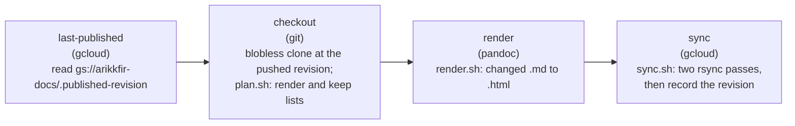
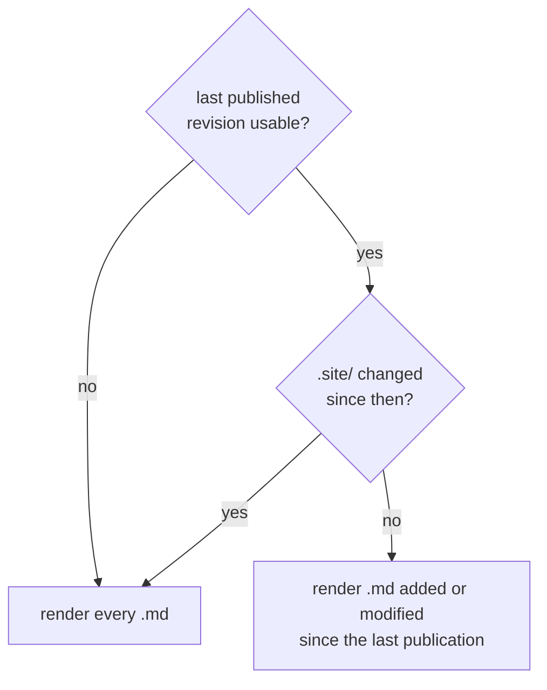
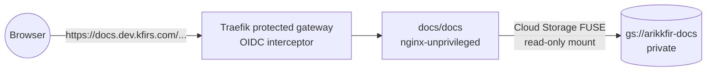

# Phase 4: Docs site

**Goal**: every push to `docs/main` publishes the repository to the private bucket `arikkfir-docs`, which the docs site
serves at `https://docs.dev.kfirs.com` behind the hub's sign-in. Markdown changed since the last publication is
rendered to HTML, and the bucket is synchronized with the tree (differences only, removed files pruned). No navigation,
no listings; pages are reached by direct links.

## Pipeline

Octomatron runs [`.tekton/publish.yaml`](https://github.com/arikkfir-org/docs/blob/main/.tekton/publish.yaml) on
pushes to `main` (see [`.octomatron.yaml`](https://github.com/arikkfir-org/docs/blob/main/.octomatron.yaml)), in
namespace `ci-docs` as service account `pipeline`.

| Step | Image | Does |
| --- | --- | --- |
| `last-published` | `google-cloud-cli:586.0.0-slim` | Reads the revision recorded by the last successful publication (empty if none) |
| `checkout` | `alpine/git:v2.54.0` | Clones without blobs, checks out the pushed commit, runs `.site/plan.sh` |
| `render` | `pandoc/core:3.11.0` | Runs `.site/render.sh`: GitHub-flavoured Markdown to standalone HTML with `.site/template.html` and `.site/site.lua` |
| `sync` | `google-cloud-cli:586.0.0-slim` | Runs `.site/sync.sh`: `gcloud storage rsync` twice, then writes `.published-revision` |

## What gets rendered

Rendering "changed since the last *successful* publication" rather than "changed in this push" means a failed or
cancelled publication is repaired by the next one. For a normal push the two are identical.

The renderer rewrites relative links to `.md` files so they point at the `.html` pages, turns Mermaid code blocks
into client-rendered diagrams, and takes the page title from the first `#` heading. The page has no header, menu or
table of contents.

## Synchronization

`gcloud storage rsync --recursive --checksums-only --delete-unmatched-destination-objects` compares content hashes,
so only changed files upload, and objects without a local counterpart are deleted. Two passes:

| Pass | Includes | Metadata |
| --- | --- | --- |
| 1 | `*.md` sources | `Content-Type: text/markdown; charset=utf-8`, `Cache-Control: public, max-age=300` |
| 2 | everything else (rendered and hand-written HTML, images) | inferred type, `Cache-Control: public, max-age=300` |

Both passes exclude hidden paths (`.git/`, `.site/`, `.tekton/`, dotfiles, and the `.published-revision` marker) and
the HTML pages of Markdown files that were not re-rendered. gcloud applies exclusions to the destination listing too,
so excluded objects are neither uploaded nor deleted: unchanged pages stay as they are, and pages of deleted
Markdown files are pruned. The object metadata is informational: the docs site sets the served headers itself.

## Serving

The `docs` Application in `delivery` runs nginx with the bucket mounted read-only by GKE's Cloud Storage FUSE CSI
driver (sidecar), as Kubernetes service account `docs/docs`. Sign-in happens at the gateway, as for every hub tool.

| Request | Response |
| --- | --- |
| A page or file | `200`; `.html` as `text/html`, `.md` as `text/markdown`, both UTF-8; `Cache-Control: private, max-age=300` |
| A directory, or `/` | `404`: no listings, no index pages |
| A hidden path (`.published-revision`, dotfiles) | `404` |

A publication shows up within about a minute (Cloud Storage FUSE caches object metadata for 60 seconds by default).

## URLs

| Repository file | URL |
| --- | --- |
| `hub/designs/x.md` | `https://docs.dev.kfirs.com/hub/designs/x.html` and `…/x.md` |
| `hub/overview.html` | `https://docs.dev.kfirs.com/hub/overview.html` |

## Access

| Principal | Role | On |
| --- | --- | --- |
| Allowlisted users | Sign-in at the protected gateway (OIDC interceptor) | `https://docs.dev.kfirs.com` |
| `docs/docs` (Workload Identity) | `roles/storage.objectViewer` | `arikkfir-docs` |
| `ci-docs/pipeline` (Workload Identity) | `roles/storage.objectUser`, `roles/storage.legacyBucketReader` | `arikkfir-docs` |

The bucket enforces public access prevention; nothing reads it anonymously.

## Decisions

| Decision | Why | Rejected |
| --- | --- | --- |
| Private bucket, served by nginx in the cluster through Cloud Storage FUSE, behind the OIDC interceptor | Same sign-in as every hub tool; the pipeline and the bucket stay as they are | Public bucket; Cloud Storage website hosting behind an HTTPS load balancer and IAP (cost, a second sign-in system) |
| pandoc with a small Lua filter | One static binary, faithful GitHub-flavoured Markdown, easy link rewriting | Static-site generators (navigation, themes and config we don't want yet) |
| Render only changed Markdown | Required; keeps publications fast as the site grows | Re-render everything on every push |
| Record the published revision in the bucket | Makes incremental rendering self-healing after failures | Trusting each push's `before` SHA |
| `latest` concurrency for publications | One publication at a time; the newest waiting one covers everything since the last success, older waiting ones are dropped | Parallel publications (an older one could finish last and roll back newer content) |
| A committed `x.html` next to `x.md` fails the pipeline | The rendered page would silently overwrite the hand-written one | Last writer wins |

## Operations

- Force a full re-render: change anything under `.site/`, or delete `gs://arikkfir-docs/.published-revision`.
- A failed publication leaves the previous content in place; the next push repairs it.
