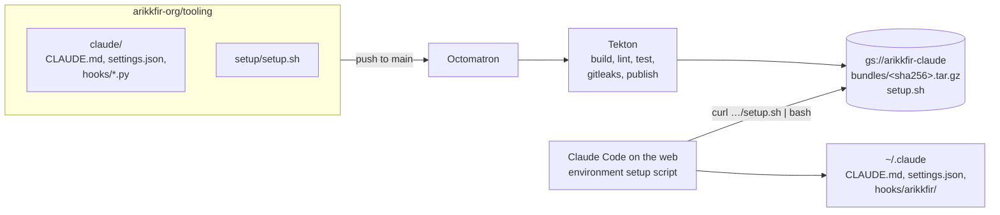

# Phase 5: Claude Code tooling

**Goal**: every Claude Code on the web session starts with the same user-level configuration: response style
(`CLAUDE.md`) and a couple of safety and quality hooks. It is published publicly from
[arikkfir-org/tooling](https://github.com/arikkfir-org/tooling), and no secrets can enter it.

## Design



## Bundle

| File | Purpose |
| --- | --- |
| `CLAUDE.md` | Lead with the answer; answer only what was asked; short by default; terse, plain language; no preaching or hedging |
| `settings.json` | Registers the two hooks |
| `hooks/guard.py` (`PreToolUse`, Bash) | Denies force-pushes and deletions targeting `main`/`master` (explicit, `HEAD`, or the checked-out branch) and recursive deletion of `/` or the home directory |
| `hooks/format.py` (`PostToolUse`, Edit/Write) | Formats the written `.go` / `.tf` file with `gofmt` / `terraform fmt` when installed, and tells Claude if the file changed or failed to parse |

Hooks are stdlib-only Python, fail open (a bug never blocks the session) and are covered by tests.

## Installation in a session

The environment's setup script runs before Claude Code starts:

```bash
curl -fsSL https://storage.googleapis.com/arikkfir-claude/setup.sh | bash
```

Claude Code in cloud sessions is started with the launcher's settings file and all default setting sources, so the
user-level files written into `~/.claude` are loaded like on a workstation.

`setup.sh` is pinned at build time to one content-addressed bundle. It downloads it, checks the SHA-256, installs
`CLAUDE.md`, replaces `hooks/arikkfir/` as a whole, and merges `settings.json` into any existing settings (bundle values
win). Running it twice changes nothing. On any failure it warns and exits 0, because a failed setup script would stop
the session from starting; `ARIKKFIR_CLAUDE_STRICT=1` makes failures fatal.

## Publication

| Pipeline (`.octomatron.yaml`) | Trigger | Steps (`.tekton/bundle.yaml`) |
| --- | --- | --- |
| `ci` | pull requests, merge queue | build, shellcheck, unit and end-to-end tests, verify, gitleaks |
| `publish` | push to `main` | the same, then upload |

Uploads go bundle first, then `setup.sh`, so the published setup script never points at a bundle that isn't there.
Bundles are immutable (`Cache-Control: immutable`); `setup.sh` is `no-cache`. Both use
`gcloud storage rsync --checksums-only`, so re-publishing unchanged content is a no-op.

## No secrets

| Guard | Stops |
| --- | --- |
| `git archive` of committed `claude/` only | Untracked or ignored local files |
| `verify.py` allowlist (`CLAUDE.md`, `settings.json`, `hooks/*.py`), 256 KiB cap | Unexpected files, binaries, archives |
| `verify.py` rejects `env`, `apiKeyHelper` and other credential-bearing settings keys | Credentials configured through settings |
| gitleaks over the extracted bundle and the repository | Tokens and keys in allowed files |

## Access

| Principal | Role | On |
| --- | --- | --- |
| `allUsers` | `roles/storage.legacyObjectReader` (no listing) | `arikkfir-claude` |
| `ci-tooling/pipeline` (Workload Identity) | `roles/storage.objectUser`, `roles/storage.legacyBucketReader` | `arikkfir-claude` |

## Decisions

| Decision | Why | Rejected |
| --- | --- | --- |
| Content-addressed bundles + pinned `setup.sh` | Atomic updates: no window where the script and the bundle disagree | Overwriting `bundle.tar.gz` and a checksum file |
| Fail-soft setup | A broken download must not block every session | Fail hard by default |
| Python hooks | Reliable JSON and shell tokenizing without `jq` | Bash hooks with `jq` |
| Hooks in `hooks/arikkfir/` | The bundle can replace its own hooks without touching others | Mixing with user hooks |
