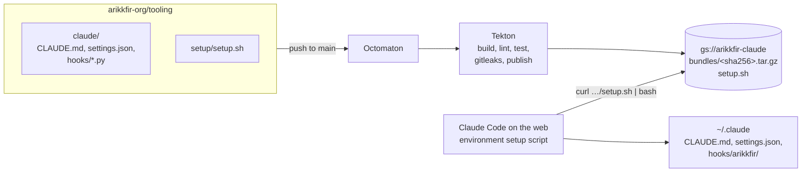

# Phase 5: Claude Code tooling

**Goal**: every Claude Code on the web session starts with the same user-level configuration: response style
(`CLAUDE.md`), safety and quality hooks, and permissions for routine commands. It is published publicly from
[arikkfir-org/tooling](https://github.com/arikkfir-org/tooling), and no secrets can enter it.

## Design



## Bundle

| File | Purpose |
| --- | --- |
| `CLAUDE.md` | Lead with the answer; answer only what was asked; one to three lines by default; "Yes" or "No" first; findings without their evidence, in plain terms; terse, plain language; no preaching or hedging; how to answer review threads |
| `settings.json` | Registers the hooks. Allows the repositories' checks, local git and the read-only GitHub tools without a prompt, and asks before `rm -r`, a push that deletes a branch, or a switch that discards changes or resets a branch |
| `hooks/guard.py` (`PreToolUse`, Bash) | Denies force-pushes and deletions targeting `main`/`master` (explicit, `HEAD`, or the checked-out branch) and recursive deletion of `/` or the home directory. Asks, even where an allow rule matches, before deleting any other remote branch and before a `git switch` that discards changes or resets a branch, however its options are spelled |
| `hooks/commit_message.py` (`PreToolUse`, Bash) | In `arikkfir-org` repositories, denies a `git commit` whose message breaks the commit rules of `CONTRIBUTING.md`, listing what to fix |
| `hooks/add_repo.py` (`PreToolUse`, the remote-session server's `add_repo` and `register_repo_root`) | Allows attaching one of `arikkfir-org`'s public repositories without a prompt; `fin` and a repository not listed yet still ask |
| `hooks/format.py` (`PostToolUse`, Edit/Write) | Formats the written `.go` / `.tf` file with `gofmt` / `terraform fmt` when installed, and tells Claude if the file changed or failed to parse |
| `hooks/pull_request.py` (`PostToolUse`, `create_pull_request`) | After an `arikkfir-org` pull request opens, reminds the session to request `arikkfir-reviewer` and to link the Linear issue and design |
| `hooks/git_hooks.py` (`SessionStart`; `PostToolUse`, `register_repo_root`) | In cloud sessions, points each repository that commits hooks in `.githooks/` at them (`core.hooksPath`) |
| `hooks/dockerd.py` (`SessionStart`) | In cloud sessions, starts the Docker daemon in the background, pulling from Docker Hub through `mirror.gcr.io` |

Hooks are stdlib-only Python, fail open (a bug never blocks the session) and are covered by tests.

`commit_message.py`, `add_repo.py`, `pull_request.py`, `git_hooks.py`, `dockerd.py`, `guard.py`'s questions, the permissions and the new `CLAUDE.md` rules come with ENG-51 (arikkfir-org/tooling#11 to #17): each is live once its pull request merges and a session installs the new bundle.

## Installation in a session

The environment's setup script runs before Claude Code starts:

```bash
curl -fsSL https://storage.googleapis.com/arikkfir-claude/setup.sh | bash
```

Claude Code in cloud sessions is started with the launcher's settings file and all default setting sources, so the
user-level files written into `~/.claude` are loaded like on a workstation.

`setup.sh` is pinned at build time to one content-addressed bundle. It downloads it, checks the SHA-256, installs
`CLAUDE.md`, replaces `hooks/arikkfir/` as a whole, and merges `settings.json` into any existing settings (bundle values
win). Running it twice changes nothing. On any failure it warns and exits 0, because a failed setup script would stop
the session from starting; `ARIKKFIR_CLAUDE_STRICT=1` makes failures fatal.

## Publication

| Pipeline (`.octomaton.yaml`) | Trigger | Steps (`.tekton/bundle.yaml`) |
| --- | --- | --- |
| `ci` | pull requests, merge queue | build, shellcheck, unit and end-to-end tests, verify, gitleaks |
| `publish` | push to `main` | the same, then upload |

Uploads go bundle first, then `setup.sh`, so the published setup script never points at a bundle that isn't there.
Bundles are immutable (`Cache-Control: immutable`); `setup.sh` is `no-cache`. Both use
`gcloud storage rsync --checksums-only`, so re-publishing unchanged content is a no-op.

## No secrets

| Guard | Stops |
| --- | --- |
| `git archive` of committed `claude/` only | Untracked or ignored local files |
| `verify.py` allowlist (`CLAUDE.md`, `settings.json`, `hooks/*.py`), 256 KiB cap | Unexpected files, binaries, archives |
| `verify.py` rejects `env`, `apiKeyHelper` and other credential-bearing settings keys | Credentials configured through settings |
| gitleaks over the extracted bundle and the repository | Tokens and keys in allowed files |

## Access

| Principal | Role | On |
| --- | --- | --- |
| `allUsers` | `roles/storage.legacyObjectReader` (no listing) | `arikkfir-claude` |
| `ci-tooling/ci-tooling-publish` (Workload Identity; `main` only, see [CI ServiceAccounts](ci-service-accounts.md)) | `roles/storage.objectUser`, `roles/storage.legacyBucketReader` | `arikkfir-claude` |

## Decisions

| Decision | Why | Rejected |
| --- | --- | --- |
| Content-addressed bundles + pinned `setup.sh` | Atomic updates: no window where the script and the bundle disagree | Overwriting `bundle.tar.gz` and a checksum file |
| Fail-soft setup | A broken download must not block every session | Fail hard by default |
| Python hooks | Reliable JSON and shell tokenizing without `jq` | Bash hooks with `jq` |
| Hooks in `hooks/arikkfir/` | The bundle can replace its own hooks without touching others | Mixing with user hooks |
| Permissions in the bundle | Routine commands stop prompting in every session at once, and a test keeps every command the repositories forbid out of the allow list | A `.claude/settings.json` per repository, one copy each to keep in step |
| Commit rules checked before the commit runs (`PreToolUse`) | The session rewrites the message while that is free, in every `arikkfir-org` repository, with nothing installed per repository | A `commit-msg` git hook copied into every repository; a CI check, whose fix needs a force-push |
| `add_repo.py` keyed to the remote-session server's exact tool names and the organization's public repositories | It grants permission: a same-named tool from another server, `fin`, or another organization's repository keeps the normal prompt. The hooks that only remind or configure match the tool from any server | A broad `mcp__.*__add_repo` matcher, or every `arikkfir-org` repository |
| Work-losing git commands also asked about by `guard.py` | A glob can't tell `git switch -qf` from `git switch -c feature`, and a rule ending in `:*` is a trailing wildcard, not a literal colon; `guard.py` parses the command, clusters and `:branch` refspecs included. The ask rules stay for when the hook fails open | Ask rules alone |
| `dockerd` started without waiting for it | Session start stays as fast as before; the first `docker` command waits instead | Waiting for the daemon in the hook |
