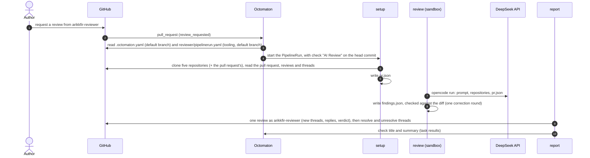
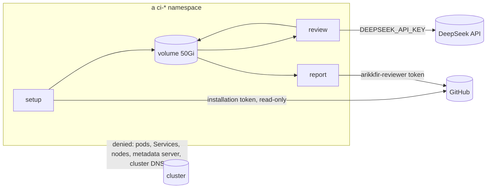

# Pull request reviewer

**Decision**: requesting a review from the GitHub user `arikkfir-reviewer` runs a three-task Tekton pipeline through
Octomaton:

- `setup` puts the hub's repositories and the pull request's full state on a 50Gi volume.
- `review` runs opencode with DeepSeek V4 Pro in a sandbox. The sandbox holds no credential but the model's API key and
  can reach nothing but the internet.
- `report` turns the findings into one GitHub review by `arikkfir-reviewer`, with one thread per finding.

Each finding carries a short code (`IAM-3`), so later rounds reply to its thread or resolve it. Names and wiring:
[reference](../reference.md#pull-request-reviewer).

## Context

The hub is one person's: every pull request needs one approval, and its only human can't approve their own pull
requests, so each merge uses the admin bypass. Changes also cross repositories: a name in `infra` must match `delivery`,
Octomaton and the [reference](../reference.md). A reviewer that reads all five repositories, keeps its findings across
rounds and approves when nothing is left gives each pull request a real review and a real approval.

## Design



| Piece | Where | What |
| --- | --- | --- |
| Trigger | Each repository's `.octomaton.yaml`, read at its default branch | Pipeline `review` (`AI Review`) on `review_request` from `arikkfir-reviewer`; params from the template context; a read-only installation token; the two Secrets it may mount |
| Pipeline | `tooling`: `reviewer/pipelinerun.yaml` | The PipelineRun: tasks `setup`, `review`, `report`; the 50Gi volume; ServiceAccount, sandbox label, DNS and resources per task. Octomaton reads it at `tooling`'s default branch for every repository |
| Scripts and prompt | `tooling`: `reviewer/` | `state.py` writes `pr.json`, `findings.py` checks `findings.json`, `report.py` posts the review. Also `prompt.md` and `opencode.json`. Standard-library Python, tested in `tooling`'s CI. `report` runs its own fresh copy, never the volume's |
| Octomaton | `octomaton` | The `review_request` trigger; `pipelineRun` in another repository; `secrets` a pipeline may mount; remote Tekton references refused |
| Tenant objects | `delivery`: the `ci-tenants` base | ServiceAccount `reviewer`, NetworkPolicy `sandbox`, ExternalSecrets `deepseek-api-key` and `reviewer-github-token` in every `ci-<repository>` namespace |
| Identity and secrets | `infra` | Secret Manager `deepseek-api-key` and `reviewer-github-token`; team `reviewers` (`arikkfir-reviewer`, `push` on every repository) |

### Octomaton

| Change | Behaviour |
| --- | --- |
| Trigger `review_request` | A `pull_request` delivery with action `review_requested` and a requested user (not a team) in `reviewers`, on an open pull request; optional base-branch globs. `.Event` is `review_request`, `.ReviewRequest.Reviewer` the requested login, `.Revision` the head commit |
| One run per request | A request is its own run, keyed by its webhook delivery, as a comment command is by its comment. Re-requesting at the same commit reviews again (the next attempt); a redelivery finds its run |
| Definitions from the default branch | As for comment commands: `.octomaton.yaml` from the repository's default branch, the run at the head commit |
| `pipelineRun` in another repository | `pipelineRun: {repository: tooling, path: reviewer/pipelinerun.yaml}` reads a repository of the same owner at its default branch. `octomaton-lint` checks the reference but can't render it |
| `secrets` | Names Secrets the run may mount besides its token. Allowed only when every trigger is `comment`, `review_request` or `schedule` |
| Remote references refused | A PipelineRun with `pipelineRef`, a `taskRef`, a step `ref`, a `resolver` or a `bundle` is refused, so the Secret guard sees every definition |
| Default concurrency | As for pull requests: runs of one pipeline on one pull request supersede each other |
| Configuration errors | Not reported on review requests: most requests are for people, and each would add a failed check |

### Tasks

| Task | Identity and credentials | Network | Steps |
| --- | --- | --- | --- |
| `setup` | ServiceAccount `reviewer`; the installation token (contents and pull requests: read) as workspace `github-token` | Internet only | `clone`: the five repositories at their default branch and the pull request's repository at the head commit; `pr.diff` and `pr.log` from it; `reviewer/` from `tooling`'s default branch into `.review/`. `state`: `pr.json` from GitHub's REST and GraphQL APIs |
| `review` | ServiceAccount `reviewer`; `DEEPSEEK_API_KEY` from Secret `deepseek-api-key` and nothing else | Internet only | `review`: `opencode run` with `prompt.md` ([opencode](#opencode)). `check`: `findings.py`. `fix`: `opencode run --continue` with the errors, only when `check` found any. `recheck`: `findings.py` again, failing the task if anything is still wrong |
| `report` | ServiceAccount `reviewer`; `GITHUB_TOKEN` from Secret `reviewer-github-token` (`arikkfir-reviewer`'s token) | Internet only | `fetch`: `reviewer/` from `tooling`'s default branch into the task's own `emptyDir`. `report`: that copy of `report.py` reads `findings.json` from the volume, posts the review, resolves threads and writes the `check-title` and `check-summary` results |

The ServiceAccount has no RoleBinding and doesn't mount its token, and its Workload Identity principal has no IAM
role. Every pod carries `kfirs.com/sandbox=true`, which NetworkPolicy `sandbox` confines to public addresses. The pods
resolve names through public resolvers (`dnsPolicy: None`), because cluster DNS is itself inside the cluster. The
cluster's Dataplane V2 enforces the policy (no Calico add-on, which GKE doesn't combine with Dataplane V2). The denied
`169.254.0.0/16` also holds Workload Identity's metadata endpoint (`169.254.169.252:988` on Dataplane V2), so no
reviewer pod can get Google credentials either.



### opencode

| Setting | Value | Why |
| --- | --- | --- |
| Image | `ghcr.io/anomalyco/opencode:1.18.33` pinned by digest (Alpine; `opencode` and `ripgrep`, no git) | The official image of the current v1 release. v2 is days old. Without git, the model reads `pr.diff` and `pr.log` |
| Model | `deepseek/deepseek-v4-pro` in `reviewer/opencode.json`; `enabled_providers: ["deepseek"]` | DeepSeek's strongest released model. V4.1 Pro, once released, is a one-line change |
| Permissions | `"permission": "allow"`, `experimental.continue_loop_on_deny: true` | `opencode run` rejects any "ask" and stops. The sandbox is the boundary, not opencode's prompts |
| Isolation from the repositories | `OPENCODE_DISABLE_PROJECT_CONFIG=1`, `OPENCODE_CONFIG=/workspace/.review/opencode.json`, `--pure` | No `AGENTS.md`, `opencode.json` or plugin from a reviewed repository configures the reviewer; the model reads each `CLAUDE.md` as material, not as its instructions |
| No uploads, no updates | `"share": "disabled"`, `OPENCODE_DISABLE_SHARE=1`, `OPENCODE_DISABLE_MODELS_FETCH=1` (the bundled model list), `"snapshot": false` | Sessions stay in the pod; nothing but DeepSeek's API is called on opencode's own account |
| State | `HOME` and `XDG_*` under `/workspace/.review/home` | `fix` continues `review`'s session, and the steps share only volumes |

DeepSeek V4 Pro costs, per million tokens, $0.022 for cached input, $0.66 for other input and $1.98 for output, twice as
much in DeepSeek's weekday peak hours (01:00–04:00 and 06:00–10:00 UTC). A review that reads a few hundred thousand
tokens, mostly cached across its turns, costs cents.

### The volume

```text
/workspace/
├── pr.json         setup: the pull request's state
├── pr.diff         setup: git diff <base>...<head> of the pull request's repository
├── pr.log          setup: git log <base>..<head>, with each commit's changed files
├── findings.json   review: the findings
├── repos/<name>/   setup: docs, infra, delivery, octomaton, tooling at their default branch; the pull request's
│                   repository (one of those, or another) at the head commit, with its base branch fetched
└── .review/        setup: reviewer/ from tooling's default branch; opencode's home and session
```

### `pr.json`

```json
{
  "repository": "arikkfir-org/infra",
  "number": 14,
  "revision": "head commit under review",
  "reviewer": "arikkfir-reviewer",
  "pr": {"the pull request, as GitHub's REST API returns it": "..."},
  "files": [
    {"filename": "…", "status": "modified", "patch": "…", "commentable": {"RIGHT": [[10, 25]], "LEFT": [[10, 22]]}}
  ],
  "comments": [{"the conversation's comments (REST)": "..."}],
  "reviews": [
    {
      "the review, as GitHub's REST API returns it": "...",
      "threads": [
        {
          "id": "PRRT_…", "code": "IAM-3", "isResolved": false, "isOutdated": false, "resolvedBy": null,
          "path": "terraform/gcp/iam.tf", "line": 42, "startLine": null, "diffSide": "RIGHT", "subjectType": "LINE",
          "comments": [{"author": "arikkfir-reviewer", "body": "…", "createdAt": "…", "url": "…"}]
        }
      ]
    }
  ],
  "codes": {"IAM-3": {"isResolved": false, "title": "…"}}
}
```

- A thread is listed under the review of its first comment. It keeps every reply, whoever wrote it.
- `code` is set only on threads `arikkfir-reviewer` started. `codes` lists every code used so far, resolved or not.
- `commentable` lists the line ranges GitHub accepts comments on, per side of the diff.

### `findings.json`

```json
{
  "summary": "What the pull request does and the review's overall take, in a few sentences. No findings.",
  "findings": {
    "IAM-3": {
      "title": "One line",
      "priority": "blocking",
      "severity": "high",
      "likelihood": "medium",
      "path": "terraform/gcp/iam.tf",
      "line": 42,
      "startLine": 40,
      "side": "RIGHT",
      "body": "Markdown: what is wrong, why it matters, how to fix it."
    }
  }
}
```

| Field | Rule |
| --- | --- |
| Code (the key) | `^[A-Z][A-Z0-9]{0,15}-[1-9][0-9]{0,3}$`. A code already in `codes` means the same finding; a new finding takes a code not in `codes` |
| `priority` | 🔴 `blocking` (must fix), 🟡 `non-blocking` (should fix) or 🔵 `nit` (could fix) |
| `severity` | The harm if it goes wrong: `low`, `medium`, `high` or `urgent` |
| `likelihood` | How likely it is to go wrong: `low`, `medium` or `high` |
| `path`, `line`, `startLine`, `side` | New codes only: a file of the diff and a range within its `commentable` lines on `side` (default `RIGHT`). Without `line`, a file-level thread. Without `path`, a finding about the pull request as a whole (its description, its scope): a file-level thread on the first changed file, marked as such. Ignored for existing codes, whose thread stays where it is |
| `summary` | At most 1,500 characters; never a finding |

### What the prompt asks

`reviewer/prompt.md` is a draft, to be refined with real reviews. It asks the reviewer to:

- Read the shared house rules first: `docs/CONTRIBUTING.md` (the conventions, including the code guidelines below) and
  the contract, `docs/hub/reference.md`.
- Then read the rules of the pull request's repository: its `CLAUDE.md`, `README.md` and any contributing notes. Where
  they conflict with the house rules, the repository's rules win.
- Review the change (`pr.diff`, `pr.log`). Where it interacts with code in other repositories or with the
  infrastructure (Terraform in `infra`, manifests in `delivery`, Octomaton's contract), use those repositories to
  check its claims, its feasibility and its robustness.
- Look for correctness and security problems, breaks of a repository's rules or of the contract, missing tests or
  docs the rules require, and a description that doesn't match the change. Leave style to linters.
- Carry earlier rounds forward. Read every thread and reply in `pr.json`. Raise a finding again under its code only if
  it still holds, answering the author's reply when there is one. Drop it when the author fixed it or answered it
  convincingly.
- One problem per finding, with a new code for a new problem. Anchor it on the changed line that causes it or should
  fix it. Give it a priority, a severity and a likelihood.
- Write plainly: simple English, short and concise; no praise, no filler.
- Write `findings.json`, and nothing else: the repositories are read-only.

The code guidelines (reuse over duplication, refactoring over scaffolding, the right thing over the easy one, and the
Go rules for errors, configuration, spans and logs) are house rules, in `CONTRIBUTING.md`, for people and the reviewer
alike.

### From findings to GitHub

`report` asks GitHub for the threads again with `arikkfir-reviewer`'s token, rather than trusting the volume, and reads
each code from a marker in the first comment (`<!-- reviewer:IAM-3 -->`, with the code shown as the comment's first
word):

| Code in `findings.json` | Thread with that code | Action, all in one review |
| --- | --- | --- |
| New | None | A new thread at `path`/`line` |
| Raised again | Open, or resolved by the reviewer | A reply with the finding's `body`; a resolved thread is unresolved |
| Raised again as a `nit` | Resolved by someone else | Nothing: the author resolved it as won't fix, and that stands |
| Raised again, `non-blocking` or `blocking` | Resolved by someone else | A reply, and the thread is unresolved |
| Not raised | Open | A reply "No longer found at `<commit>`", then the thread is resolved |
| Not raised | Resolved | Nothing |

Every finding is a thread, whose first comment reads:

```text
🔴 IAM-3: <title>
Blocking · high severity · medium likelihood

<body>
```

Threads other users started are left alone. The review is created pending on the reviewed commit, filled, then
submitted. A pending review left by an interrupted `report` is deleted first. A marker with the PipelineRun's name in
the body keeps a retried `report` from submitting twice.

| Findings | Review |
| --- | --- |
| Any `blocking` or `non-blocking` finding | Request changes |
| `nit` findings only | Approve, with the nits as open threads |
| None | Approve |

A nit's thread stays open. The author either fixes it and requests another review, or resolves it to say it won't be
fixed, and the approval stands. The body holds the summary and one line of counts (🔴 blocking, 🟡 non-blocking,
🔵 nits, resolved). It never repeats a finding.

## Decisions

| Decision | Why | Rejected |
| --- | --- | --- |
| A review requested from a real user starts the pipeline, and that user posts the review | Only users can be requested as reviewers, and their review fulfils the request. Re-requesting after changes is GitHub's own loop | The Octomaton App reviewing (it can't be requested); every push (cost, noise); a comment command |
| A fine-grained token of `arikkfir-reviewer`, pull requests read and write | The review, replies and resolution need the user; the token can't push code even though the user may | A classic token (all of the user's rights); the App (not the user) |
| `arikkfir-reviewer` gets `push` through team `reviewers` | Resolving a thread takes write access, and an approval by a user with write access counts toward the one required approval | `triage` (can't resolve threads) |
| `review_request` reads definitions from default branches only | A pull request can't rewrite its reviewer, its prompt or its Secrets, like comment commands | Definitions at the head commit, like `pull_request` |
| One PipelineRun in `tooling`, referenced by every repository | One copy to change; it sits next to its scripts and their tests | A copy in each of six repositories; a cluster Pipeline through Tekton's cluster resolver (the Secret guard can't see it) |
| Octomaton lets a pipeline mount the Secrets it declares, only if all its triggers read default-branch definitions | Head-commit definitions still can't name a Secret, so a pull request can't reach the reviewer's token | A server-wide allowlist: any pull request's CI could mount the token |
| Octomaton refuses remote Tekton references (`pipelineRef`, resolvers, bundles) | The guard only sees inline definitions; a remote one would slip past it. No repository uses them | Resolving them first (Octomaton would fetch and trust what Tekton fetches) |
| Every reviewer pod is sandboxed, not just `review` | None of them needs the cluster; each holds one credential | `setup` and `report` on the CI default network |
| Codes as keys, one thread per code | A finding keeps its conversation across rounds; the author's replies are the next round's input | A list matched by location or text (moves with the code, breaks on rewording) |
| The model sets each finding's priority (with severity and likelihood); `report` derives the verdict | Every verdict follows from what the review shows. Only nits leave an approval | A model-chosen verdict |
| Every finding is a thread, a pull-request-wide one too | Each finding keeps its code, its conversation and its resolution | Pull-request-wide findings in the review's body, which can't be tracked or resolved |
| Setup lists the commentable lines, and `findings.py` checks against them, with one correction round | Line anchors are where model output goes wrong; GitHub rejects the whole review for one bad anchor | Posting and falling back when GitHub refuses |

## Security and failure modes

- The sandbox can reach the internet, GitHub anonymously included, and spend DeepSeek credit. Content in a pull request
  could steer the model into leaking the DeepSeek key. Only members of the organization can open pull requests that run
  anything (forks are ignored) and request reviews, so the key's exposure is the price of an internet-connected model.
  Revoke and rotate it in DeepSeek's console and Secret Manager if needed.
- The model can write anywhere on the volume, so nothing that holds a credential runs code from it. `report` runs
  `report.py` from its own copy of `tooling`, and reads only `findings.json` from the volume, as data. It checks the
  schema, sizes, codes and anchors again against the diff and threads it fetches itself, and never follows
  instructions from the file. `setup` runs before the model does. The worst a steered model can do is post
  a wrong review, and a human reads it before merging.
- `arikkfir-reviewer`'s token lives only in the `ci-*` namespaces as Secret `reviewer-github-token`. Octomaton lets
  only `review` mount it. It expires within a year; renewing it is a manual step.
- DeepSeek unreachable, a timeout or a second invalid `findings.json` fails `review` and the check, and no review is
  posted. Re-run the check, or re-request the review.
- Spot preemption: `setup` and `report` retry twice (both can be repeated), `review` once.
- A new request for the same pull request supersedes the running review (Octomaton's default for pull requests).

## Rollout

1. docs (this pull request): the design and the [reference](../reference.md#pull-request-reviewer).
2. infra: the two Secret Manager secrets and team `reviewers`. You apply `terraform/gcp` and `terraform/github`, then
   add the values:
   - DeepSeek: an API key from `platform.deepseek.com`.
   - `arikkfir-reviewer`: signed in as that user, create a fine-grained token with resource owner `arikkfir-org`,
     all repositories, and pull requests read and write (metadata read comes with it). Expiry: one year (the
     organization's maximum is 366 days). The organization requires an owner's approval for such tokens: approve the
     request under the organization's settings, Personal access tokens, Pending requests.

   ```bash
   gcloud secrets versions add deepseek-api-key --data-file=-
   gcloud secrets versions add reviewer-github-token --data-file=-
   ```

3. delivery: the tenant objects. The ExternalSecrets turn ready once the values exist.
4. octomaton: the trigger, cross-repository `pipelineRun`, `secrets`, and refusing remote references. It deploys
   itself.
5. tooling: `reviewer/`.
6. Each repository: pipeline `review` in `.octomaton.yaml`, after step 4 is live.
7. Try it: request a review from `arikkfir-reviewer` on a pull request.

## Open questions

- The prompt: `reviewer/prompt.md` starts as a draft. It will be tuned against real reviews.
- DeepSeek V4.1 Pro: DeepSeek said on 2026-09-10 that it is coming, without a date. Switching is one line in
  `reviewer/opencode.json`.
- The App already receives review events (`pull_request_review`, `pull_request_review_comment`,
  `pull_request_review_thread`), which Octomaton ignores. An author's reply to a finding could start a new round
  without a re-request.
- Every pull request could get the reviewer automatically (a `CODEOWNERS` entry requests it on open) instead of on
  request.
- A token budget per review, if DeepSeek's spend needs a cap.
