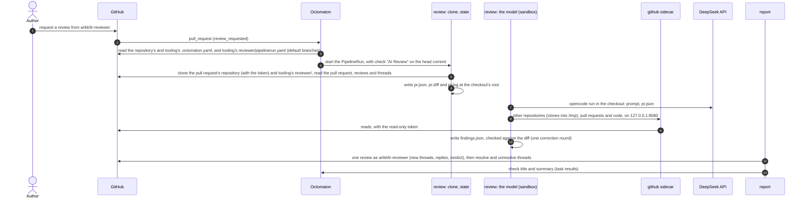
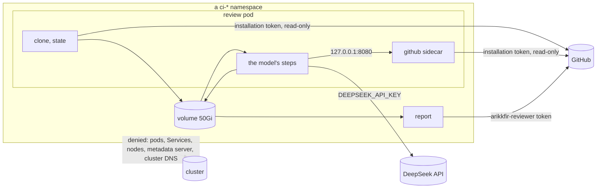
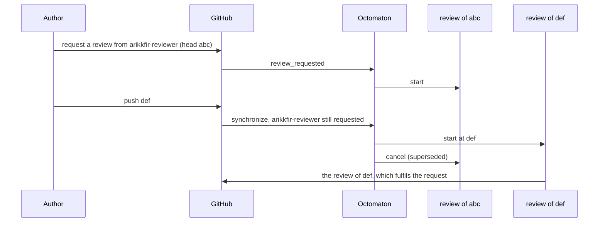

# Pull request reviewer

**Decision**: requesting a review from the GitHub user `arikkfir-reviewer` runs a two-task Tekton pipeline through
Octomaton:

- `review` checks out the pull request's repository on a 50Gi volume, with the pull request's full state at its root,
  then runs opencode with DeepSeek in a sandbox, in the hub's reviewer image (opencode plus bash, python3, git and the
  usual command-line tools), in that checkout. The model's steps hold no credential but its API key and can reach
  nothing but the internet. Their `github` sidecar holds a token that reads every repository's code and pull
  requests, and reads GitHub for the model, which clones the hub's other repositories as it needs them and can follow a
  change into an internal repository (`fin`) without the token.
- `report` turns the findings into one GitHub review by `arikkfir-reviewer`, with one thread per finding.

Each finding carries a short code (`IAM-3`), so later rounds reply to its thread or resolve it. Names and wiring:
[reference](../reference.md#pull-request-reviewer).

## Context

The hub is one person's: every pull request needs one approval, and its only human can't approve their own pull
requests, so each merge uses the admin bypass. Changes also cross repositories: a name in `infra` must match `delivery`,
Octomaton and the [reference](../reference.md). A reviewer that reads all five repositories, keeps its findings across
rounds and approves when nothing is left gives each pull request a real review and a real approval.

## Design



| Piece | Where | What |
| --- | --- | --- |
| Trigger | `tooling`: `organization.pipelines` in `.octomaton.yaml` (the organization repository), read at its default branch | Pipeline `review` (`AI Review`) for every repository, on `review_request` from `arikkfir-reviewer`; params from the template context; a read-only installation token for every repository; the two Secrets it may mount |
| Pipeline | `tooling`: `reviewer/pipelinerun.yaml` | The PipelineRun: tasks `review`, `report`; the 50Gi volume; ServiceAccount, sandbox label, DNS and resources per task; the reviewer image for every step and the sidecar, so a node pulls one image for a review. Octomaton reads it at `tooling`'s default branch for every repository |
| Scripts and prompt | `tooling`: `reviewer/` | `state.py` writes `pr.json`, `findings.py` checks `findings.json`, `report.py` posts the review, `github_proxy.py` serves GitHub in the `github` sidecar. Also `prompt.md` and `opencode.json`. Standard-library Python, tested in `tooling`'s CI. `report` and the sidecar run their own fresh copies, never the volume's |
| Image | `octomaton`: `images/reviewer/`, pipelines `reviewer-image` and `reviewer-image-check` | opencode's image plus the model's tools, published to Artifact Registry as `ci-octomaton-release` |
| Octomaton | `octomaton` | The `review_request` trigger; `pipelineRun` in another repository; `secrets` a pipeline may mount; `githubToken.repositories: all`; remote Tekton references refused; organization pipelines |
| Tenant objects | `delivery`: the `ci-tenants` base | ServiceAccount `reviewer`, NetworkPolicy `sandbox`, ExternalSecrets `reviewer-deepseek-api-key` and `reviewer-github-pat` in every `ci-<repository>` namespace |
| Identity and secrets | `infra` | Secret Manager `reviewer-deepseek-api-key` and `reviewer-github-pat`; team `reviewers` (`arikkfir-reviewer`, `push` on every repository) |

### Octomaton

| Change | Behaviour |
| --- | --- |
| Trigger `review_request` | A `pull_request` delivery with action `review_requested` and a requested user (not a team) in `reviewers`, on an open pull request; optional base-branch globs. `.Event` is `review_request`, `.ReviewRequest.Reviewer` the requested login, `.Revision` the head commit |
| One run per request | A request is its own run, keyed by its webhook delivery, as a comment command is by its comment. Re-requesting at the same commit reviews again (the next attempt); a redelivery finds its run |
| A pending request follows the head | New commits on the pull request (`synchronize`) while the review is still requested run the request's pipelines again at the new head, as that request (`.Action` stays `review_requested`), and supersede the older commit's run |
| Definitions from the default branch | As for comment commands: `.octomaton.yaml` from the repository's default branch, the run at the head commit |
| `pipelineRun` in another repository | `pipelineRun: {repository: tooling, path: reviewer/pipelinerun.yaml}` reads a repository of the same owner at its default branch. `octomaton-lint` checks the reference but can't render it |
| `secrets` | Names Secrets the run may mount besides its token. Allowed only when every trigger is `comment`, `review_request` or `schedule` |
| `githubToken.repositories: all` | Mints the run's token for every repository the App is installed on in the owner, with the pipeline's `permissions`, and keeps that scope on refresh. Allowed only when every trigger is `comment`, `review_request` or `schedule`, as for `secrets` |
| Remote references refused | A PipelineRun with `pipelineRef`, a `taskRef`, a step `ref`, a `resolver` or a `bundle` is refused, so the Secret guard sees every definition |
| Default concurrency | As for pull requests: runs of one pipeline on one pull request supersede each other |
| Configuration errors | Not reported on review requests: most requests are for people, and each would add a failed check |
| Organization pipelines | `organization.pipelines` in the organization repository's `.octomaton.yaml` (server setting `OCTOMATON_ORGANIZATION_REPOSITORY`, `tooling` in the hub), read at its default branch, join every repository's pipelines. A repository can't redefine one: a name clash is a configuration error. No `schedule` triggers |

### Tasks

| Task | Identity and credentials | Network | Steps |
| --- | --- | --- | --- |
| `review` | ServiceAccount `reviewer`; the installation token (contents and pull requests: read, every repository) as workspace `github-token`, an isolated workspace that only `clone`, `state` and the sidecar `github` mount (at `/var/run/github-token` in the steps, outside the `/workspace` they all share); `DEEPSEEK_API_KEY` from Secret `reviewer-deepseek-api-key` in `review` and `fix` only | Internet only | Sidecar `github`: [the GitHub proxy](#the-github-proxy), started before the steps. Every step starts in the volume's root, made when the pod starts; the model's cd into the checkout. `clone`: the pull request's repository at the head commit, into `<name>/`, with the installation token as an HTTP header on git's command line, never on the volume; refused if its root already has a `pr.json`, `pr.diff`, `pr.log` or `findings.json` (a link included); `pr.diff` and `pr.log` from it, at its root; `reviewer/` from `tooling`'s default branch, cloned anonymously, into `.review/` beside it. `state`: `<name>/pr.json` from GitHub's REST and GraphQL APIs. `review`: `opencode run` with `prompt.md` ([opencode](#opencode)), refusing to start if the token is mounted. `check`: `findings.py`. `fix`: `opencode run --continue` with the errors, only when `check` found any. `recheck`: `findings.py` again, failing the task if anything is still wrong |
| `report` | ServiceAccount `reviewer`; `GITHUB_TOKEN` from Secret `reviewer-github-pat` (`arikkfir-reviewer`'s token) | Internet only | `fetch`: `reviewer/` from `tooling`'s default branch into the task's own `emptyDir`. `report`: that copy of `report.py` reads `<name>/findings.json` from the volume, posts the review, resolves threads and writes the `check-title` and `check-summary` results |

The ServiceAccount has no RoleBinding and doesn't mount its token, and its Workload Identity principal has no IAM
role. Every pod carries `kfirs.com/sandbox=true`, which NetworkPolicy `sandbox` confines to public addresses. The pods
resolve names through public resolvers (`dnsPolicy: None`), because cluster DNS is itself inside the cluster. The
cluster's Dataplane V2 enforces the policy (no Calico add-on, which GKE doesn't combine with Dataplane V2). The denied
`169.254.0.0/16` also holds Workload Identity's metadata endpoint (`169.254.169.252:988` on Dataplane V2), so no
reviewer pod can get Google credentials either.



### opencode

| Setting | Value | Why |
| --- | --- | --- |
| Image | `me-west1-docker.pkg.dev/arikkfir/images/reviewer:main`, pulled for every pod: `ghcr.io/anomalyco/opencode:1.18.33` (Alpine; `opencode` and `ripgrep`) plus `bash`, `python3`, `git`, `jq`, `yq`, `curl`, `wget` and GNU userland, built from `octomaton`'s `images/reviewer/` | The official image of the current v1 release, v2 being days old, with the tools the model reaches for: `git log` and `git blame` in the checkouts, `curl` and `git` through the GitHub proxy, `jq`, `yq` and `python3` to read what it fetches. opencode runs commands in bash once it is on `PATH` |
| Model | `deepseek/deepseek-flash` (V4.1 Flash) in `reviewer/opencode.json`; `enabled_providers: ["deepseek"]` | A third of V4 Pro's input price ([tooling#18](https://github.com/arikkfir-org/tooling/pull/18)). opencode 1.18.33 hides the deprecated `deepseek-v4-flash`; `deepseek-flash` is its active successor, at the same price. A stronger model is a one-line change |
| Reasoning | `opencode run --variant low` in `review` and `fix`: DeepSeek's `reasoning_effort: low` | A review is some fifty short turns of reading and searching, and each turn waits on the model's reasoning; at the default effort a turn took about ten seconds |
| Permissions | `"permission": {"*": "allow", "task": "deny"}`, `experimental.continue_loop_on_deny: true` | `opencode run` rejects any "ask" and stops. The sandbox is the boundary, not opencode's prompts. No subagents: `opencode run` doesn't log a subagent's steps, and one redid a whole review, unseen, for eleven minutes; denied outright, the `task` tool isn't offered |
| Working directory | The pull request's checkout, `/workspace/shared/<name>`, with `pr.json`, `pr.diff`, `pr.log` and `findings.json` at its root; other repositories cloned by the model into `/tmp` | The model starts in what it reviews, with `git` history at hand, and fetches only the repositories the change touches. The scripts and opencode's state stay beside the checkout in `.review/`, out of its way: in the working directory, models read them for minutes, looking for the expected answer |
| Isolation from the repositories | `OPENCODE_DISABLE_PROJECT_CONFIG=1`, `OPENCODE_DISABLE_EXTERNAL_SKILLS=1`, `OPENCODE_DISABLE_CLAUDE_CODE_PROMPT=1`, `OPENCODE_CONFIG=/workspace/shared/.review/opencode.json`, `--pure` | The working directory is a checkout the pull request controls: no `opencode.json`, `.opencode/`, plugin, `.claude/`/`.agents/` skill or `CLAUDE.md` from it configures the reviewer, and the model reads each `CLAUDE.md` as material, not as its instructions. One path stays open: opencode's `read` tool hands the model an `AGENTS.md` or `CONTEXT.md` from a subdirectory of the checkout as instructions, and no setting turns it off (see [Security](#security-and-failure-modes)) |
| No uploads, no updates | `"share": "disabled"`, `OPENCODE_DISABLE_SHARE=1`, `OPENCODE_DISABLE_MODELS_FETCH=1` (the bundled model list), `OPENCODE_DISABLE_AUTOUPDATE=1`, `"snapshot": false`; an empty `node_modules` and a `package-lock.json` listing `@opencode-ai/plugin` in opencode's config directory | Sessions stay in the pod. Nothing but DeepSeek's API is called on opencode's own account, and opencode doesn't install its plugin package from npm at start (it skips the install only when both exist) |
| State | `HOME` and `XDG_*` under `/workspace/shared/.review/home` | `fix` continues `review`'s session, and the steps share only volumes |

DeepSeek V4.1 Flash costs, per million tokens, $0.15 for input and $0.60 for output (V4 Pro: $0.435 and $0.87). A review
that reads a few hundred thousand tokens costs cents.

### The GitHub proxy

`reviewer/github_proxy.py` (standard-library Python) runs in the `review` pod's `github` sidecar, from a fresh clone of
`tooling`'s default branch, never the volume's. It listens on `127.0.0.1:8080` only, and its readiness gates the steps.

| Path | Methods | Forwards to | With |
| --- | --- | --- | --- |
| `/api/<path>` | `GET`, `HEAD` | `https://api.github.com/<path>` | `Authorization: Bearer <token>` |
| `/git/<owner>/<repository>.git/info/refs?service=git-upload-pack` | `GET`, `HEAD` | `https://github.com/<owner>/<repository>.git/...` | HTTP Basic `x-access-token:<token>` |
| `/git/<owner>/<repository>.git/git-upload-pack` | `POST` | the same | the same |
| `/healthz` | any | nothing | |
| anything else (writes, GraphQL, `git-receive-pack`) | | refused | |

It reads the token file for every request (Octomaton refreshes it), drops the client's own `Authorization` and
cookies, never follows redirects, and points a redirect to GitHub back at itself. The token reads code and pull requests
only (`contents: read`, `pull_requests: read`), so even a request that slipped through could write nothing. The
`github-token` workspace is named only in the sidecar and in `clone` and `state`, which finish before the model starts
(Tekton's isolated workspaces, beta: without them the run is refused), and the `review` and `fix` steps refuse to start
the model if it is mounted in them anyway.

### The volume

```text
/workspace/shared/      the workspace shared (Tekton's mount path; scripts use $(workspaces.shared.path))
├── <name>/             clone: the pull request's repository at the head commit, with origin's branches; the
│   │                   model's working directory
│   ├── pr.json         state: the pull request's state
│   ├── pr.diff         clone: git diff <base>...<head>
│   ├── pr.log          clone: git log <base>..<head>, with each commit's changed files
│   ├── findings.json   review: the findings
│   └── …               the repository's own files
└── .review/            clone: reviewer/ from tooling's default branch; opencode's home and session
/tmp/<repository>/      review: other repositories the model clones through the proxy (each step's own /tmp)
```

The four files at the checkout's root are untracked. `clone` refuses a repository whose root already has one, a link
included: the pull request controls the checkout, and a link would send `clone`'s or `state`'s writes, or the model's, anywhere on
the volume, `.review/` included.

### `pr.json`

```json
{
  "repository": "arikkfir-org/infra",
  "number": 14,
  "revision": "head commit under review",
  "baseRef": "main",
  "reviewer": "arikkfir-reviewer",
  "pr": {"the pull request, as GitHub's REST API returns it": "..."},
  "files": [
    {"filename": "…", "status": "modified", "patch": "…", "commentable": {"RIGHT": [[10, 25]], "LEFT": [[10, 22]]}}
  ],
  "comments": [{"the conversation's comments by organization members and people with write access (REST)": "..."}],
  "reviews": [
    {
      "the review, as GitHub's REST API returns it": "...",
      "threads": [
        {
          "id": "PRRT_…", "code": "IAM-3", "isResolved": false, "isOutdated": false, "resolvedBy": null,
          "path": "terraform/gcp/iam.tf", "line": 42, "startLine": null, "diffSide": "RIGHT", "subjectType": "LINE",
          "comments": [{"author": "arikkfir-reviewer", "body": "…", "createdAt": "…", "url": "…"}]
        }
      ]
    }
  ],
  "codes": {"IAM-3": {"isResolved": false, "title": "…"}}
}
```

- Only the words of organization members and people with write access go in: comments, reviews and thread comments
  whose author's association is `OWNER` or `MEMBER`, or whose repository permission is `admin`, `maintain` or `write`
  (asked once per author; a failure counts as an outsider). GitHub hides private organization membership from an
  installation token, so the owner reads as `CONTRIBUTOR` and `arikkfir-reviewer` as `NONE`: the permission is what
  trusts them ([ENG-46](https://linear.app/arikkfir/issue/ENG-46),
  [tooling#8](https://github.com/arikkfir-org/tooling/pull/8)). Anyone can comment on a public repository's pull
  request, and an outsider's comment must never steer the model. `report` still reads every thread, so the filter
  can't hide one of the reviewer's codes from it.
- A thread is listed under the review of its first trusted comment, and keeps its trusted replies. A thread with no
  trusted comment is left out.
- `code` is set only on threads `arikkfir-reviewer` started. `codes` lists every code used so far, resolved or not.
- `commentable` lists the line ranges GitHub accepts comments on, per side of the diff.

### `findings.json`

```json
{
  "summary": "What the pull request does and the review's overall take, in a few sentences. No findings.",
  "findings": {
    "IAM-3": {
      "title": "One line",
      "priority": "blocking",
      "severity": "high",
      "likelihood": "medium",
      "path": "terraform/gcp/iam.tf",
      "line": 42,
      "startLine": 40,
      "side": "RIGHT",
      "body": "Markdown: what is wrong, why it matters, how to fix it."
    }
  }
}
```

| Field | Rule |
| --- | --- |
| Code (the key) | `^[A-Z][A-Z0-9]{0,15}-[1-9][0-9]{0,3}$`. A code already in `codes` means the same finding; a new finding takes a code not in `codes` |
| `priority` | 🔴 `blocking` (must fix), 🟡 `non-blocking` (should fix) or 🔵 `nit` (could fix) |
| `severity` | The harm if it goes wrong: `low`, `medium`, `high` or `urgent` |
| `likelihood` | How likely it is to go wrong: `low`, `medium` or `high` |
| `path`, `line`, `startLine`, `side` | New codes only: a file of the diff and a range within its `commentable` lines on `side` (default `RIGHT`). Without `line`, a file-level thread. Without `path`, a finding about the pull request as a whole (its description, its scope): a file-level thread on the first changed file, marked as such (in the review's body only when the pull request changes no files). Ignored for existing codes, whose thread stays where it is |
| `summary` | At most 1,500 characters; never a finding |

### What the prompt asks

`reviewer/prompt.md` is a draft, to be refined with real reviews. It asks the reviewer to:

- Clone `docs` first, with any other repository it already knows it needs, in one command, and read the shared house
  rules: `CONTRIBUTING.md` (the conventions, including the code guidelines below) and the contract,
  `hub/reference.md`.
- Then read the rules of the pull request's repository: its `CLAUDE.md`, `README.md` and any contributing notes. Where
  they conflict with the house rules, the repository's rules win.
- Review the change (`pr.diff`, `pr.log`). Where it interacts with code in other repositories or with the
  infrastructure (Terraform in `infra`, manifests in `delivery`, Octomaton's contract), use those repositories to
  check its claims, its feasibility and its robustness.
- Look for correctness and security problems, breaks of a repository's rules or of the contract, missing tests or
  docs the rules require, and a description that doesn't match the change. Leave style to linters.
- Carry earlier rounds forward. Read every thread and reply in `pr.json`. Raise a finding again under its code only if
  it still holds, answering the author's reply when there is one. Drop it when the author fixed it or answered it
  convincingly.
- One problem per finding, with a new code for a new problem. Anchor it on the changed line that causes it or should
  fix it. Give it a priority, a severity and a likelihood.
- Write plainly: simple English, short and concise; no praise, no filler.
- Work in few turns: every call it already knows it needs in one turn (all of a step's files, independent searches
  and commands together). Each turn waits on the model however little it does, and reviews read one file per turn,
  so a 114-file pull request took 162 turns and 18 minutes.
- Use the tools in the image: `git` in the checkouts; other repositories, pull requests and code (internal ones too)
  through the GitHub proxy on `127.0.0.1:8080`, cloned into `/tmp`.
- Write `findings.json`, and nothing else: the repositories are read-only.

The code guidelines (reuse over duplication, refactoring over scaffolding, the right thing over the easy one, and the
Go rules for errors, configuration, spans and logs) are house rules, in `CONTRIBUTING.md`, for people and the reviewer
alike.

### From findings to GitHub

`report` asks GitHub for the threads again with `arikkfir-reviewer`'s token, rather than trusting the volume, and reads
each code from the marker that starts the thread's first comment (`<!-- reviewer:IAM-3 -->`):

| Code in `findings.json` | Thread with that code | Action, all in one review |
| --- | --- | --- |
| New | None | A new thread at `path`/`line` |
| Raised again | Open, or resolved by the reviewer | A reply with the finding's `body`; a resolved thread is unresolved |
| Raised again as a `nit` | Resolved by someone else | Nothing: the author resolved it as won't fix, and that stands |
| Raised again, `non-blocking` or `blocking` | Resolved by someone else | A reply, and the thread is unresolved |
| Not raised | Open | A reply "**IAM-3**: no longer found at `<commit>`.", then the thread is resolved |
| Not raised | Resolved | Nothing |

Every finding is a thread, whose first comment reads:

```text
<!-- reviewer:IAM-3 -->
🔴 **IAM-3: <title>**
Blocking · high severity · medium likelihood

<body>
```

A reply repeats the heading without the marker. The reply to a finding that is no longer raised reads
"**IAM-3**: no longer found at `<commit>`."

Threads other users started are left alone. The review is created pending on the reviewed commit, filled, then
submitted. A pending review left by an interrupted `report` is deleted first. A marker with the PipelineRun's name in
the body keeps a retried `report` from submitting twice.

| Findings | Review |
| --- | --- |
| Any `blocking` or `non-blocking` finding | Request changes |
| `nit` findings only | Approve, with the nits as open threads |
| None | Approve |

A nit's thread stays open. The author either fixes it and requests another review, or resolves it to say it won't be
fixed, and the approval stands. The body holds the summary and one line of counts, by priority (🔴 high for
blocking, 🟡 medium for non-blocking, 🔵 low for nits, then resolved). It never repeats a finding.

## Decisions

| Decision | Why | Rejected |
| --- | --- | --- |
| New commits while the review is still requested review the new head | `report` refuses to post the review of a commit that is no longer the head, and GitHub sends no new request while one is pending, so a re-request did nothing: the review was lost until someone removed and re-added the reviewer (5 times on 2026-10-02 and 03) | Posting the older commit's review (it would approve code that isn't the head); `report` removing and re-adding the request; reviewing every push, requested or not (cost, noise) |
| A review requested from a real user starts the pipeline, and that user posts the review | Only users can be requested as reviewers, and their review fulfils the request. Re-requesting after changes is GitHub's own loop | The Octomaton App reviewing (it can't be requested); every push (cost, noise); a comment command |
| A fine-grained token of `arikkfir-reviewer`, contents and pull requests read and write | The review, replies and resolution need the user. GitHub resolves a thread only for a token with contents write, so the token can push branches and tags and manage releases: rulesets keep it off default branches, and a pull request it pushes to still needs another approval | A classic token (all of the user's rights); the App (not the user, and it would need contents write too); pull requests only (resolving fails) |
| `arikkfir-reviewer` gets `push` through team `reviewers` | Resolving a thread takes write access, and an approval by a user with write access counts toward the one required approval | `triage` (can't resolve threads) |
| `review_request` reads definitions from default branches only | A pull request can't rewrite its reviewer, its prompt or its Secrets, like comment commands | Definitions at the head commit, like `pull_request` |
| One PipelineRun in `tooling`, referenced by every repository | One copy to change; it sits next to its scripts and their tests | A copy in each of six repositories; a cluster Pipeline through Tekton's cluster resolver (the Secret guard can't see it) |
| Pipeline `review` declared once, as an organization pipeline in `tooling` | Nothing about it differs between repositories; every repository, new ones included, gets it without a change. `tooling` already holds the reviewer, and Claude Code can't clone `.github` (its name starts with a dot) | An identical entry in each repository's `.octomaton.yaml`; `.github`, GitHub's convention |
| The organization repository is an Octomaton server setting | Octomaton stays free of repository names; the hub sets `tooling` | A fixed `.github` or `tooling` in the code |
| A repository can't redefine an organization pipeline | No repository can skip the reviewer or point `review` at another definition | Repository pipelines overriding organization ones by name |
| Octomaton lets a pipeline mount the Secrets it declares, only if all its triggers read default-branch definitions | Head-commit definitions still can't name a Secret, so a pull request can't reach the reviewer's token | A server-wide allowlist: any pull request's CI could mount the token |
| Octomaton refuses remote Tekton references (`pipelineRef`, resolvers, bundles) | The guard only sees inline definitions; a remote one would slip past it. No repository uses them | Resolving them first (Octomaton would fetch and trust what Tekton fetches) |
| Every reviewer pod is sandboxed, not just `review` | None of them needs the cluster; each holds one credential | `report` on the CI default network |
| `clone` clones the pull request's repository, and fetches the pull request, with the installation token, given to git as an HTTP header on its command line (`git -c http.extraHeader=…`). `tooling`, for `reviewer/`, stays anonymous | Internal and private repositories (`fin`) refuse anonymous clones. The token is already in the `review` task's `clone` and `state`: read-only, an hour at most. Given on the command line, it never reaches the volume the model reads. Used for every pull request, not only for non-public repositories: one path runs on every review, with no visibility check | The token in the remote's URL or in a credential helper's file (both on the volume); an anonymous attempt first, then the token (its path would run only for internal repositories); a second, read-only personal access token for every clone (every repository, for up to a year, on a volume an internet-connected model reads) |
| The model works in the pull request's checkout, with the pull request's files at its root, and clones other repositories itself through the proxy | It starts in what it reviews, with its history, and fetches the one or two repositories a change touches in one command. `.review/` sits beside the checkout, out of the model's way: in its working directory, models spent minutes of every review reading the scripts and opencode's session for the expected answer | Cloning the hub's five repositories into `repos/` before the model starts (most go unread, and only the hub's); ignoring the pull request's files in each repository's `.gitignore` or `.git/info/exclude` (ripgrep, so opencode's grep, glob and list, skips ignored files, and `.gitignore` needs a change in every repository, `fin` included) |
| `clone` and `state` are the `review` task's first steps, not a task of their own | A task of its own started a second pod before the model, and its volume moved whenever the next pod landed on another node: 15-89 s in 11 of 18 reviews | The affinity assistant, which pins a run's pods to the volume's node (turned off in `delivery`: pinned pods wait on a full node rather than letting the autoscaler add one) |
| Codes as keys, one thread per code | A finding keeps its conversation across rounds; the author's replies are the next round's input | A list matched by location or text (moves with the code, breaks on rewording) |
| The model sets each finding's priority (with severity and likelihood); `report` derives the verdict | Every verdict follows from what the review shows. Only nits leave an approval | A model-chosen verdict |
| Every finding is a thread, a pull-request-wide one too | Each finding keeps its code, its conversation and its resolution | Pull-request-wide findings in the review's body, which can't be tracked or resolved |
| The model gets other repositories through a proxy in a sidecar that holds a read-only token for every repository; the steps never mount it | A change often only makes sense next to another repository's pull request or code, internal ones (`fin`) included, which the model can't read anonymously. The token is short-lived, refreshed, and reads code and pull requests only; the model never holds it, so it can't leak it | The token in the model's environment (one prompt injection away from leaking); `arikkfir-reviewer`'s token behind the proxy (writes, and lives a year); fetching the pull requests a change links to before the model starts (misses what the model finds on its own) |
| Octomaton mints the token for every repository (`githubToken.repositories: all`), only for pipelines read from the default branch | Octomaton already mints and refreshes run tokens; widening the scope is one option, guarded like `secrets`, so no pull request's own definitions get it | A second fine-grained personal access token (a manual yearly renewal, and a Secret every namespace holds) |
| The image is built in `octomaton`, and `tooling` runs its `main` tag, pulled for every pod (`imagePullPolicy: Always`) | `ci-octomaton-release` already pushes to `images`, only from `octomaton`'s `main`; every merge to `images/reviewer` reaches the next review, with no bump in `tooling` to forget. Pulling every time keeps a node from running a `main` it cached earlier; the layers stay cached, so a pull costs one manifest read | A digest pinned in `tooling`, bumped by hand after every publish; `apk add` at the start of every review (slow, unpinned, and a mirror outage fails the review); building it in `tooling` (a second identity that writes `images`) |
| Rootless BuildKit with `--oci-worker-no-process-sandbox` builds the image, its step unconfined by seccomp and AppArmor | A plain Dockerfile, built without a privileged container; BuildKit's own Kubernetes examples run it so | kaniko (Google archived it); a privileged BuildKit |
| `state` lists the commentable lines, and `findings.py` checks against them, with one correction round | Line anchors are where model output goes wrong; GitHub rejects the whole review for one bad anchor | Posting and falling back when GitHub refuses |

## Security and failure modes

- The sandbox can reach the internet, GitHub anonymously included, and spend DeepSeek credit. Content in a pull
  request could steer the model into leaking the DeepSeek key. Only members of the organization can open pull requests
  that run anything (forks are ignored) and request reviews, and only the comments, reviews and replies of
  organization members and people with write access reach the model (anyone else's are dropped from `pr.json`), so the
  key's exposure is the price of an internet-connected model. Failed steps' logs reach the check run through
  Octomaton's [redaction](check-run-redaction.md), which removes the key by value. Revoke and rotate it in DeepSeek's
  console and Secret Manager if needed.
- A pull request can steer the model through what it reads: its diff, its comments, and an `AGENTS.md` or
  `CONTEXT.md` in a subdirectory, which opencode's `read` tool presents as instructions (none of the hub's repositories
  has one). Only members of the organization open pull requests that run the reviewer, and its approval counts toward
  the one a merge needs, so a member can steer it into approving their own change, as they can steer any reviewer
  with what they write.
- The model can write anywhere on the volume, so nothing that holds a credential runs code from it. `report` runs
  `report.py` from its own copy of `tooling`, and reads only `findings.json` from the volume, as data. It checks the
  schema, sizes, codes and anchors again against the diff and threads it fetches itself, and never follows
  instructions from the file. `clone` and `state` run before the model does. The worst a steered model can do is post
  a wrong review, and a human reads it before merging.
- `clone` gives git the installation token as an HTTP header on its command line only, so no `.git/config`, URL or
  credential helper on the volume holds it, and the model never sees it. The volume does hold an internal or private
  repository's code: DeepSeek reads it like any reviewed code, and a steered model could send it anywhere on the
  internet.
- The token reads every repository's code and pull requests. Only `clone`, `state` and the `github` sidecar mount it, and the
  sidecar serves reads only. A steered model can't take the token, but it can read any repository through the sidecar,
  internal ones (`fin`) included, and send what it reads anywhere on the internet: the price of a reviewer that checks
  a change against the rest of the organization.
- `arikkfir-reviewer`'s token lives only in the `ci-*` namespaces as Secret `reviewer-github-pat`. Octomaton lets
  only `review` mount it. It expires within a year; renewing it is a manual step. Its contents write, which resolving
  threads needs, would let a stolen token push branches and tags and manage releases, but never push to a default
  branch.
- DeepSeek unreachable, a timeout or a second invalid `findings.json` fails `review` and the check, and no review is
  posted. Re-run the check, or re-request the review.
- A lost node (a Spot preemption until arikkfir-org/infra#20): `report` retries twice (it can be repeated), `review`
  once, from its `clone`.
- A new request for the same pull request supersedes the running review (Octomaton's default for pull requests), and
  so do new commits while the review is still requested: the review starts again at the new head.



## Rollout

1. docs (this pull request): the design and the [reference](../reference.md#pull-request-reviewer).
2. infra: the two Secret Manager secrets and team `reviewers`. You apply `terraform/gcp` and `terraform/github`, then
   add the values:
   - DeepSeek: an API key from `platform.deepseek.com`.
   - `arikkfir-reviewer`: signed in as that user, create a fine-grained token with resource owner `arikkfir-org`,
     all repositories, and contents and pull requests read and write (metadata read comes with it; resolving review
     threads needs contents write). Expiry: one year (the organization's maximum is 366 days). The organization
     requires an owner's approval for such tokens: approve the request under the organization's settings, Personal
     access tokens, Pending requests.

   ```bash
   gcloud secrets versions add reviewer-deepseek-api-key --data-file=-
   gcloud secrets versions add reviewer-github-pat --data-file=-
   ```

3. delivery: the tenant objects. The ExternalSecrets turn ready once the values exist.
4. octomaton: the trigger, cross-repository `pipelineRun`, `secrets`, and refusing remote references; then
   organization pipelines. Each deploys itself.
5. tooling: `reviewer/`.
6. octomaton: the organization repository as a server setting, `tooling` in the hub. Then `tooling`: pipeline `review`
   under `organization.pipelines`.
7. Try it: request a review from `arikkfir-reviewer` on a pull request.

### Tools and GitHub access

The reviewer image and the GitHub proxy came after the first rollout, in this order:

1. docs: this design and the [reference](../reference.md#pull-request-reviewer).
2. octomaton: `githubToken.repositories: all`, and `images/reviewer` with its pipelines. The merge deploys Octomaton
   and publishes the image.
3. tooling: `reviewer/pipelinerun.yaml` pinned to the published image's digest, the `github` sidecar, the prompt, and
   `repositories: all` in `.octomaton.yaml`. Before Octomaton knows `repositories`, that file is invalid and stops every
   pipeline of every repository, so this merges last.

## Open questions

- The prompt: `reviewer/prompt.md` starts as a draft. It will be tuned against real reviews.
- A stronger model, if Flash's reviews fall short: V4 Pro, or V4.1 Pro, which DeepSeek said on 2026-09-10 is coming,
  without a date. Switching is one line in `reviewer/opencode.json`.
- The App already receives review events (`pull_request_review`, `pull_request_review_comment`,
  `pull_request_review_thread`), which Octomaton ignores. An author's reply to a finding could start a new round
  without a re-request.
- Every pull request could get the reviewer automatically (a `CODEOWNERS` entry requests it on open) instead of on
  request.
- A token budget per review, if DeepSeek's spend needs a cap.
