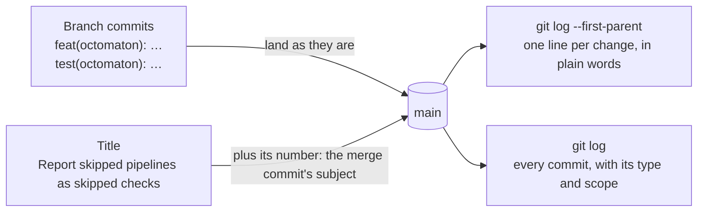

# Pull request titles

**Decision**: a pull request's title names the change in the imperative and in sentence case, with no `type(scope):` prefix, no issue key and no emoji, within 65 characters. It becomes the merge commit's subject; the commits it merges keep their Conventional Commits subjects. The rules are in [CONTRIBUTING.md](../../CONTRIBUTING.md) ("Pull requests"). Ticket: [ENG-51](https://linear.app/arikkfir/issue/ENG-51). Pull request: [docs#46](https://github.com/arikkfir-org/docs/pull/46).

## Context

- Default branches take merge commits only (the `Default branch` ruleset allows only `merge`, and its merge queue merges with `MERGE`), and every repository sets `merge_commit_title = "PR_TITLE"` (`terraform/github` in `infra`). The title becomes the merge commit's subject, and GitHub appends ` (#123)`.
- A merge keeps the commits it brings in, each with a Conventional subject, so a Conventional title repeats them. From `docs`, before this change:

  ```text
  236528a docs(hub): drop fin's admin bypass from the contract (#41)
  80d2dc1 docs(hub): drop fin's admin bypass from the contract
  ```

- Nothing reads a title's type: there is no changelog tooling and there are no version tags ([Releases](../../CONTRIBUTING.md#releases)), and no pipeline or ruleset checks titles. `arikkfir-reviewer` applies the title rule from `CONTRIBUTING.md` like the rest of it.
- `weesp-ai`, another GitHub organization the owner works in, also merges with merge commits and forbids the prefix on titles.

## Design



## Decisions

| Decision                           | Why                                                                                              | Rejected                                                                                                                                            |
|------------------------------------|--------------------------------------------------------------------------------------------------|-----------------------------------------------------------------------------------------------------------------------------------------------------|
| No `type(scope):` prefix on titles | The commits beside the merge carry the type and scope already, and nothing parses the merge's    | Conventional titles, the rule until now: every merge repeats its commits' prefix, and pushes the change's name further right in a 72-column subject |
| Commits keep Conventional Commits  | Each commit lands on `main` as it is, and its type and scope say what kind of change it is       | One style for both: either the merges repeat the commits, or the commits lose their type                                                            |
| Imperative, sentence case          | `git log --first-parent` reads as a list of what each merge did                                  | A lower-case summary as in commit subjects: without a prefix, the title starts a sentence                                                           |
| Within 65 characters               | GitHub appends ` (#123)`, 7 characters, and the subject then fits in 72 columns, like a commit's | No limit                                                                                                                                            |

## Failure modes

A title that breaks the rule merges anyway: nothing but `arikkfir-reviewer` and the human reviewer checks it. A merge commit's subject is permanent once on `main`.

## Rollout

None: guidance only. `arikkfir-reviewer` reads `CONTRIBUTING.md` from `main`, so it judges titles by this rule once the pull request merges, and by the old one until then. Pull requests opened before keep their Conventional titles, so `git log --first-parent` mixes both styles around the merge.
