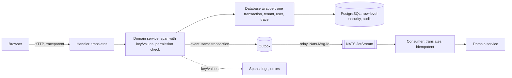

# Service conventions

**Decision**: every service follows one set of rules for Go code, HTTP APIs, database access, messaging and telemetry, so a request can be followed from the browser to the database and back, a failure explains how it happened, and a new service starts from settled patterns instead of its own. The rules are in [CONTRIBUTING.md](../../CONTRIBUTING.md) ("Code and configuration"). Pull request: [docs#52](https://github.com/arikkfir-org/docs/pull/52).

## Context

- The rules came out of designing Fin's architecture: the hub's first product with a browser front end, a database per environment, NATS messaging and background workers together. They hold for any service, so they belong here; Fin's `CLAUDE.md` keeps only what is specific to Fin.
- Until now `CONTRIBUTING.md` had four Go rules: check every error, configure with envconfig, start a span in every significant method, log through slog. They said nothing about what an error or a span must carry, how an HTTP API behaves, or how a message is delivered.
- Cloud Logging links a log line to its trace only through its own field names (`logging.googleapis.com/trace`, `logging.googleapis.com/spanId`, `logging.googleapis.com/trace_sampled`), and GKE's logging agent reads `severity`, `message` and `timestamp` from each JSON line. A plain `trace_id` field links nothing.
- Error Reporting groups Go errors by the frames of a trace in `debug.Stack()`'s format, so where the stack is taken decides how errors group.
- A database and a stream can't commit together, so an effect and its event stay consistent only through an outbox, and a consumer can't tell a redelivery from a new message without its own record.

## Design

Every arrow carries the trace: `traceparent` in HTTP and NATS headers, and the outbox row across the hop through the database. The key/values a function records on its span reach the logs and errors beneath it.

## Decisions

| Decision                                                                                      | Why                                                                                                                                                               | Rejected                                                                                                             |
|-----------------------------------------------------------------------------------------------|-------------------------------------------------------------------------------------------------------------------------------------------------------------------|----------------------------------------------------------------------------------------------------------------------|
| Every returned error is wrapped with what the function was doing and its key/values           | A Go error is a string with no stack: the chain of wraps shows how the program got from its entry point to the root cause, each link with its location and values | `fmt.Errorf` with `%w` alone: no locations, no values; a stack trace logged at every level: noise without the values |
| Span key/values ride the context into logs and errors                                         | Spans and log lines rarely say which tenant or record they concern unless every call repeats it                                                                   | Repeating attributes at each log call: the first one forgotten is the one you need                                   |
| A function fits on one screen, with at most a couple of concerns                              | Reviewable units, and names for the rest; funlen and gocognit keep it true                                                                                        | No limit                                                                                                             |
| Transports translate; domain services decide, span and permission check first                 | Business rules sit in one place, testable without HTTP or NATS                                                                                                    | Handlers that query the database                                                                                     |
| HTTP versions in the path, a new version holding only changed routes, OpenAPI as the contract | Clients are generated, and a new version doesn't copy routes that didn't change                                                                                   | Version headers; copying every route into each version                                                               |
| Permissions, never roles                                                                      | Narrowing what someone may do changes data, not code                                                                                                              | Roles checked in handlers                                                                                            |
| RFC 9110 methods, strong ETags, required `If-Match`; RFC 9457 errors                          | Retries are safe, caches revalidate, and no update is lost silently                                                                                               | Last write wins                                                                                                      |
| Times in UTC on the wire; the viewer's zone in clients and in grouping                        | One meaning per value, and "March" is the viewer's March                                                                                                          | Local times on the server                                                                                            |
| Database access only through one transactional wrapper that sets tenant, user and trace       | Row-level security and audit trails need the session's identity on every statement, and only a wrapper that can't be skipped guarantees it                        | A tenant filter in every query: one forgotten `WHERE` leaks data                                                     |
| `timestamptz`, and a `version` bumped by a trigger as the ETag                                | No ambiguous times, and no query can forget the version                                                                                                           | `date` columns; versions set by each query                                                                           |
| At-least-once delivery, idempotent consumers, a transactional outbox                          | No lost and no doubled effects across a crash                                                                                                                     | Publishing after the commit: a crash between the two loses the event                                                 |
| Message schemas with explicit presence and a breaking-change check                            | A missing field differs from a zero, and old and new versions run side by side during a rollout                                                                   | Implicit presence, proto3's default; no check                                                                        |
| Streams, consumers and buckets declared with the deployment                                   | They are reviewed, versioned and torn down with their environment                                                                                                 | Created by code at start-up                                                                                          |
| Cloud Logging's field names on GKE, text elsewhere                                            | Logs link to their traces and read well in Logs Explorer; text stays readable locally                                                                             | Plain `trace_id` fields, which nothing links                                                                         |
| `service.namespace` is the Kubernetes namespace                                               | Environments of one service stay apart in traces and metrics                                                                                                      | One namespace for every environment                                                                                  |
| Model calls follow OpenTelemetry's GenAI conventions                                          | Models, tokens and tool calls show the same way in every service                                                                                                  | Attributes invented per service                                                                                      |

## Failure modes

- A rule nothing checks drifts. golangci-lint enforces the Go rules (errcheck, wrapcheck, contextcheck, sloglint, spancheck, depguard, funlen, gocognit), CI runs the OpenAPI and schema breaking-change checks, and `arikkfir-reviewer` reads the rest from `CONTRIBUTING.md`.
- A wrapper that can be bypassed guarantees nothing: the database wrapper must be the only code that builds a query handle.
- Error-chain libraries record frames differently in `-trimpath` builds, which every image is; a service configures its library to filter the runtime's frames.
- OpenTelemetry's GenAI conventions are still experimental and have moved to a repository of their own, so a service pins the release it follows.

## Rollout

None at merge: guidance only. New code follows the rules; existing code adopts them as it changes, not in a sweep. Fin applies them from its first slice. `arikkfir-reviewer` reads `CONTRIBUTING.md` from `main`, so it applies them once this merges.
