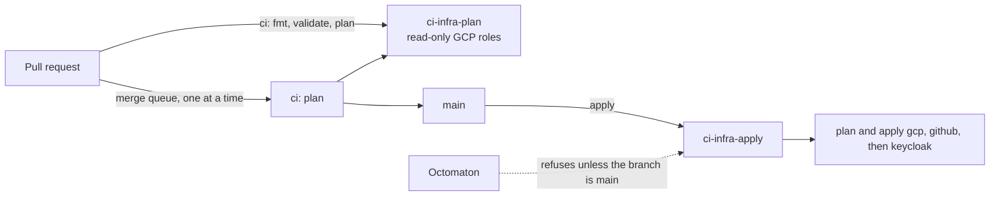

# Terraform plan on pull requests, apply on merge

**Decision**: `infra` plans `gcp`, `github` and `keycloak` on every pull request and in the merge queue, and applies whatever the
plans say when a change merges to `main`. Two Kubernetes ServiceAccounts in `ci-infra` hold the GCP roles:
`ci-infra-plan` (read-only roles) and `ci-infra-apply`. `ci-infra-apply` carries the annotation
`octomaton.dev/branches: main`, and Octomaton refuses any run that names it unless the run's branch is `main`. Names
and wiring: [reference](../reference.md#terraform-applies).

## Context

- Today the owner runs `make terraform <root>`, reads the plan and applies it.
- A run's PipelineRun file comes from the commit under test, so a pull request's own run can name any ServiceAccount in
  its namespace. Even an unchanged `terraform plan` runs the pull request's code (`data "external"`).
- A GKE identity says only which namespace and ServiceAccount a pod runs as, never which branch. Only Octomaton knows
  the branch, so only Octomaton can keep the identity that applies away from unmerged code.

## Design

### Octomaton: ServiceAccount branches

| Item | Value |
| --- | --- |
| Annotation | `octomaton.dev/branches` on a ServiceAccount in a tenant namespace: comma-separated branch globs, as in `on.push.branches`. Without it, every branch may use the ServiceAccount |
| Check | Before creating a run, Octomaton gets each ServiceAccount its PipelineRun names (`spec.taskRunTemplate.serviceAccountName`, `spec.taskRunSpecs[].serviceAccountName`). These are the only fields that name one in a `tekton.dev/v1` PipelineRun, the one version Octomaton accepts (Tekton v1.15.0; `taskServiceAccountName` and a top-level `serviceAccountName` are `v1beta1`'s). When one carries the annotation and the run's branch matches none of its globs, the run is refused: no PipelineRun, and its check fails with the reason |
| Fails closed | Apart from a ServiceAccount that doesn't exist (below), a named ServiceAccount Octomaton can't read (a missing permission, an API error) refuses the run the same way, as do an empty or invalid annotation and a name that isn't a string. A run goes through only when every named ServiceAccount was read and is unannotated or matches |
| Run's branch | The branch whose code runs: the pushed branch (`push`); the head branch (`pull_request`, `comment`, `review_request`); the merge group's branch, `gh-readonly-queue/…` (`merge_group`); the default branch (`schedule`). A tag push has no branch and matches nothing |
| Not checked | A PipelineRun that names no ServiceAccount: it runs as Tekton's default, which must never carry the annotation. A ServiceAccount that doesn't exist: Tekton fails the run |
| Permission | ClusterRole `octomaton-tenant` gets `get` on `serviceaccounts` |

The annotation is the one piece of Octomaton configuration outside `.octomaton.yaml`. It sits on the identity, in
`delivery`, where a pull request to the repository that uses it can't change it. It only restricts: a new
ServiceAccount, annotated or not, has no GCP roles, because roles bind to named principals in `terraform/gcp`.

### Identities

Both are ServiceAccounts in `ci-infra`, created by `delivery`, with Workload Identity Federation principals and no
Google service accounts.

| ServiceAccount | Annotation | Roles (scope) |
| --- | --- | --- |
| `ci-infra-plan` | none | `roles/iam.securityReviewer`, `roles/serviceusage.serviceUsageViewer`, `roles/compute.networkViewer`, `roles/container.clusterViewer`, `roles/artifactregistry.reader`, `roles/secretmanager.viewer`, `roles/dns.reader`, `roles/iam.serviceAccountViewer` (project); `roles/storage.legacyBucketReader` (each bucket `terraform/gcp` manages); `roles/storage.objectViewer` (bucket `arikkfir-devops`); `roles/secretmanager.secretAccessor` (secrets `infra-plan-github-pat` and `infra-plan-keycloak-secret`) |
| `ci-infra-apply` | `octomaton.dev/branches: main` | `roles/serviceusage.serviceUsageAdmin`, `roles/compute.networkAdmin`, `roles/container.admin`, `roles/artifactregistry.admin`, `roles/storage.admin`, `roles/secretmanager.admin`, `roles/dns.admin`, `roles/iam.serviceAccountAdmin`, `roles/iam.securityAdmin` (project); `roles/iam.serviceAccountUser` (service account `gke-hub-nodes@`) |

The roles cover each resource type in `terraform/gcp`. Each admin role also sets the IAM policies of its own
resources: `roles/storage.admin` the buckets', `roles/secretmanager.admin` the secrets' and
`roles/artifactregistry.admin` the repository's. `roles/iam.securityAdmin` sets the project's and the DNS zones',
which `roles/dns.admin` can't. GCP grants `roles/owner` only to Google accounts, groups and service accounts, never
to a federated principal.

### GitHub tokens

| Secret Manager secret | Token (fine-grained, resource owner `arikkfir-org`, all repositories) | Read by |
| --- | --- | --- |
| `infra-plan-github-pat` | Repository Administration and Metadata: read, Contents: read and write; organization Administration and Members: read | `ci-infra-plan` |
| `infra-apply-github-pat` | Repository Administration and Contents: read and write, Metadata: read; organization Administration and Members: read and write | `ci-infra-apply` (through `roles/secretmanager.admin`) |

Both have Contents read and write because GitHub shows a repository's merge settings (merge methods, auto-merge,
branch updates and deletion, commit titles and messages) only to tokens that have it. Without it, the provider reads
them as unset, so every plan shows every repository changed, and an apply stores the wrong values.

A step reads its token with `gcloud secrets versions access` into a volume only that task's steps share. No Kubernetes
Secret holds it: Octomaton never lets a `push` pipeline mount one. The owner creates both tokens, adds them with
`gcloud secrets versions add` and renews them within a year.

### Pipelines

| Pipeline | Triggers | ServiceAccount | Steps |
| --- | --- | --- | --- |
| `ci` (`Continuous Integration`) | `pull_request` to `main`, `merge_group` | `ci-infra-plan` | `fmt -check`; `init -backend=false` and `validate` in every root; then in `gcp`, `github` and `keycloak`, a full `init` (it reads the state in `arikkfir-devops`) and `plan -lock=false`, without refreshing `keycloak` ([Keycloak](keycloak.md#decisions)). The plans go into the check's summary, deletions and replacements first |
| `apply` (`Apply`) | `push` to `main` | `ci-infra-apply` | A full `init` and `plan -out` in `gcp`, `github` and `keycloak`, then apply the saved plans in full, deletions and replacements included, in that order. The plans go into the check's summary |

- `argocd` is never planned or applied by a pipeline. It bootstraps Argo CD, which manages itself afterwards, so
  applying it again would fight Argo CD.
- Plans don't take the state lock. `ci-infra-plan` can't write it, and a plan changes nothing.
- The merge queue of `infra` builds one entry at a time, in groups of exactly one. The merge queue's `ci` runs and
  `apply` share the concurrency group `terraform` (policy `queue`), so each entry is planned after the previous
  merge has been applied.

## Decisions

| Decision | Why | Rejected |
| --- | --- | --- |
| The branch restriction lives on the ServiceAccount, in `delivery` | Only Octomaton knows a run's branch, and a pull request to `infra` can't change `delivery` | A list in `.octomaton.yaml` (a pull request edits it); a branch condition on the principal (GKE identities carry none); a namespace for runs from `main` (Octomaton gives a repository one namespace); roles on the shared `pipeline` ServiceAccount (any pull request could apply) |
| Two identities, plan and apply | Pull requests still get plans, which can't change GCP or any GitHub setting | Plans only after merging |
| Predefined roles | `roles/owner` can't be granted to a federated principal | `roles/owner` |
| Tokens read from Secret Manager at run time | Octomaton refuses Secrets in `push` pipelines | Kubernetes Secrets, which would need that rule relaxed |
| Apply every plan in full, deletions and replacements included | Pull requests plan, merges apply: the pull request's plan is the review, and merging approves it. `prevent_destroy` still fails any plan that would destroy a DNS zone, the organization's settings or a repository | Stopping on any deletion or replacement for the owner to apply by hand, the first version (until arikkfir-org/infra#28). It stopped even on IAM bindings a reviewed pull request removed |
| Merge queue of one, sharing a concurrency group with `apply` | The plan of each merge is the plan that is applied | Groups of up to five |
| Contents read and write on both tokens | GitHub shows merge settings only to such tokens, and pull request plans still refresh, so they show drift | A plan token without it and `-refresh=false` for `github` in `ci` (no drift in pull request plans); `ignore_changes` on the merge settings (Terraform would set them only at creation) |

## Security and failure modes

- A pull request can run any code as `ci-infra-plan`: it can read the project's configuration and IAM policies,
  Terraform's state and the plan token. It can't change GCP or any GitHub setting, but the token's Contents write lets
  it push branches and tags and manage releases in every repository. The `Default branch` ruleset keeps it off
  default branches. Only `infra`'s own branches get pull request runs (Octomaton ignores forks), but Dependabot's are
  among them, so a compromised provider version that a pull request installs could use the token too.
- Only a merge to `main` runs as `ci-infra-apply`. Its roles include `roles/iam.securityAdmin`, so it could grant
  itself more: the review and the merge are the gate.
- Octomaton is the only workload that creates pods in `ci-infra` (RoleBinding `octomaton`), so it is the only path to
  `ci-infra-apply`. Cluster admins can always bypass it.
- A merge applies its plan in full, deletions and replacements included. The pull request's `Continuous Integration`
  check lists them first: read it before merging.
- An apply that fails part-way leaves what it applied; the next merge, or the owner, finishes. A refused run (wrong
  branch) fails the `Apply` check with the reason.
- Missing roles show up as a failed plan or apply, never as a wrong change.

## Rollout

1. `docs`: this design and the reference.
2. `octomaton` (arikkfir-org/octomaton#15): the annotation check; `get` on ServiceAccounts in ClusterRole
   `octomaton-tenant` (`deploy/rbac.yaml`); README and CLAUDE.md name the annotation as the one exception to
   "configuration lives only in `.octomaton.yaml`". Argo CD deploys `main`.
3. `delivery`: the two ServiceAccounts in `ci-infra`, `ci-infra-apply` annotated. The guard is live before the
   ServiceAccount gets any role.
4. `infra`: the identities' roles and the two secrets (`terraform/gcp`), and the merge queue of one
   (`terraform/github`). The owner applies both by hand, then creates the tokens and adds them.
5. `infra`: `ci` plans, the `apply` pipeline, README and CLAUDE.md. Its first merge applies (no changes expected).
6. Later: the same restriction for the push pipelines of `docs`, `tooling` and `octomaton`, whose `pipeline`
   ServiceAccounts hold write roles that their pull requests can use today
   ([CI ServiceAccounts](ci-service-accounts.md)).
