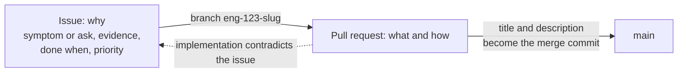
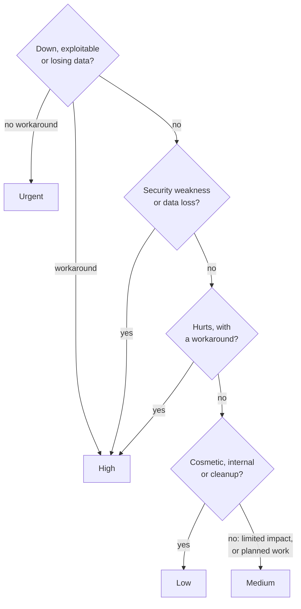

# Writing issues

**Decision**: an issue says why something should change; its pull request says what changed and how. A bug's title describes the wrong behaviour as it is today, any other title the outcome it asks for. The body is a lead paragraph, `## Evidence` and `## Done when`. Priority is set when the issue is filed, on a ladder cut by impact and workaround. The rules are in [CONTRIBUTING.md](../../CONTRIBUTING.md) ("Writing an issue"). Ticket: [ENG-51](https://linear.app/arikkfir/issue/ENG-51). Pull request: [docs#43](https://github.com/arikkfir-org/docs/pull/43).

## Context

- `CONTRIBUTING.md` said how to reference and close an issue, not how to write one, so each session invented a shape: some issues designed the fix, some pull requests re-argued the case, and no issue carried a priority.
- The rules come from the shared guide of `weesp-ai`, another GitHub organization the owner works in, adapted to the hub. The title rule matches the hub's own issues: ENG-48 ("The argocd Application never reaches Synced") and ENG-45 ("infra plans every pull request and applies every merge to main").
- ENG has no Linear issue templates.

## Design

Priority, from the most severe case down:

## Decisions

| Decision                                                                                                           | Why                                                                                                                                                                                | Rejected                                                                                                                         |
|--------------------------------------------------------------------------------------------------------------------|------------------------------------------------------------------------------------------------------------------------------------------------------------------------------------|----------------------------------------------------------------------------------------------------------------------------------|
| The issue says why; the pull request says what and how                                                             | The pull request becomes the merge commit, so the how lands in `main`'s history next to the code. An issue may name the code path at fault, which helps whoever picks it up        | The issue designing the fix: nobody reviews it, and it goes stale once the code disagrees                                        |
| A bug's title is the wrong behaviour; any other title is the outcome                                               | A list of titles reads as the state of things: what is broken now, and what will be true when done                                                                                 | Imperative titles ("Fix argocd sync"): they name a fix before anyone has found the cause                                         |
| Body: lead, `## Evidence`, `## Done when`                                                                          | The lead is enough to triage. Evidence shows it's real before anyone spends time on it. Done-when is a check someone can make without reading the diff                             | A free-form body: the shape this replaces                                                                                        |
| The rules live in `CONTRIBUTING.md`                                                                                | Reviewed in Git, read by people and agents alike, next to the pull request rules they pair with                                                                                    | A Linear issue template: it holds the body's headings but not how to choose a title or a priority, and it changes outside review |
| Priority, set at filing and cut by impact and workaround                                                           | It orders the work. ENG plans personal projects (the team's own description): nobody is a customer, so "down", "exploitable" and "losing data" describe the hub's services instead | `weesp-ai`'s ladder, cut by customer impact ("a customer cannot work")                                                           |
| Security weaknesses and data loss never below High; with no workaround, down, exploitable or losing data is Urgent | Each can be irreversible, and only a workaround makes waiting acceptable                                                                                                           | Ranking them like any other bug, by how many it touches                                                                          |

## Failure modes

Nothing checks an issue against these rules: Linear accepts any shape. They hold only as long as whoever files an issue follows `CONTRIBUTING.md`.

## Rollout

None: guidance only. Existing issues keep their shape; the rules apply from the next issue filed.
