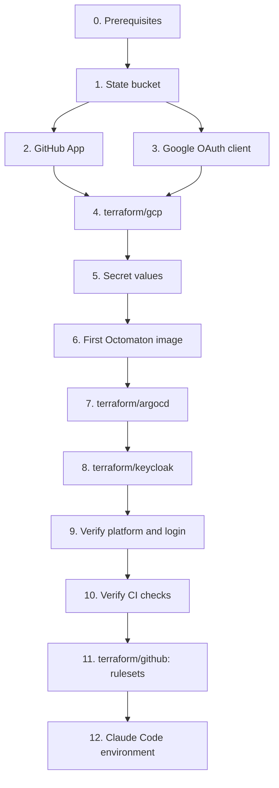

# Bootstrap runbook

Bringing the hub up from nothing, in order. Names and values: [reference](../reference.md). Designs:
[phase 1](../designs/phase-1-foundations.md), [phase 2](../designs/phase-2-octomaton.md),
[phase 3](../designs/phase-3-ingress-and-auth.md), [Keycloak](../designs/keycloak.md).



## 0. Prerequisites

- `gcloud` signed in as a project owner of `arikkfir`, plus Application Default Credentials:
  `gcloud auth login && gcloud auth application-default login`.
- Terraform ≥ 1.14, `kubectl`, Go and [`ko`](https://ko.build).
- A GitHub token for Terraform with administration rights on `arikkfir-org` repositories (classic: `repo`,
  `admin:org`), exported as `GITHUB_TOKEN`.

## 1. Terraform state bucket

State for every root lives in `gs://arikkfir-devops`. Skip this step if the bucket already exists.

```bash
gcloud storage buckets create gs://arikkfir-devops --project=arikkfir --location=me-west1 \
  --uniform-bucket-level-access --public-access-prevention
gcloud storage buckets update gs://arikkfir-devops --versioning
```

## 2. GitHub App

In `arikkfir-org` → Settings → Developer settings → GitHub Apps → New GitHub App:

| Field | Value |
| --- | --- |
| Name | `octomaton-dev` (`Octomaton` is taken on GitHub) |
| Homepage URL | `https://github.com/arikkfir-org/octomaton` |
| Webhook URL | `https://octomaton.dev/github/hooks` |
| Webhook secret | `openssl rand -hex 32` (keep it for step 5) |
| Repository permissions | Checks: read and write; Contents: read; Metadata: read; Pull requests: read and write; Merge queues: read |
| Events | Push, Pull request, Issue comment, Check suite, Check run, Merge group |
| Where can it be installed | Only on this account |

Then: generate a private key (download the `.pem`), note the App ID, and install the App on all repositories of
`arikkfir-org`. A new App gets a new ID: if it isn't the one the [hub reference](../reference.md#octomaton) records
(Octomaton, GitHub App), change it there and in `infra`'s `terraform/github/rulesets.tf` (`local.octomaton_app_id`),
whose rulesets accept `Continuous Integration` only from that App, before step 11.

## 3. Google OAuth client

Keycloak signs people in with Google. In the GCP console for project `arikkfir`, under Google Auth Platform:

| Item | Value |
| --- | --- |
| Branding | App name, logo, and the privacy and terms pages at `https://legal.kfirs.com`; authorized domain `kfirs.com`. Sign-in works while the branding is unverified |
| Audience | External, published to production |
| Client | Web application, authorized redirect URI `https://id.kfirs.com/realms/hub/broker/google/endpoint`, no JavaScript origins |

Copy the client's secret at once and keep it for step 5. A new client gets a new client ID: if it isn't the one the
[hub reference](../reference.md#authentication) records (identity provider `google`), change it there and in `infra`'s
`terraform/keycloak/realm.tf`.

## 4. GCP resources

```bash
cd infra
terraform -chdir=terraform/gcp init
terraform -chdir=terraform/gcp plan    # the two DNS zones must import without changes
terraform -chdir=terraform/gcp apply
```

This creates the network, static IPs, the cluster, IAM, secret containers, Artifact Registry, buckets, the
`octomaton-dev` DNS zone and the DNS records for every hub host.

Then delegate `octomaton.dev` to its new zone: at the domain's registrar, set the name servers to the four that
`terraform -chdir=terraform/gcp output octomaton_dev_name_servers` prints. Turn DNSSEC off at the registrar first if
it's on. `dig +short NS octomaton.dev` must list them before step 7, because the Gateways wait for the
`octomaton.dev` certificate.

## 5. Secret values

```bash
add() { gcloud secrets versions add "$1" --project=arikkfir --data-file=-; }
printf '%s' "<app id>"                          | add octomaton-github-app-id
add octomaton-github-private-key               < octomaton.YYYY-MM-DD.private-key.pem
printf '%s' "<webhook secret>"                  | add octomaton-github-webhook-secret
printf '%s' "<google client secret>"            | add keycloak-google-client-secret
openssl rand -hex 32 | tr -d '\n'               | add keycloak-bootstrap-admin
openssl rand -hex 32 | tr -d '\n'               | add keycloak-hub-client-secret
openssl rand -base64 32 | tr -d '\n' | tr -- '+/' '-_' | add oauth2-proxy-cookie-secret
```

`keycloak-hub-client-secret` starts as a placeholder. `terraform/keycloak` writes the real value in step 8, but Argo
CD (wave 2) and oauth2-proxy read the secret from the start, and an ExternalSecret with nothing to read would hold back
every later wave, Keycloak's included.

## 6. First Octomaton image

Octomaton builds its own releases, but the first one has to come from a workstation. Every commit on `main` is a
release, tagged with its short SHA; `make image` builds and pushes the image of `HEAD` that way:

```bash
gcloud auth configure-docker me-west1-docker.pkg.dev
git clone https://github.com/arikkfir-org/octomaton && cd octomaton
make image    # tags the image with HEAD's short SHA
```

Build it from the head of `main`: Argo CD deploys that commit, with the image tagged with its short SHA
([Octomaton deployment](../designs/octomaton-deployment.md)).

## 7. Argo CD

```bash
cd infra
terraform -chdir=terraform/argocd init
terraform -chdir=terraform/argocd apply
gcloud container clusters get-credentials hub --zone=me-west1-a --project=arikkfir --dns-endpoint
kubectl -n argocd get applications -w     # everything converges to Synced / Healthy
```

## 8. Keycloak

Once Argo CD shows `keycloak` Synced and Healthy, apply `terraform/keycloak` once by hand, as the operator's temporary
bootstrap admin. It creates realm `hub`, its sign-in flows, client `hub`, the declared users and the pipelines'
clients, and writes the generated secrets to Secret Manager:

```bash
kubectl -n keycloak port-forward svc/keycloak-service 8080 &
cd infra
KEYCLOAK_CLIENT_ID=bootstrap-admin \
KEYCLOAK_CLIENT_SECRET="$(gcloud secrets versions access latest --secret=keycloak-bootstrap-admin --project=arikkfir)" \
make terraform keycloak ARGS="-var keycloak_url=http://localhost:8080"
```

External Secrets would pick up the real `keycloak-hub-client-secret` within the hour; have it read the new value now
(Reloader then restarts oauth2-proxy, and Argo CD rereads its Secret on its own):

```bash
kubectl -n auth annotate externalsecret oauth2-proxy force-sync="$(date +%s)" --overwrite
kubectl -n argocd annotate externalsecret argocd-oidc force-sync="$(date +%s)" --overwrite
```

Then delete the bootstrap admin, a full administrator that nothing needs any more. Keycloak creates it only on a fresh
install, and `kc.sh bootstrap-admin` in a Keycloak pod recreates one for break-glass:

```bash
kubectl -n keycloak exec keycloak-0 -- bash -c '
  kc=/opt/keycloak/bin/kcadm.sh; cfg=/tmp/kcadm.config
  $kc config credentials --config $cfg --server http://localhost:8080 --realm master \
    --client "$KC_BOOTSTRAP_ADMIN_CLIENT_ID" --secret "$KC_BOOTSTRAP_ADMIN_CLIENT_SECRET"
  id=$($kc get clients --config $cfg -r master -q clientId=bootstrap-admin --fields id --format csv --noquotes)
  $kc delete "clients/$id" --config $cfg -r master; rm -f $cfg'
```

## 9. Verify the platform and login

- `kubectl -n traefik get certificate wildcard-kfirs-com octomaton-dev` shows both `Ready`.
- `curl -s 'https://octomaton.dev/?go-get=1'` returns the `go-import` tag, and `https://octomaton.dev` redirects to
  the repository.
- `kubectl -n external-secrets get clustersecretstore gcp-secret-manager` is `Valid`, and every `ExternalSecret` is
  `SecretSynced`.
- `https://argocd.dev.kfirs.com`, `https://grafana.dev.kfirs.com`, `https://tekton.dev.kfirs.com`,
  `https://nui.dev.kfirs.com` and `https://traefik.dev.kfirs.com` show Keycloak's login page, sign in through Google
  the account of a user `terraform/keycloak` declares in group `admins`, and refuse any other.

## 10. Verify CI

Open a pull request in any hub repository; a `Continuous Integration` check run from Octomaton appears and links to
the Tekton Dashboard.

Pushes made before Octomaton ran were never delivered, so nothing is published yet. Merge a pull request (any change) into `docs` and into `tooling` to trigger the first publish, then check `https://docs.dev.kfirs.com/README.md.html` (after signing in) and `https://storage.googleapis.com/arikkfir-claude/setup.sh`.

## 11. GitHub repositories and rulesets

Only once `Continuous Integration` checks work, since the rulesets require them from the App ID in
`terraform/github/rulesets.tf` (step 2):

```bash
cd infra
terraform -chdir=terraform/github init
terraform -chdir=terraform/github apply
```

Then, in each repository's Settings → General → Features, turn Sponsorships on and Preserve this repository off:
the provider can't set them.

## 12. Claude Code environment

In claude.ai/code → environment settings → setup script:

```bash
curl -fsSL https://storage.googleapis.com/arikkfir-claude/setup.sh | bash
```
