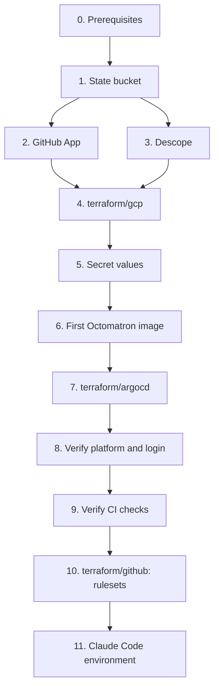

# Bootstrap runbook

Bringing the hub up from nothing, in order. Names and values: [reference](../reference.md). Designs:
[phase 1](../designs/phase-1-foundations.md), [phase 2](../designs/phase-2-octomatron.md),
[phase 3](../designs/phase-3-ingress-and-auth.md).



## 0. Prerequisites

- `gcloud` signed in as a project owner of `arikkfir`, plus Application Default Credentials:
  `gcloud auth login && gcloud auth application-default login`.
- Terraform ≥ 1.14, `kubectl`, Go and [`ko`](https://ko.build).
- A GitHub token for Terraform with administration rights on `arikkfir-org` repositories (classic: `repo`,
  `admin:org`), exported as `GITHUB_TOKEN`.

## 1. Terraform state bucket

```bash
gcloud storage buckets create gs://arikkfir-tfstate --project=arikkfir --location=me-west1 \
  --uniform-bucket-level-access --public-access-prevention
gcloud storage buckets update gs://arikkfir-tfstate --versioning
```

## 2. GitHub App

In `arikkfir-org` → Settings → Developer settings → GitHub Apps → New GitHub App:

| Field | Value |
| --- | --- |
| Name | `octomatron` |
| Webhook URL | `https://octomatron.dev.kfirs.com/github/hooks` |
| Webhook secret | `openssl rand -hex 32` (keep it for step 5) |
| Repository permissions | Checks: read and write; Contents: read; Metadata: read; Pull requests: read and write; Merge queues: read |
| Events | Push, Pull request, Issue comment, Check suite, Check run, Merge group |
| Where can it be installed | Only on this account |

Then: generate a private key (download the `.pem`), note the App ID, and install the App on all repositories of
`arikkfir-org`.

## 3. Descope

Company `KFIRS`, project `development` (`P3JyPV2qsSrMLUpVPTGcBNRHlSkv`). The sign-in-only Google flow `hub-sign-in`,
the default OIDC application's login page and the first user are already configured
([phase 3](../designs/phase-3-ingress-and-auth.md#manual-setup)). Create an access key (Access keys → create) and keep
it for step 5: it is the OIDC client secret.

## 4. GCP resources

```bash
cd infra
terraform -chdir=terraform/gcp init
terraform -chdir=terraform/gcp plan    # the two DNS zones must import without changes
terraform -chdir=terraform/gcp apply
```

This creates the network, static IPs, the cluster, IAM, secret containers, Artifact Registry, buckets and the DNS
records for every hub host.

## 5. Secret values

```bash
add() { gcloud secrets versions add "$1" --project=arikkfir --data-file=-; }
printf '%s' "<app id>"                          | add octomatron-github-app-id
add octomatron-github-private-key               < octomatron.YYYY-MM-DD.private-key.pem
printf '%s' "<webhook secret>"                  | add octomatron-github-webhook-secret
printf '%s' "<descope access key>"              | add oidc-client-secret
openssl rand -base64 32 | tr -d '\n' | tr -- '+/' '-_' | add oauth2-proxy-cookie-secret
printf '%s\n' "you@example.com" "friend@example.com" | add hub-authorized-emails
```

## 6. First Octomatron image

Octomatron builds its own releases, but the first one has to come from a workstation:

```bash
gcloud auth configure-docker me-west1-docker.pkg.dev
git clone https://github.com/arikkfir-org/octomatron && cd octomatron
git tag v0.1.0 && git push origin v0.1.0
KO_DOCKER_REPO=me-west1-docker.pkg.dev/arikkfir/images/octomatron ko build --bare --tags=v0.1.0 ./cmd/octomatron
```

## 7. Argo CD

```bash
cd infra
terraform -chdir=terraform/argocd init
terraform -chdir=terraform/argocd apply
gcloud container clusters get-credentials hub --zone=me-west1-a --project=arikkfir --dns-endpoint
kubectl -n argocd get applications -w     # everything converges to Synced / Healthy
```

## 8. Verify the platform and login

- `kubectl -n traefik get certificate wildcard-kfirs-com` is `Ready`.
- `kubectl -n external-secrets get clustersecretstore gcp-secret-manager` is `Valid`, and every `ExternalSecret` is
  `SecretSynced`.
- `https://argocd.dev.kfirs.com`, `https://grafana.dev.kfirs.com`, `https://tekton.dev.kfirs.com`,
  `https://nui.dev.kfirs.com` and `https://traefik.dev.kfirs.com` redirect to Descope, accept an allowlisted Google
  account, and reject any other.

## 9. Verify CI

Open a pull request in any hub repository; a `ci` check run from `octomatron` appears and links to the
Tekton Dashboard.

Pushes made before Octomatron ran were never delivered, so nothing is published yet. Push a commit to `docs/main` and
to `tooling/main` (directly: the rulesets of step 10 are not applied yet), then check
`https://storage.googleapis.com/arikkfir-docs/README.html` and `https://storage.googleapis.com/arikkfir-claude/setup.sh`.

## 10. GitHub repositories and rulesets

Only once `ci` checks work, since the rulesets require them:

```bash
cd infra
terraform -chdir=terraform/github init
terraform -chdir=terraform/github apply -var octomatron_app_id=<app id>
```

## 11. Claude Code environment

In claude.ai/code → environment settings → setup script:

```bash
curl -fsSL https://storage.googleapis.com/arikkfir-claude/setup.sh | bash
```
