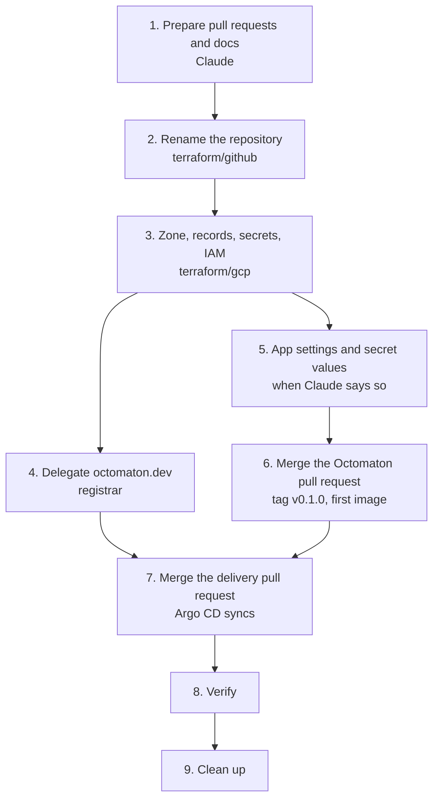

# Octomaton rename runbook

One-off migration from Octomatron to Octomaton, with the Go module at `octomaton.dev`. Each step says who does it:
Claude prepares every change as a pull request (a direct push in `docs`); you merge, apply, and handle the GitHub App,
secret values and the registrar. Once step 1 lands, the [reference](../reference.md) and the
[bootstrap runbook](bootstrap.md) describe the new names.

## What changes

| | Before | After |
| --- | --- | --- |
| Repository | `arikkfir-org/octomatron` | `arikkfir-org/octomaton` |
| Go module | `github.com/arikkfir-org/octomatron` | `octomaton.dev`: `go install octomaton.dev/cmd/octomaton@latest` |
| Command and image | `cmd/octomatron`, `images/octomatron` | `cmd/octomaton`, `images/octomaton` |
| GitHub App | `octomatron` | `octomaton-dev`; App ID, installation and private key unchanged |
| Webhook URL | `https://octomatron.dev.kfirs.com/github/hooks` | `https://octomaton.dev.kfirs.com/github/hooks` |
| Repository config | `.octomatron.yaml`, `apiVersion: octomatron.kfirs.com/v1` | `.octomaton.yaml`, `apiVersion: octomaton.kfirs.com/v1` |
| Bookkeeping | labels `octomatron.kfirs.com/…`, config-error check `octomatron` | `octomaton.kfirs.com/…`, check `octomaton` |
| Kubernetes | namespace `octomatron`, CI tenant `ci-octomatron` | `octomaton`, `ci-octomaton` |
| Secret Manager | `octomatron-github-{app-id,private-key,webhook-secret}` | `octomaton-github-{app-id,private-key,webhook-secret}` |
| IAM | `ci-octomatron/pipeline` writes to `images` | `ci-octomaton/pipeline` |
| Terraform variable | `octomatron_app_id` | `octomaton_app_id` |
| Metrics, env, paths | `octomatron_*`, `OCTOMATRON_*`, `/etc/octomatron/` | `octomaton_*`, `OCTOMATON_*`, `/etc/octomaton/` |
| DNS (new) | | Cloud DNS zone `octomaton-dev` for `octomaton.dev`; apex A record → `ingress-public` |
| TLS (new) | | Certificate `octomaton-dev`; listener `octomaton-dev` on the public gateway |
| Go import page (new) | | App `go-import` (nginx): `https://octomaton.dev/<path>?go-get=1` returns the `go-import` tag, anything else redirects to the repository |

The `go-import` tag is `<meta name="go-import" content="octomaton.dev git https://github.com/arikkfir-org/octomaton">`.
Unchanged: the `ci` check and its App ID pin, Descope, the `*.kfirs.com` certificate and every other host.

## Decisions

- **`octomaton.dev` is the project's identity; the hub's instance stays under `dev.kfirs.com`.** The domain carries the
  Go module and sends browsers to the repository. The webhook stays at `octomaton.dev.kfirs.com`, like every other hub
  tool.
- **App name `octomaton-dev`.** GitHub refuses an App name that matches an existing account, and a user `octomaton`
  exists. Nothing depends on the name: required checks pin the App ID.
- **Terraform renames the repository** through `moved` blocks. No manual rename on GitHub.
- **A certificate of its own for `octomaton.dev`**, not a SAN on the wildcard: a problem with the new domain can't
  block renewal of the hub's certificate. It syncs after the Gateways, so a pending certificate never holds them up.
- **A new webhook secret.** The secrets are recreated under new names anyway.
- **Labels keep the `kfirs.com` convention** (`octomaton.kfirs.com/`), as [CONTRIBUTING](../../CONTRIBUTING.md)
  requires.

## Order



## 1. Prepare the changes (Claude)

| Repository | Where | Change |
| --- | --- | --- |
| `docs` | `main` | Reference, bootstrap runbook, overview, contributing guide, `.octomaton.yaml`; `phase-2-octomatron.md` becomes `phase-2-octomaton.md`; a design for this change |
| `octomatron` | pull request #1 (open) | Module `octomaton.dev` and every import; `cmd/octomaton`; every name above; `.octomaton.yaml`; README with the `go install` line. `octomaton version` falls back to the module version, so `go install` builds report their tag |
| `delivery` | pull request #1 (open) | Rename the app, namespace, CI tenant, secrets, image and host. New `go-import` app; `octomaton.dev` certificate and public-gateway listener; a DNS-01 solver for zone `octomaton-dev` in both ClusterIssuers |
| `infra` | new pull request: `terraform/github` | Repository key with `moved` blocks; variable `octomaton_app_id`; `.octomaton.yaml`; README |
| `infra` | new pull request: `terraform/gcp` | Secrets, IAM, record `octomaton.dev.kfirs.com`; zone `octomaton-dev` with its apex record and cert-manager's grant; a name-server output |
| `.github`, `tooling` | new pull requests | `.octomaton.yaml` and mentions |

Review the pull requests. Nothing live changes until step 2.

## 2. Rename the repository (you)

Merge the `terraform/github` pull request and the `.github` and `tooling` ones. Use the admin bypass: the `ci` check
can't run until step 7. Then:

```bash
cd infra && git pull
terraform -chdir=terraform/github plan -var octomaton_app_id=<app id>
```

The plan must show only this: `github_repository.this` and `github_repository_ruleset.protected` moved from
`["octomatron"]` to `["octomaton"]`, the repository renamed in place and its ruleset updated in place. Nothing is added
or destroyed. Apply it, then point your own clone at the new name:

```bash
terraform -chdir=terraform/github apply -var octomaton_app_id=<app id>
git -C <your octomatron clone> remote set-url origin https://github.com/arikkfir-org/octomaton.git
```

GitHub redirects the old URLs, and pull request #1 moves with the repository.

## 3. GCP: zone, records, secrets and IAM (you)

Merge the `terraform/gcp` pull request, then:

```bash
terraform -chdir=terraform/gcp plan
terraform -chdir=terraform/gcp apply
```

Expect only these changes:

| Created | Destroyed (only if you applied `terraform/gcp` before) |
| --- | --- |
| Zone `octomaton-dev` (`octomaton.dev.`), its apex A record, cert-manager's `roles/dns.admin` on it | |
| Secrets `octomaton-github-*` and External Secrets' accessor grants on them | Secrets `octomatron-github-*` with their values, and their grants |
| Record `octomaton.dev.kfirs.com.` | Record `octomatron.dev.kfirs.com.` |
| `ci-octomaton/pipeline` as `roles/artifactregistry.writer` on `images` | The same grant for `ci-octomatron` |

cert-manager's existing grant on zone `kfirs-com` only moves to a new address. If you never applied this root, the plan
is [bootstrap](bootstrap.md) step 4 with the new names.

## 4. Delegate octomaton.dev (you)

```bash
terraform -chdir=terraform/gcp output octomaton_dev_name_servers
```

At the registrar, replace the domain's name servers with these four. If DNSSEC is on there, turn it off first, or
resolvers will reject the new zone. Delegation can take a few hours:

```bash
dig +short NS octomaton.dev    # the four ns-cloud-…googledomains.com. servers
```

## 5. GitHub App and secret values (you, when Claude says so)

App settings, General:

| Field | Value |
| --- | --- |
| GitHub App name | `octomaton-dev`. Any free name works; tell Claude if you choose another |
| Homepage URL | `https://octomaton.dev` |
| Webhook URL | `https://octomaton.dev.kfirs.com/github/hooks` |
| Webhook secret | A new one: `openssl rand -hex 32` |

The App ID, installation and private key stay the same. Fill the new secrets:

```bash
add() { gcloud secrets versions add "$1" --project=arikkfir --data-file=-; }
printf '%s' "<app id>"             | add octomaton-github-app-id
add octomaton-github-private-key   < octomatron.YYYY-MM-DD.private-key.pem
printf '%s' "<new webhook secret>" | add octomaton-github-webhook-secret
```

If you haven't done [bootstrap](bootstrap.md) step 5 yet, add its other secrets now too.

## 6. Release v0.1.0 (you)

Merge the Octomaton pull request (#1, admin bypass), then build the first image from its tag:

```bash
gcloud auth configure-docker me-west1-docker.pkg.dev
git clone https://github.com/arikkfir-org/octomaton && cd octomaton
git tag v0.1.0 && git push origin v0.1.0
KO_DOCKER_REPO=me-west1-docker.pkg.dev/arikkfir/images/octomaton ko build --bare --tags=v0.1.0 ./cmd/octomaton
```

The Go checksum database records every version it sees permanently: never move or re-push a tag. Don't run
`go install octomaton.dev/…` before step 8; until `octomaton.dev` answers, the Go proxy may cache the failure for a
while.

## 7. Deploy (you)

Merge the delivery pull request (#1, admin bypass). If Argo CD isn't installed yet, continue with
[bootstrap](bootstrap.md) step 7; otherwise Argo CD syncs `main` on its own.

## 8. Verify

```bash
kubectl -n traefik get certificate octomaton-dev              # Ready (needs step 4)
curl -s 'https://octomaton.dev/cmd/octomaton?go-get=1' | grep go-import
curl -sI https://octomaton.dev | grep -i '^location'           # https://github.com/arikkfir-org/octomaton
go install octomaton.dev/cmd/octomaton@v0.1.0 && octomaton version   # v0.1.0
```

Then [bootstrap](bootstrap.md) step 9: a pull request gets a `ci` check from `octomaton-dev`, and the App's recent
deliveries succeed. Finish any bootstrap steps still open (8 to 11).

## 9. Clean up

- Claude: drop the `moved` blocks from `infra` in a small follow-up pull request; they only serve the one apply.
- You, only if you pushed an image under the old name:
  `gcloud artifacts packages delete octomatron --repository=images --location=me-west1 --project=arikkfir`.
- You, optionally: rename the `.pem` file.

## If something goes wrong

| Symptom | Cause and fix |
| --- | --- |
| `terraform/github` plans to destroy the repository (and `prevent_destroy` stops it) | The `moved` blocks are missing or wrong. Don't work around it; fix the pull request. |
| Certificate `octomaton-dev` stays pending | Delegation isn't live yet (`dig +short NS octomaton.dev`, `kubectl get challenges -A`). cert-manager retries on its own. |
| `go install` reports `unrecognized import path` | `https://octomaton.dev/…?go-get=1` doesn't return the tag: check the `go-import` app and the certificate. |
| `go install` reports `module declares its path as …` | The tag points at a commit from before the rename. Tag a new version rather than moving the tag. |
| Webhook deliveries are rejected | The webhook secret in the App and in `octomaton-github-webhook-secret` differ. |
