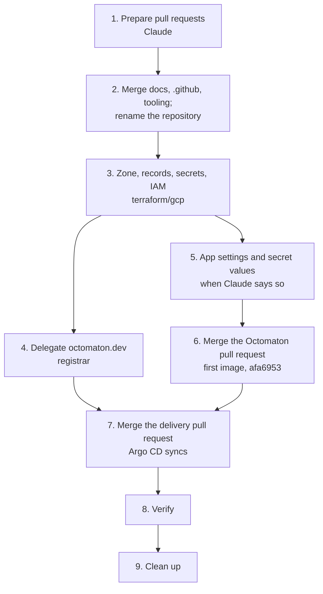

# Octomaton rename runbook

One-off migration from Octomatron to Octomaton, with Octomaton's own domain `octomaton.dev` for its webhook, Go module,
labels and configuration API group ([design](../designs/octomaton-dev.md)). Each step says who does it: Claude prepares
every change as a pull request; you merge, apply, and handle the GitHub App, secret values and the registrar. Once
step 2 lands, the [reference](../reference.md) and the [bootstrap runbook](bootstrap.md) describe the new names.

## What changes

| | Before | After |
| --- | --- | --- |
| Repository | `arikkfir-org/octomatron` | `arikkfir-org/octomaton` |
| Go module | `github.com/arikkfir-org/octomatron` | `octomaton.dev`: `go install octomaton.dev/cmd/octomaton-lint@latest` |
| Commands and image | `cmd/octomatron` (server, `lint`, `version`), `images/octomatron` | `cmd/octomaton` (server), `cmd/octomaton-lint`, `images/octomaton` |
| GitHub App | `octomatron` | `Octomaton`, homepage `https://github.com/arikkfir-org/octomaton`; App ID, installation and private key unchanged |
| Webhook URL | `https://octomatron.dev.kfirs.com/github/hooks` | `https://octomaton.dev/github/hooks` |
| Repository config | `.octomatron.yaml`, `apiVersion: octomatron.kfirs.com/v1` | `.octomaton.yaml`, `apiVersion: octomaton.dev/v1` |
| Bookkeeping | labels `octomatron.kfirs.com/…`, config-error check `octomatron` | labels `octomaton.dev/…`, check `octomaton` |
| Kubernetes | namespace `octomatron`, CI tenant `ci-octomatron` | `octomaton`, `ci-octomaton` |
| Secret Manager | `octomatron-github-{app-id,private-key,webhook-secret}` | `octomaton-github-{app-id,private-key,webhook-secret}` |
| IAM | `ci-octomatron/pipeline` writes to `images` | `ci-octomaton/pipeline` |
| Terraform variable | `octomatron_app_id` | `octomaton_app_id` |
| Telemetry, configuration | Prometheus metrics `octomatron_*`; `/etc/octomatron/config.yaml` and mounted secret files | Metrics `octomaton.*` in Cloud Monitoring and traces in Cloud Trace; `OCTOMATON_*` variables only, nothing mounted |
| DNS | record `octomatron.dev.kfirs.com` | zone `octomaton-dev` for `octomaton.dev`, apex A record → `ingress-public` |
| TLS (new) | | certificate `octomaton-dev`, listener `octomaton-dev` on the public gateway |
| Import page (new) | | `go-import` (nginx) in namespace `octomaton`: the `go-import` tag for `?go-get=1`, a redirect to the repository otherwise |

Unchanged: the `ci` check and its App ID pin, Descope, the `*.kfirs.com` certificate and every other host.

## Order



## 1. Prepare the changes (Claude)

| Repository | Pull request | Change |
| --- | --- | --- |
| `docs` | #1 (merged) | Reference, bootstrap runbook, overview, contributing guide, `.octomaton.yaml`; `phase-2-octomatron.md` becomes `phase-2-octomaton.md`; the [octomaton.dev design](../designs/octomaton-dev.md); pull requests for `docs` too |
| `octomatron` | #1 (open) | Module `octomaton.dev` and every import; `cmd/octomaton` and `cmd/octomaton-lint`; every name above; `.octomaton.yaml`; configuration from `OCTOMATON_*` variables and telemetry through OpenTelemetry; README with the `go install` line. `octomaton-lint -version` falls back to the module version, so `go install` builds report their tag |
| `delivery` | #1 (open) | Rename the app, namespace, CI tenant, secrets and image; configure Octomaton with environment variables. `octomaton.dev` route: `/github/hooks` to Octomaton, the rest to the new `go-import` nginx. `octomaton.dev` certificate and public-gateway listener; a DNS-01 solver for zone `octomaton-dev` in both ClusterIssuers |
| `infra` | #5: `terraform/github` | Repository key with `moved` blocks; variable `octomaton_app_id`; `.octomaton.yaml`; README; Dependabot alerts and security updates for every repository |
| `infra` | #6: `terraform/gcp` | Secrets and IAM renamed; record `octomatron.dev.kfirs.com` dropped; zone `octomaton-dev` with its apex record and cert-manager's grant; a name-server output; Octomaton's telemetry grants and the Telemetry and Cloud Trace APIs |
| `.github`, `tooling` | new | `.octomaton.yaml` and mentions |

Review the pull requests. Nothing live changes until step 2.

## 2. Merge the docs and rename the repository (you)

Merge the `docs`, `.github`, `tooling` and `terraform/github` pull requests. Use the admin bypass: the `ci` check can't
run until step 7. Then:

```bash
cd infra && git pull
terraform -chdir=terraform/github plan -var octomaton_app_id=<app id>
```

The plan must show only this: `github_repository.this` and `github_repository_ruleset.default-branch` moved from
`["octomatron"]` to `["octomaton"]`, the repository renamed in place and its ruleset updated in place, and 12 to add: a
`github_repository_vulnerability_alerts` and a `github_repository_dependabot_security_updates` for each of the six
repositories. Nothing is destroyed. Apply it, then point your own clone at the new name:

```bash
terraform -chdir=terraform/github apply -var octomaton_app_id=<app id>
git -C <your octomatron clone> remote set-url origin https://github.com/arikkfir-org/octomaton.git
```

GitHub redirects the old URLs, and pull request #1 moves with the repository.

## 3. GCP: zone, records, secrets and IAM (you)

Merge the `terraform/gcp` pull request, then:

```bash
terraform -chdir=terraform/gcp plan
terraform -chdir=terraform/gcp apply
```

Expect only these changes:

| Created | Destroyed (only if you applied `terraform/gcp` before) |
| --- | --- |
| Zone `octomaton-dev` (`octomaton.dev.`), its apex A record, cert-manager's `roles/dns.admin` on it | Record `octomatron.dev.kfirs.com.` |
| Secrets `octomaton-github-*` and External Secrets' accessor grants on them | Secrets `octomatron-github-*` with their values, and their grants |
| `ci-octomaton/pipeline` as `roles/artifactregistry.writer` on `images` | The same grant for `ci-octomatron` |
| `octomaton/octomaton` as `roles/telemetry.metricsWriter`, `roles/telemetry.tracesWriter` and `roles/serviceusage.serviceUsageConsumer` on the project; the `cloudtrace` and `telemetry` APIs | |

cert-manager's existing grant on zone `kfirs-com` only moves to a new address. If you never applied this root, the plan
is [bootstrap](bootstrap.md) step 4 with the new names.

## 4. Delegate octomaton.dev (you)

```bash
terraform -chdir=terraform/gcp output octomaton_dev_name_servers
```

At the registrar, replace the domain's name servers with these four. If DNSSEC is on there, turn it off first, or
resolvers will reject the new zone. Delegation can take a few hours:

```bash
dig +short NS octomaton.dev    # the four ns-cloud-…googledomains.com. servers
```

## 5. GitHub App and secret values (you, when Claude says so)

App settings, General:

| Field | Value |
| --- | --- |
| GitHub App name | `Octomaton` |
| Homepage URL | `https://github.com/arikkfir-org/octomaton` |
| Webhook URL | `https://octomaton.dev/github/hooks` |
| Webhook secret | A new one: `openssl rand -hex 32` |

The App ID, installation and private key stay the same. Fill the new secrets:

```bash
add() { gcloud secrets versions add "$1" --project=arikkfir --data-file=-; }
printf '%s' "<app id>"             | add octomaton-github-app-id
add octomaton-github-private-key   < octomatron.YYYY-MM-DD.private-key.pem
printf '%s' "<new webhook secret>" | add octomaton-github-webhook-secret
```

If you haven't done [bootstrap](bootstrap.md) step 5 yet, add its other secrets now too.

## 6. First image (you)

Merge the Octomaton pull request (#1, admin bypass). Releases have no version tags: every commit on `main` is a release
named by its short SHA, and Octomaton builds the next ones itself. Build the image of #1's merge commit, `afa6953`,
which the delivery pull request pins:

```bash
gcloud auth configure-docker me-west1-docker.pkg.dev
git clone https://github.com/arikkfir-org/octomaton && cd octomaton && git checkout afa6953
VERSION=afa6953 KO_DOCKER_REPO=me-west1-docker.pkg.dev/arikkfir/images/octomaton \
  go run github.com/google/ko@v0.19.1 build --bare --tags=afa6953 ./cmd/octomaton
```

Don't run `go install octomaton.dev/…` before step 8; until `octomaton.dev` answers, the Go proxy may cache the
failure for a while.

## 7. Deploy (you)

Check that `dig +short NS octomaton.dev` lists the Cloud DNS servers: the Gateways wait for the `octomaton.dev`
certificate, as they do for the wildcard one. Then merge the delivery pull request (#1, admin bypass). If Argo CD
isn't installed yet, continue with [bootstrap](bootstrap.md) step 7; otherwise Argo CD syncs `main` on its own.

## 8. Verify

```bash
kubectl -n traefik get certificate octomaton-dev                         # Ready
curl -s 'https://octomaton.dev/cmd/octomaton?go-get=1' | grep go-import
curl -sI https://octomaton.dev | grep -i '^location'                      # https://github.com/arikkfir-org/octomaton
curl -s -o /dev/null -w '%{http_code}\n' -X POST https://octomaton.dev/github/hooks   # 401: Octomaton, unsigned
go install octomaton.dev/cmd/octomaton-lint@latest && octomaton-lint -version    # v0.0.0-<time>-<sha>: newest main commit
```

Then [bootstrap](bootstrap.md) step 9: a pull request gets a `ci` check from Octomaton, and the App's recent
deliveries succeed. Finish any bootstrap steps still open (8 to 11).

## 9. Clean up

- Claude: drop the `moved` blocks from `infra` in a small follow-up pull request; they only serve the one apply.
- You, only if you pushed an image under the old name:
  `gcloud artifacts packages delete octomatron --repository=images --location=me-west1 --project=arikkfir`.
- You, optionally: rename the `.pem` file.

## If something goes wrong

| Symptom | Cause and fix |
| --- | --- |
| `terraform/github` plans to destroy the repository (and `prevent_destroy` stops it) | The `moved` blocks are missing or wrong. Don't work around it; fix the pull request. |
| Argo CD's `traefik` app waits on certificate `octomaton-dev` | Delegation isn't live yet (`dig +short NS octomaton.dev`, `kubectl get challenges -A`). cert-manager retries on its own. |
| `go install` reports `unrecognized import path` | `https://octomaton.dev/…?go-get=1` doesn't return the tag: check `go-import` and the certificate. |
| `go install` reports `module declares its path as …` | The tag points at a commit from before the rename. Tag a new version rather than moving the tag. |
| Webhook deliveries fail with `401` | The webhook secret in the App and in `octomaton-github-webhook-secret` differ. |
