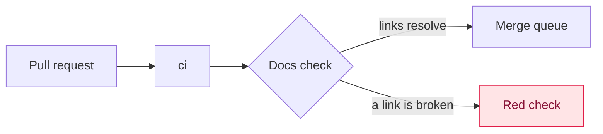

# Writing toolkit for investigations and walkthroughs

Root-cause write-ups and pull request walkthroughs are read by someone with ninety seconds who doesn't know the code. This page is the visual vocabulary they share; the templates are [root-cause write-up](root-cause.md) and [pull request walkthrough](walkthrough.md).

## Prefer the left

| Instead of                                        | Use                                         |
|---------------------------------------------------|---------------------------------------------|
| A paragraph tracing how something flows           | A diagram                                   |
| A paragraph narrating a chain of events           | A sequence diagram, or a numbered list      |
| Parallel bullet lists under headings              | A table, one row per thing compared         |
| Numbers in a sentence                             | A chart or a table                          |
| Status words: broken, fixed, partly, new, changed | A status marker                             |
| A wall of logs or code in the text                | A drill-down                                |
| An abstract description                           | A worked example with real values           |
| Jargon                                            | Plain words, with the term in brackets once |

Three rules keep this from backfiring:

- A diagram earns its place by showing a mechanism: order, branching, who talks to whom. A box with one arrow is a sentence in a rectangle.
- A table needs at least two rows and two columns that differ. One row is a sentence in a costume.
- Never a chart without real numbers.

## Diagrams

Mermaid code blocks, which GitHub and the docs site both render (the site loads Mermaid 11).

| To show                     | Use                                  |
|-----------------------------|--------------------------------------|
| Who talks to whom, in order | `sequenceDiagram`, with `autonumber` |
| Where the path branches     | `flowchart LR`                       |
| When things happened        | `timeline`                           |
| How much                    | `xychart-beta`                       |
| A state that got stuck      | `stateDiagram-v2`                    |
| Which commit                | `gitGraph`                           |

Give the step at fault a class of its own, with a text colour so it reads in dark mode too:



## Status markers

Emoji, because they look the same on GitHub, on the docs site and in a terminal. GitHub strips inline styles, so coloured labels don't survive.

| Marker | Means                                         |
|--------|-----------------------------------------------|
| 🔴     | Broken, still on `main`                       |
| 🟢     | Fixed and deployed                            |
| 🟡     | Partly, or fixed on `main` but not deployed   |
| ✅     | Proven                                        |
| ❌     | Ruled out                                     |
| ❓     | Not verified                                  |
| ⚠️     | Caution                                       |
| 🆕     | New                                           |
| 🔄     | Changed                                       |

## Drill-downs

Evidence that would turn a section into a wall goes in a `<details>` block, which the reader opens when they want it. Leave a blank line after `</summary>`, or the Markdown inside won't render.

```html
<details>
<summary>🔎 The failing step's log, at the deployed revision</summary>

…a fenced code block, a table or prose…

</details>
```

## Constraints

- GitHub-flavoured Markdown with one `#` heading and relative links to other `.md` files, like every page here.
- No inline styles, scripts or images from other hosts: GitHub strips the first two, and the docs site sits behind sign-in.
- Accuracy over polish: a wrong diagram is worse than none.
